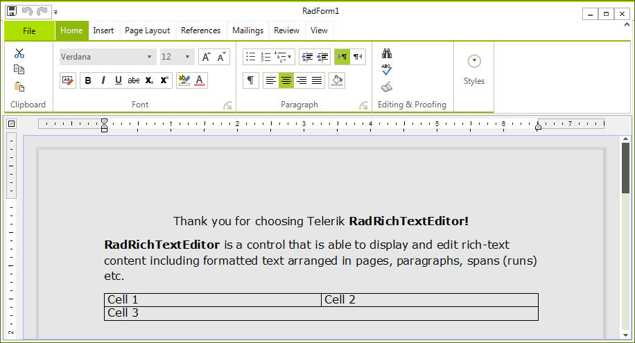
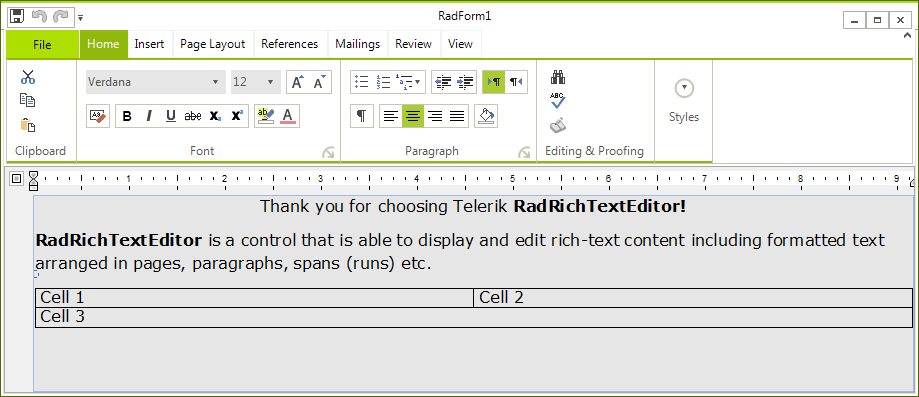

# Layout Modes

The __RadRichTextEditor__ allows you to choose between several layout modes.   

* [Paged](#paged)

* [Flow](#flow)

* [FlowNoWrap](#flownowrap)

## Paged

>caption Figure 1: DocumentLayoutMode.Paged

When using the paged mode, the content of the edited document is divided into pages. The size and layout of each page are defined by the __DefaultPageLayoutSettings__ property of [RadDocument]() and specifically - the __Width__ and __Height__ properties of the __PageLayoutSettings__ object.
        
Next, the margins of the control in a page are specified by the __PageMargin__ property of each [Section]().
        
In __Paged__ mode, resizing a __RadRichTextEditor__ will not affect the document layout but scroll bars will appear if the document does not fit in the view.
        
## Flow

>caption Figure 2: DocumentLayoutMode.Flow

In __Flow__ layout mode, the document content is not divided into pages. Instead the whole content is displayed as in a  TextBox or RichTextBox. This layout option resembles __MS Word’s Web-Layout__ mode. The width of the document is the same as that of the __RadRichTextEditor__ and changing the control’s width will also resize the content of the document.

## FlowNoWrap

The __FlowNoWrap__ layout mode is similar to the __Flow__ layout mode, but it doesn't allow the text in the separate paragraphs to get wrapped when the free space gets exceeded. Instead a horizontal scroll bar will appear.

# See Also

 * [History]()
