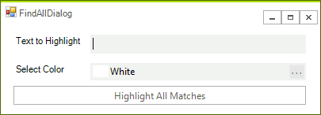

# Replace Default Dialogs

This article will demonstrate how you can replace the default __FindAndRepacle__ dialog with a custom one. It will show which dialogs can be replaced as well.

## Create Custom Dialog

1\. Let's start by adding a simple **RadForm** to our project (the main form of the project should contain at least one **RadRichTextEditor**). Make the form to look like in the following picture (you can leave the default control names).

2\. Open the code behind and add event handler for the button. You can add a method that will perform the search as well:

<snippet id='richtexteditor-findalldialog-search-cs' />
<snippet id='richtexteditor-findalldialog-search-vb' />

3\. The new dialog need to implement the __IFindReplaceDialog__ otherwise you cannot replace the default one. So go ahead and add the interface to the form's class declaration:

<snippet id='richtexteditor-findalldialog-declare-cs' />
<snippet id='richtexteditor-findalldialog-declare-vb' />

Now, you are ready to add the required fields, property and methods:

<snippet id='richtexteditor-findalldialog-interface-cs' />
<snippet id='richtexteditor-findalldialog-interface-vb' />

4\. The final step is to assign a new instance of the dialog to the corresponding property:

<snippet id='richtexteditor-changedefaultdialogs-assign-cs' />
<snippet id='richtexteditor-changedefaultdialogs-assign-vb' />

## Dialogs that can be replaced

The following list shows which dialogs can be replaced in **RadRichTextEditor**:
        
* AddNewBibliographicSourceDialog

* ChangeEditingPermissionsDialog

* CodeFormattingDialog

* EditCustomDictionaryDialog

* FindReplaceDialog

* FloatingBlockPropertiesDialog

* FontPropertiesDialog

* InsertCaptionDialog

* InsertCrossReferenceWindow

* InsertDateTimeDialog

* InsertHyperlinkDialog

* InsertSymbolDialog

* InsertTableDialog

* InsertTableOfContentsDialog

* ManageBibliographicSourcesDialog

* ManageBookmarksDialog

* ManageStylesDialog

* NewCaptionLabelDialog

* NotesDialog

* ParagraphPropertiesDialog

* ProtectDocumentDialog

* SetNumberingValueDialog

* SpellCheckingDialog

* StyleFormattingPropertiesDialog

* TablePropertiesDialog

* TabStopsPropertiesDialog

* UnprotectDocumentDialog

* WatermarkSettingsDialog
