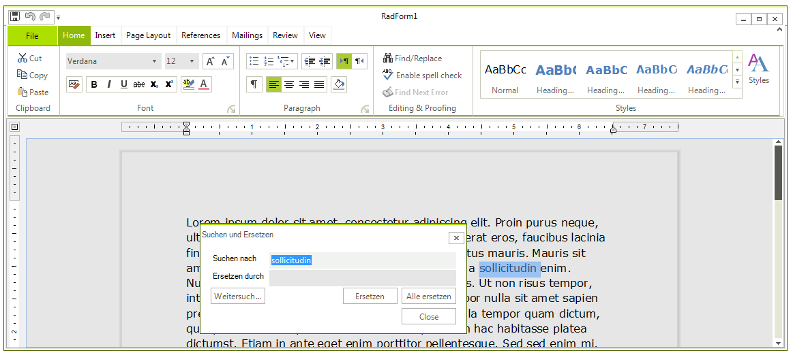
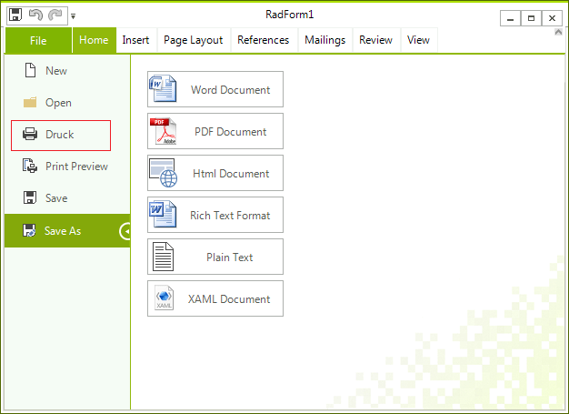

# Localization

To change the default English localization provider you should use the __CurrentProvider__ static property of the          __RichTextBoxLocalizationProvider__ class. For example, you can load the string from a XML file like this:

{{source=..\SamplesCS\RichTextEditor\Localization.cs region=xml}} 
{{source=..\SamplesVB\RichTextEditor\Localization.vb region=xml}} 

````C#
            
RichTextBoxLocalizationProvider.CurrentProvider = RichTextBoxLocalizationProvider.FromFile(@"C:\RichTextBoxStrings.xml");

````
````VB.NET
RichTextBoxLocalizationProvider.CurrentProvider = RichTextBoxLocalizationProvider.FromFile("C:\RichTextBoxStrings.xml")

````

{{endregion}} 

>important You can download a XML file that contains all the currently used strings from here: [Strings file](https://www.telerik.com/docs/default-source/ui-for-winforms/richtextboxstrings6007d3a020c44a809319582ae2c3ba01.zip?sfvrsn=4c89d61a_2)
>

>note As of R2 2015 __RichTextBoxLocalizationProvider__ contains all strings related to the __RadRichTextEditorRibbonUI__ as well.
>

Another approach is to create a custom localization provider class which inherits __RichTextBoxLocalizationProvider__. In it you should just override the __GetLocalizedString__  method and return the localized string depending on current id.

{{source=..\SamplesCS\RichTextEditor\Localization.cs region=custom}} 
{{source=..\SamplesVB\RichTextEditor\Localization.vb region=custom}} 

````C#
    
public class MyRichTextBoxLocalizationProvider : RichTextBoxLocalizationProvider
{
    public override string GetLocalizedString(string id)
    {
        switch (id)
        {
            case "Documents_FindReplaceDialog_FindNext":
                return "Weitersuchen";
            case "Documents_FindReplaceDialog_Header":
                return "Suchen und Ersetzen";
            case "Documents_FindReplaceDialog_Replace":
                return "Ersetzen";
            case "Documents_FindReplaceDialog_ReplaceAll":
                return "Alle ersetzen";
            case "Documents_FindReplaceDialog_ReplaceWith":
                return "Ersetzen durch";
            case "Documents_FindReplaceDialog_TextToFind":
                return "Suchen nach";
            case "Documents_FindReplaceDialog_RestartSearch":
                return "Zeigen unten die Multifunktionsleiste";
            case "Documents_FindReplaceDialog_SearchedTextNotFound":
                return "Der Suchbegriff wurde nicht gefunden";
            case "RibbonUI_BackstageButtonPrint":
                return "Druck";
        }
    
        return base.GetLocalizedString(id);
    }
}

````
````VB.NET
Public Class MyRichTextBoxLocalizationProvider
    Inherits RichTextBoxLocalizationProvider
    Public Overrides Function GetLocalizedString(ByVal id As String) As String
        Select Case id
            Case "Documents_FindReplaceDialog_FindNext"
                Return "Weitersuchen"
            Case "Documents_FindReplaceDialog_Header"
                Return "Suchen und Ersetzen"
            Case "Documents_FindReplaceDialog_Replace"
                Return "Ersetzen"
            Case "Documents_FindReplaceDialog_ReplaceAll"
                Return "Alle ersetzen"
            Case "Documents_FindReplaceDialog_ReplaceWith"
                Return "Ersetzen durch"
            Case "Documents_FindReplaceDialog_TextToFind"
                Return "Suchen nach"
            Case "Documents_FindReplaceDialog_RestartSearch"
                Return "Zeigen unten die Multifunktionsleiste"
            Case "Documents_FindReplaceDialog_SearchedTextNotFound"
                Return "Der Suchbegriff wurde nicht gefunden"
            Case "RibbonUI_BackstageButtonPrint"
                Return "Druck"
        End Select
        Return MyBase.GetLocalizedString(id)
    End Function
End Class

````

{{endregion}} 

The following code snippet shows how you can use the new class:

{{source=..\SamplesCS\RichTextEditor\Localization.cs region=change}} 
{{source=..\SamplesVB\RichTextEditor\Localization.vb region=change}} 

````C#
            
RichTextBoxLocalizationProvider.CurrentProvider = new MyRichTextBoxLocalizationProvider();
            
InitializeComponent();

````
````VB.NET
RichTextBoxLocalizationProvider.CurrentProvider = New MyRichTextBoxLocalizationProvider()
InitializeComponent()

````

{{endregion}} 


>note It is necessary to specify the RichTextBoxLocalizationProvider. __CurrentProvider__ property before initializing the components.
>

>caption Fig.1 RichTextBoxLocalizationProvider


>caption Fig.2 Localize RadRichTextEditorRibbonUI




