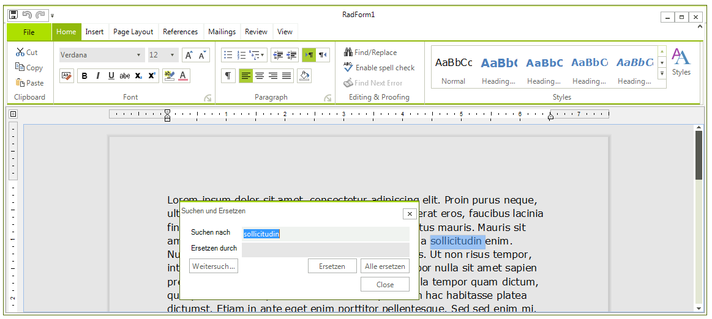
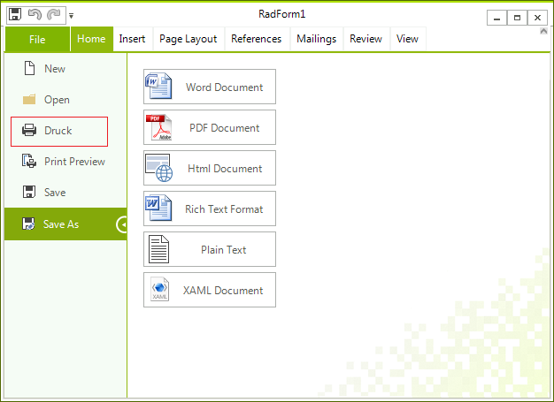

# Localization

To change the default English localization provider you should use the __CurrentProvider__ static property of the          __RichTextBoxLocalizationProvider__ class. For example, you can load the string from a XML file like this:

<snippet id='richtexteditor-localization-xml-cs' />
<snippet id='richtexteditor-localization-xml-vb' />

>important You can download a XML file that contains all the currently used strings from here: [Strings file](https://github.com/telerik/winforms-sdk/blob/master/Localization%20Providers/RichTextBoxStrings.xml)
>

>note As of R2 2015 __RichTextBoxLocalizationProvider__ contains all strings related to the __RadRichTextEditorRibbonUI__ as well.
>

Another approach is to create a custom localization provider class which inherits __RichTextBoxLocalizationProvider__. In it you should just override the __GetLocalizedString__  method and return the localized string depending on current id.

<snippet id='richtexteditor-localization-custom-cs' />
<snippet id='richtexteditor-localization-custom-vb' />

The following code snippet shows how you can use the new class:

<snippet id='richtexteditor-localization-change-cs' />
<snippet id='richtexteditor-localization-change-vb' />

>note It is necessary to specify the RichTextBoxLocalizationProvider. __CurrentProvider__ property before initializing the components.
>

>caption Figure 1: RichTextBoxLocalizationProvider

>caption Figure 2: Localize RadRichTextEditorRibbonUI

