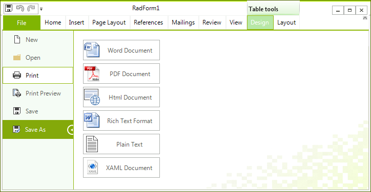

# Printing

__RadRichTextEditor__ allows printing the __RadDocument__ instance shown in it. The following article describes the available printing modes, as well as how to use the respective for the feature API.
      
In order to take advantage of the printing functionality, the document you want to be printed has to be shown in a __RadRichTextEditor__. In cases when you do not wish to actually show the editor to the user you can set the height of the control to *0*.
      
## Using UI 



**RadRichTextEditor**'s predefined UI – [RibbonUI](), allows you to directly *Print* by pressing the backstage item of the ribbon.
        
## Printing programmatically

Additionally to using the UI, you can print by taking advantage of the __Print()__,  __Print(bool showPrinterSettings)__ and __Print(bool showPrinterSettings, RadPrintDocument document)__ methods of  __RadRichTextEditor__. In addition **RadRichTextEditor** also provides a __PrintPreview()__ and __PrintPreview(RadPrintDocument document)__ methods.         

{{source=..\SamplesCS\RichTextEditor\Print.cs region=print}} 
{{source=..\SamplesVB\RichTextEditor\Print.vb region=print}} 

````C#
this.radRichTextEditor1.Print();
//or
this.radRichTextEditor1.PrintPreview();

````
````VB.NET
Me.radRichTextEditor1.Print()
'or
Me.radRichTextEditor1.PrintPreview()

````

{{endregion}} 

If you want to specify any print setting you can create an instance of [RadPrintDocument]() and pass it to the respective method override.

# See Also

* [Print Silently Documents in RadRichTextEditor ]() 
        
