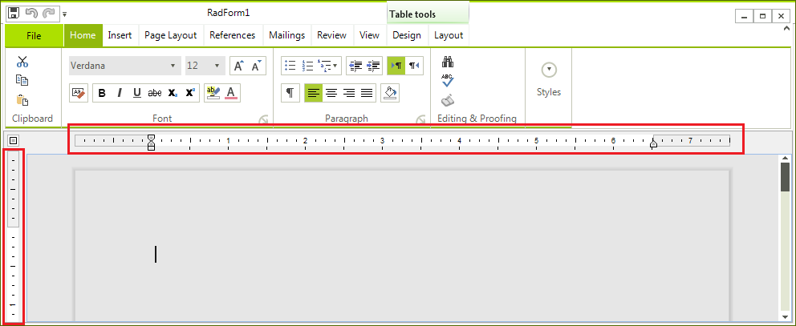
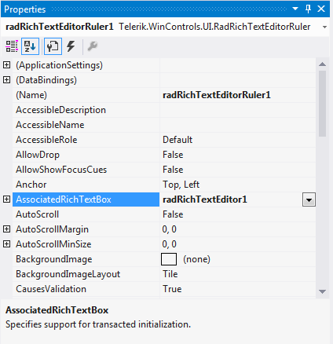

# RadRichTextEditorRuler 
 
__RadRichTextEditorRuler__ is a control providing ruler functionality to [RadRichTextEditor](). The rulers allow you to change the paragraph, page margins or align the paragraphs in the document.

>note Rulers only apply to the [Paged](https://docs.telerik.com/devtools/winforms/controls/richtexteditor/document-elements/raddocument) document layout mode of the __RadRichtextEditor.__ 
>

## Using the RadRichTextEditorRuler at design time

Since __RadRichTextEditorRuler__ is a separate control it is available in the toolbox. Here is how to put it in  action:

1\. Drag and drop __RadRichTextEditorRuler__ on the form.

2\. Drag and drop __RadRichTextEditor__ inside the __RadRichTextEditorRuler.__.

3\. Set the __AssociatedRichTextBox__ property in the properties window.

4\. Set the LayoutMode of the __RadRichTextEditor__ to [Paged]().

## Using the RadRichTextEditorRuler programmatically.

You can add the control in code as well. The following snippet demonstrates how to add __RadRichTextEditorRuler__ and __RadRichTextEditor__ to a form:

<snippet id='richtexteditor-radrichtexteditorrulercode-ruler-cs' />
<snippet id='richtexteditor-radrichtexteditorrulercode-ruler-vb' />

