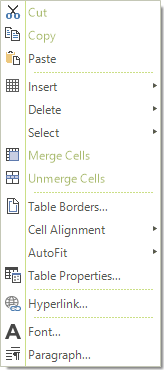
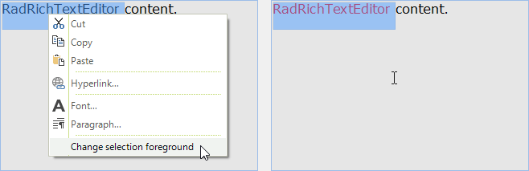

# Context Menu

The __RadRichTextEditor__ UI has a built-in context menu feature which can be used to easily customize different elements in a document. The menu is displayed when you __mouse right click__ on the __RadRichTextEditor__ control. It contains some context specific commands arranged in groups. There are groups for spellchecking, clipboard, table editing and text editing.

>caption Figure 1: Menu in the context of a table

The context menu is enabled by default. You can control this with the __IsContextMenuEnabled__ property. If you set the property to *false*, the [Selection Mini Tool Bar]() will be displayed when you click the mouse right button.

#### Disabling the context menu

<snippet id='richtexteditor-contextmenucode-disablecontextmenu-cs' />
<snippet id='richtexteditor-contextmenucode-disablecontextmenu-vb' />

The menu is accessible through the __ContextMenu__ property of __RadRichTextEditor__ control.

>note The context menu instance is cached and shared between all the instances of **RadRichTextEditor** in an application.
	
The **RadRichTextEditor** default context menu can be fully replaced by an object that implements the __IContextMenu__ interface which is marked with __CustomContextMenuAttribute__. Additionally, the menu can be customized by adding, removing and modifying menu groups and items. You can do that by using the __Showing__ event of the menu or by creating a custom content builder and override its construction methods.

You can customize the context menu bu using one of the following approaches:
      
* [Using the Showing event](#using-the-showing-event)

* [Creating ContextMenuBuilder Class](#creating-contextmenubuilder-class)

## Using the Showing event

The first one involves subscribing to the __Showing__ event of the default __ContextMenu__.  The __Showing__ event is not part of the __IContextMenu__ interface, so in order to subscribe to it you need a cast to the __ContextMenu__ class (the default implementation of __IContextMenu__ in __Telerik.Windows.Documents.RadRichTextEditor.dll__). Here is an example of this approach.

#### Subscribe to Event

<snippet id='richtexteditor-contextmenucode-subscribeshowingevent-cs' />
<snippet id='richtexteditor-contextmenucode-subscribeshowingevent-vb' />

#### Handle Event

<snippet id='richtexteditor-contextmenucode-handleshowingevent-cs' />
<snippet id='richtexteditor-contextmenucode-handleshowingevent-vb' />

>caption Figure 2: Changing Text Color

## Creating ContextMenuBuilder Class

The second approach is more suitable when you need to reuse the customization across several __RadRichTextEditor__   instances/applications. Here you can either implement the __IContextMenuContentBuilder__ interface or derive from the __ContextMenuContentBuilder__ class and override some of its protected methods which are responsible for the creation of each context menu group:

#### Custom Builder Class

<snippet id='richtexteditor-contextmenucode-customcontextmenubuilderclass-cs' />
<snippet id='richtexteditor-contextmenucode-customcontextmenubuilderclass-vb' />

Now you can simply assign the instance of your class to the __ContentBuilder__ property of the context menu:

#### Assinging Builder

<snippet id='richtexteditor-contextmenucode-assigncustomcontextmenubuilder-cs' />
<snippet id='richtexteditor-contextmenucode-assigncustomcontextmenubuilder-vb' />

And of course, for those of you who don’t need additional UI pop-ups, these can be disabled by setting the __IsContextMenuEnabled__ property of the __RadRichTextEditor__ to __False__.

# See Also

 * [Getting Started]()
 * [Ribbon UI]()
 * [Selection Mini Toolbar]()
 * [How to Customize the RichTextEditor's Context Menu items]()
