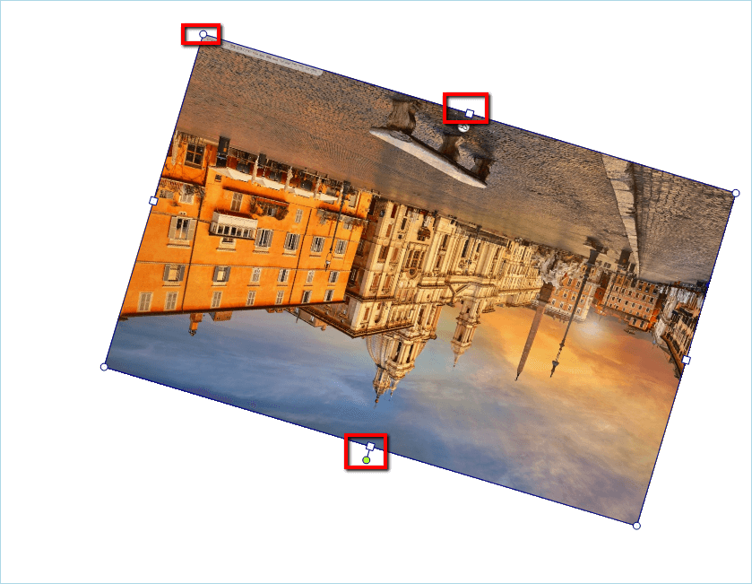

# Editing Images

This topic contains the following sections:

* [Using the UI](#using-the-ui)

* [Disable Image Editing Capabilities](#disable-image-editing-capabilities)

__RadRichTextEditor__ allows editing images that have been inserted in the editor. Currently, you can resize, rotate and drag and drop images. The supported image formats are as follows:
      
* JPEG

* PNG

* BMP

## Using the UI

You can resize the image using the adorner that is shown around the image. In addition, the thumb that is shown on top allows you to rotate the image.

## Disable Image Editing Capabilities

As most features of the editor, the image editing capabilities can be easily disabled.

To remove the image adorner from your application you can create a new __UILayersBuilder__ as shown [here]() and remove the __AdornerLayer__.

<snippet id='richtexteditor-editingimages-layer-cs' />
<snippet id='richtexteditor-editingimages-layer-vb' />

Alternatively, you can disable the capabilities of the image adorner by accessing it though **RadRichTextEditor**'s __ImageSelectionAdornerSettings__ property. This allows you to set the Boolean properties __CanDrag__,  __CanResize__ and __CanRotate__ which disable/enable respectively dragging of the image, resizing it or rotating it.

<snippet id='richtexteditor-editingimages-disable-cs' />
<snippet id='richtexteditor-editingimages-disable-vb' />

# See Also

 * [Inline images]()
