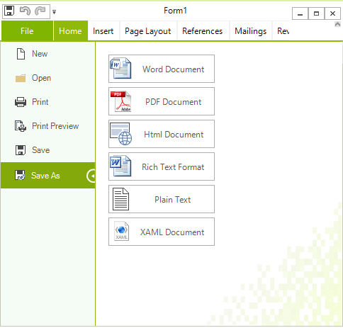
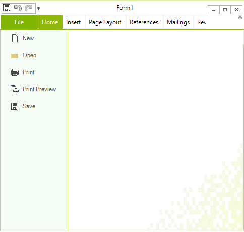

# Create Custom RichTextEditorRibbonBar

This topic explains how one can create custom class that inherits __RichTextEditorRibbonBar__. This is useful because all events in this class can be overridden. All elements that you see in the ribbon are accessible by their names in the inherited class as well. This allows you to easily modify them from the inherited class. 

A common scenario is to hide the "Save As" button and override the functionality of the save button. The following spinet demonstrates this:

#### Create custom RichTextEditorRibbonBar class

{{source=..\SamplesCS\RichTextEditor\UI\CustomRichTextEditorRibbonBar.cs region=CustomRibbonCode}} 
{{source=..\SamplesVB\RichTextEditor\UI\CustomRichTextEditorRibbonBar.vb region=CustomRibbonCode}}
````C#
class CustomRichTextEditorRibbonBar : RichTextEditorRibbonBar
{
    public CustomRichTextEditorRibbonBar()
    {
        buttonSaveHTML.Visible = false;
        buttonSavePDF.Visible = false;
        buttonSavePlain.Visible = false;
        buttonSaveRich.Visible = false;
        buttonSaveWord.Visible = false;
        buttonXAML.Visible = false;
        backstageTabItemSaveAs.Visibility = Telerik.WinControls.ElementVisibility.Collapsed;
    }
    protected override void ButtonSave_Click(object sender, EventArgs e)
    {
        var provider = new HtmlFormatProvider();
        string content = provider.Export(this.AssociatedRichTextEditor.Document); 
        //save the content to the database for example
    }
}

````
````VB.NET
Friend Class CustomRichTextEditorRibbonBar
    Inherits RichTextEditorRibbonBar
    Public Sub New()
        buttonSaveHTML.Visible = False
        buttonSavePDF.Visible = False
        buttonSavePlain.Visible = False
        buttonSaveRich.Visible = False
        buttonSaveWord.Visible = False
        buttonXAML.Visible = False
        backstageTabItemSaveAs.Visibility = Telerik.WinControls.ElementVisibility.Collapsed
    End Sub
    Protected Overrides Sub ButtonSave_Click(ByVal sender As Object, ByVal e As EventArgs)
        Dim provider = New HtmlFormatProvider()
        Dim content As String = provider.Export(Me.AssociatedRichTextEditor.Document)
        'save the content to the database for example
    End Sub
End Class

````

{{endregion}} 

|Default|Custom|
|---|---|
|||


# See Also

 * [Ribbon UI]()
 * [Localization]()
