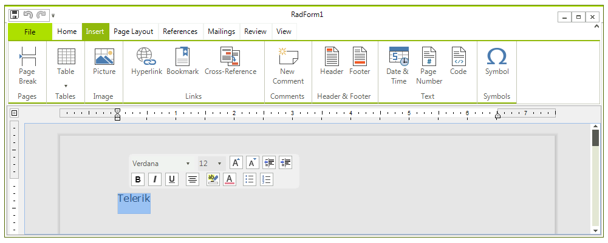

# Selection Mini Toolbar

__SelectionMiniToolBar__ is a floating toolbar that appears next to the current position after making a selection with the mouse in the document. It contains some useful commands for formatting text. You can access it via the RadRichTextEditor.RichTextBoxElement.**SelectionMiniToolBar** property.

The dialog can be completely replaced with a custom one. This can be done as easy as with the other   __RadRichTextEditor__ dialogs by implementing the interface __ISelectionMiniToolBar__ and assigning an instance of the new class to the __SelectionMiniToolBar__ property of the element.
        
And of course, for those of you who don't need additional UI pop-ups, these can be disabled by setting the __IsSelectionMiniToolBarEnabled__ property of __RadRichTextEditor__ to *false*.
        
