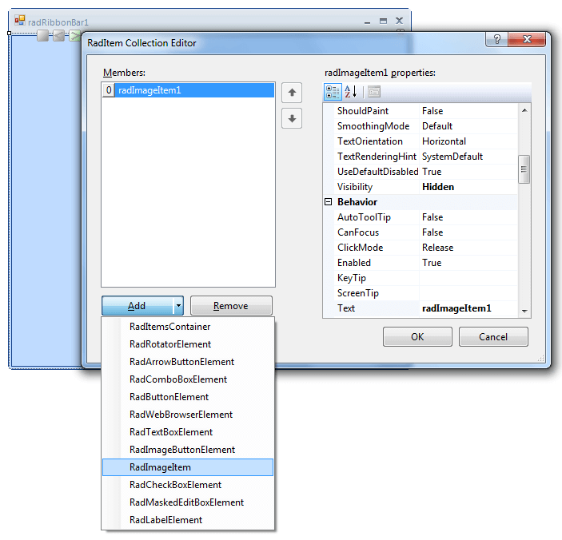
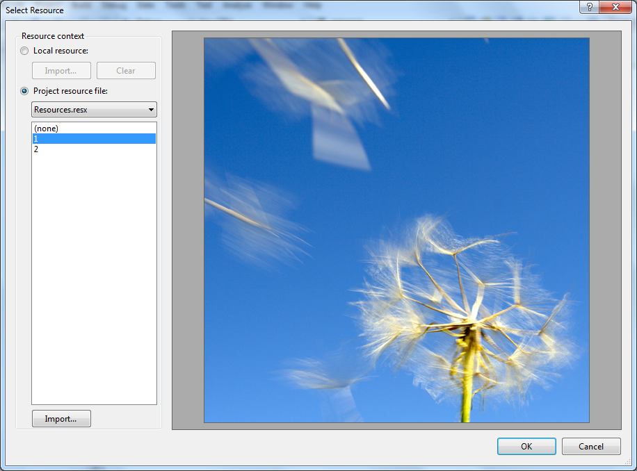
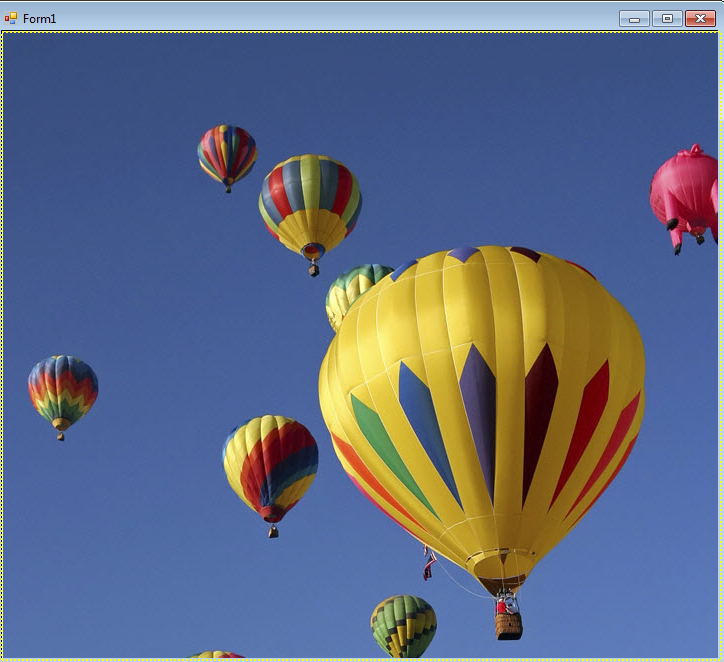

# Getting Started with WinForms Rotator

This tutorial demonstrates configuring __RadRotator__ at design-time, then running the animation at design time and run time. This example displays a series of images and one web site.
        

1\. In a new Windows Application, set the form __Size__ property to 500,500.
            

2\. Drop a RadRotator on the form and set the Dock property to Fill. 

3\. In the Property Window click the ellipses for the Items property. This step will launch the __Rad Items Collection Editor__.
            

4\. In the __Rad Items Collection Editor__, click the Add split button arrow to display the types that can be used by RadRotator.
            

5\. Locate and click the __RadImageItem__.

6\. In the __Rad Items Collection Editor__ properties, click the Image property ellipses.

7\. In the __Select Resource__ dialog, click the __Local Resource__ radio button, click the __Import__ button and open any image file. The "Sample Pictures" distributed with Windows can be used too.

8\. Click __OK__ to close the __Select Resource__ dialog.
            

9\. Add three more RadImageItems. 

10\. Add a __RadWebBrowserItem__ to the collection. Set the Url property to [http://www.telerik.com](http://www.telerik.com).

11\. Click __OK__ to close the __RadItem Collection Editor.__

12\. In the designer, notice the controls in the upper left of the __RadRotator__. Click the ">" button and observe that you can navigate through the items at design time.

13\. In the __Properties__ window for the __RadRotator__, set the __Running__ property to __true__.

14\. Press __F5__ to run the application.
            

## Telerik UI for WinForms Learning Resources
* [Telerik UI for WinForms Rotator Component](https://www.telerik.com/products/winforms/rotator.aspx)
* [Getting Started with Telerik UI for WinForms Components](https://docs.telerik.com/devtools/winforms/getting-started/first-steps)
* [Telerik UI for WinForms Setup](https://docs.telerik.com/devtools/winforms/installation-and-upgrades/installing-on-your-computer)
* [Telerik UI for WinForms Application Modernization](https://docs.telerik.com/devtools/winforms/winforms-converter/overview)
* [Telerik UI for WinForms Visual Studio Templates](https://docs.telerik.com/devtools/winforms/visual-studio-integration/visual-studio-templates)
* [Deploy Telerik UI for WinForms Applications](https://docs.telerik.com/devtools/winforms/deployment-and-distribution/application-deployment)
* [Telerik UI for WinForms Virtual Classroom(Training Courses for Registered Users)](https://learn.telerik.com/learn/course/external/view/elearning/17/telerik-ui-for-winforms)
* [Telerik UI for WinForms License Agreement)](https://www.telerik.com/purchase/license-agreement/winforms-dlw-s)

