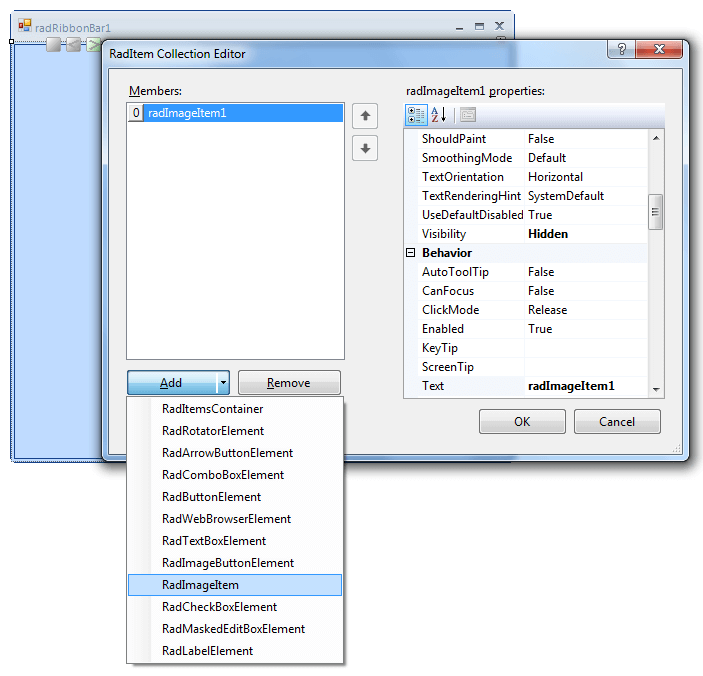
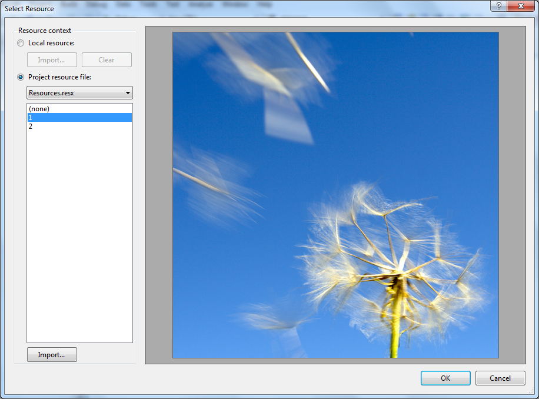
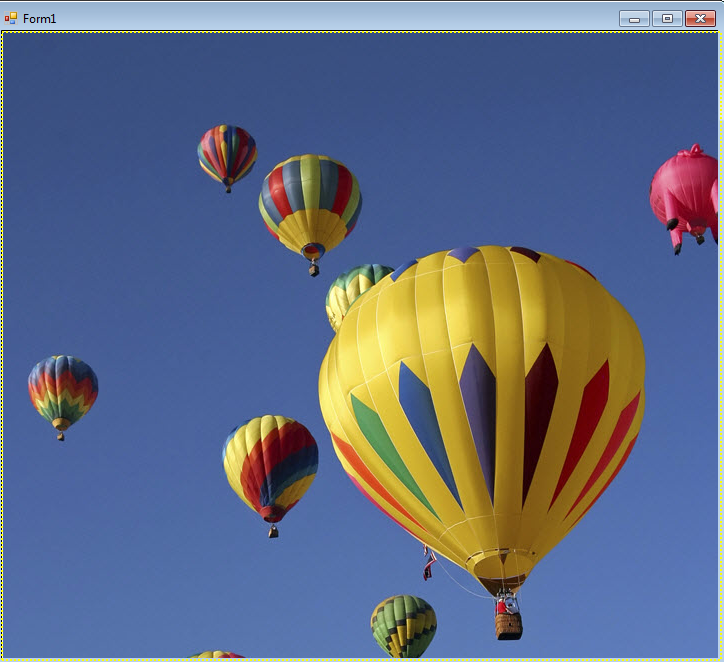

# Getting Started with WinForms Rotator

This tutorial will help you to quickly get started using the control.

## Adding Telerik Assemblies Using NuGet

To use `RadRotator` when working with NuGet packages, install the `Telerik.UI.for.WinForms.AllControls` package. The [package target framework version may vary]().

Read more about NuGet installation in the [Install using NuGet Packages]() article.

>tip With the 2025 Q1 release, the Telerik UI for WinForms has a new licensing mechanism. You can learn more about it [here]().

## Adding Assembly References Manually

When dragging and dropping a control from the Visual Studio (VS) Toolbox onto the Form Designer, VS automatically adds the necessary assemblies. However, if you're adding the control programmatically, you'll need to manually reference the following assemblies:

* __Telerik.Licensing.Runtime__
* __Telerik.WinControls__
* __Telerik.WinControls.UI__
* __TelerikCommon__

The Telerik UI for WinForms assemblies can be install by using one of the available [installation approaches](). 

## Defining the RadRotator

This tutorial demonstrates how to configure **RadRotator** at design time and then run the animation. This example displays a series of images and one web site.
        

1\. In a new Windows Application, set the form `Size` property to 500,500.
            

2\. Drop a **RadRotator** on the form and set the `Dock` property to `Fill`. 

3\. In the **Properties** window, click the ellipses for the `Items` property. This step will launch the **Rad Items Collection Editor**.
            

4\. In the **Rad Items Collection Editor**, click the **Add** split button arrow to display the types that can be used by **RadRotator**.
            

5\. Locate and click `RadImageItem`.

6\. In the **Rad Items Collection Editor** properties, click the **Image** property ellipses.

7\. In the **Select Resource** dialog, click the **Local Resource** radio button, click the **Import** button, and open any image file.

8\. Click **OK** to close the **Select Resource** dialog.
            

9\. Add three more `RadImageItem` entries. 

10\. Add a `RadWebBrowserItem` to the collection. Set the `Url` property to [http://www.telerik.com](http://www.telerik.com).

11\. Click **OK** to close the **RadItem Collection Editor**.

12\. In the designer, notice the controls in the upper left of **RadRotator**. Click the **>** button and observe that you can navigate through the items at design time.

13\. In the **Properties** window for **RadRotator**, set the `Running` property to `true`.

14\. Press `F5` to run the application.
            

## Telerik UI for WinForms Learning Resources
* [Telerik UI for WinForms Rotator Component](https://www.telerik.com/products/winforms/rotator.aspx)
* [Getting Started with Telerik UI for WinForms Components](https://docs.telerik.com/devtools/winforms/getting-started/first-steps)
* [Telerik UI for WinForms Setup](https://docs.telerik.com/devtools/winforms/installation-and-upgrades/installing-on-your-computer)
* [Telerik UI for WinForms Application Modernization](https://docs.telerik.com/devtools/winforms/winforms-converter/overview)
* [Telerik UI for WinForms Visual Studio Templates](https://docs.telerik.com/devtools/winforms/visual-studio-integration/visual-studio-templates)
* [Deploy Telerik UI for WinForms Applications](https://docs.telerik.com/devtools/winforms/deployment-and-distribution/application-deployment)
* [Telerik UI for WinForms Virtual Classroom(Training Courses for Registered Users)](https://learn.telerik.com/learn/course/external/view/elearning/17/telerik-ui-for-winforms)
* [Telerik UI for WinForms License Agreement)](https://www.telerik.com/purchase/license-agreement/winforms-dlw-s)

