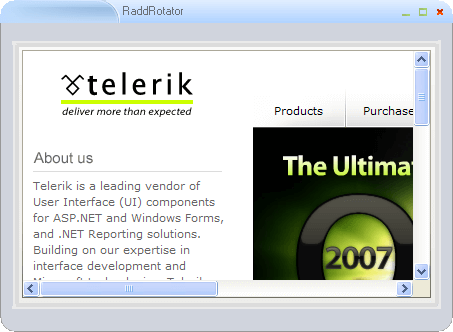
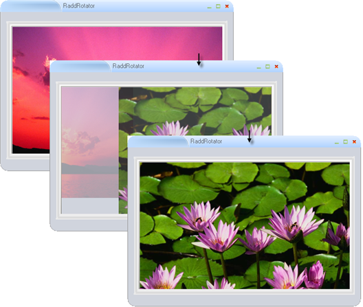

# Rotator

## 

RadRotator is a multipurpose component for content rotation and personalization. Highly customizable, it delivers high interactivity and user involvement. You can display a series of images, web URLs or any collection of rad elements.





Animation between frames can be opaque or transparent and the movement can be in any direction. You can adjust the level of granularity and interval between frames.

