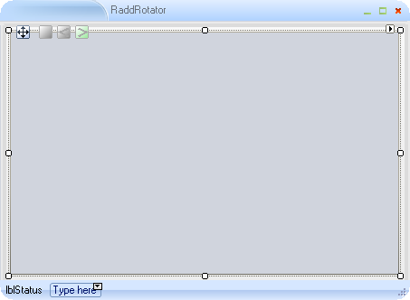

# Tutorial: Creating a Slide Viewer with RadRotator

The following tutorial demonstrates how to programmatically load images from the Pictures directory for display in **RadRotator**. The tutorial also integrates a **RadStatusStrip** control that contains a `RadLabelElement`.


1\. In the default form of a new Windows application:

2\. Drop a **RadStatusStrip** to the form and set the `Dock` property to `Bottom`.
            
3\. Click the **RadStatusStrip** downward pointing arrow and add a `RadLabelElement`.
            
4\. Drop a **RadRotator** on the form and set its `Dock` property to `Fill`.
            
5\. Navigate to the code view of the default form.

6\. Change the declaration of the form so that it derives from `RadForm`.
            
{{source=..\SamplesCS\Rotator\TutorialCreatingASlideViewerWithRadRotator.cs region=inheritFromRadForm}} 
{{source=..\SamplesVB\Rotator\TutorialCreatingASlideViewerWithRadRotator.Designer.vb region=inheritFromRadForm}} 

````C#
public partial class TutorialCreatingASlideViewerWithRadRotator : RadForm

````
````VB.NET
Partial Class TutorialCreatingASlideViewerWithRadRotator
    Inherits Telerik.WinControls.UI.RadForm

````
	
{{endregion}} 

7\. Return to the design view of the form. Visual Studio will repaint the form.



8\. Click the **Events** tab of the **Properties** window and navigate to the `Load` event of the form. Double-click it to create a `Load` event handler and replace the code with the following snippet. The code uses the `Directory.GetFiles()` method to retrieve all `.jpg` file paths. Each file path is passed to a `GetThumbNail()` method that returns a `RadImageItem`, which is added to the **RadRotator** `Items` collection. After the image items are loaded, the `Start()` method is called to begin the animation.

{{source=..\SamplesCS\Rotator\TutorialCreatingASlideViewerWithRadRotator.cs region=rotatorExample}} 
{{source=..\SamplesVB\Rotator\TutorialCreatingASlideViewerWithRadRotator.vb region=rotatorExample}} 

````C#
public TutorialCreatingASlideViewerWithRadRotator()
{
    InitializeComponent();
    radRotator1.BeginRotate += new BeginRotateEventHandler(radRotator1_BeginRotate);
}
private void TutorialCreatingASlideViewerWithRadRotator_Load(object sender, EventArgs e)
{
    string myPicturesPath = Environment.GetFolderPath(Environment.SpecialFolder.MyPictures);
    foreach (string fileName in Directory.GetFiles(myPicturesPath, "*.jpg"))
    {
        radRotator1.Items.Add(GetThumbNail(fileName));
    }
    radRotator1.Start(true);
    radRotator1.ShouldStopOnMouseOver = false;
}
private RadImageItem GetThumbNail(string path)
{
    RadImageItem imageItem = new RadImageItem();
    Image image = Image.FromFile(path);
    // workaround to prevent using internal image thumbnail
    image.RotateFlip(System.Drawing.RotateFlipType.Rotate180FlipNone);
    image.RotateFlip(System.Drawing.RotateFlipType.Rotate180FlipNone);
    // calculate aspect ratio so image is not distorted
    double ratio = 0;
    if (image.Width > image.Height)
    {
        ratio = ClientRectangle.Width / image.Width;
    }
    else
    {
        ratio = ClientRectangle.Height / image.Height;
    }
    int newWidth = (int)(image.Width * ratio);
    int newHeight = (int)(image.Height * ratio);
    imageItem.Image = image.GetThumbnailImage(newWidth, newHeight, null, IntPtr.Zero);
    return imageItem;
}
void radRotator1_BeginRotate(object sender, BeginRotateEventArgs e)
{
    radLabelElement1.Text = String.Format("Rotating from item {0} to {1}", e.From, e.To);
}

````
````VB.NET
Private Sub TutorialCreatingASlideViewerWithRadRotator_Load(ByVal sender As System.Object, ByVal e As System.EventArgs) Handles Me.Load
    Dim myPicturesPath As String = Environment.GetFolderPath(Environment.SpecialFolder.MyPictures)
    For Each fileName As String In Directory.GetFiles(myPicturesPath, "*.jpg")
        RadRotator1.Items.Add(GetThumbNail(fileName))
    Next
    RadRotator1.Start(True)
    RadRotator1.ShouldStopOnMouseOver = False
End Sub
Private Function GetThumbNail(ByVal path As String) As RadImageItem
    Dim imageItem As New RadImageItem()
    Dim image As Image = image.FromFile(path)
    ' workaround to prevent using internal image thumbnail
    image.RotateFlip(System.Drawing.RotateFlipType.Rotate180FlipNone)
    image.RotateFlip(System.Drawing.RotateFlipType.Rotate180FlipNone)
    ' calculate aspect ratio so image is not distorted
    Dim ratio As Double = 0
    If image.Width > image.Height Then
        ratio = ClientRectangle.Width / image.Width
    Else
        ratio = ClientRectangle.Height / image.Height
    End If
    Dim newWidth As Integer = Convert.ToInt32(image.Width * ratio)
    Dim newHeight As Integer = Convert.ToInt32(image.Height * ratio)
    imageItem.Image = image.GetThumbnailImage(newWidth, newHeight, Nothing, IntPtr.Zero)
    Return imageItem
End Function
Private Sub RadRotator1_BeginRotate(ByVal sender As Object, ByVal e As Telerik.WinControls.UI.BeginRotateEventArgs) Handles RadRotator1.BeginRotate
    RadLabelElement1.Text = [String].Format("Rotating from item {0} to {1}", e.From, e.[To])
End Sub

````

{{endregion}} 

9\. Press `F5` to run the application. 
            
