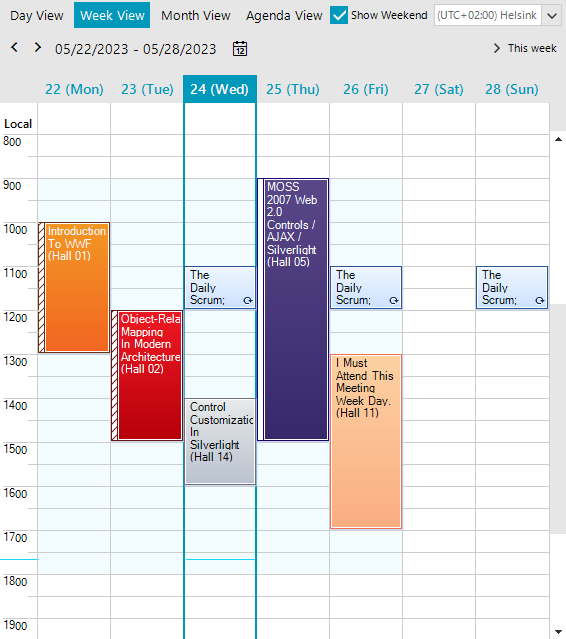
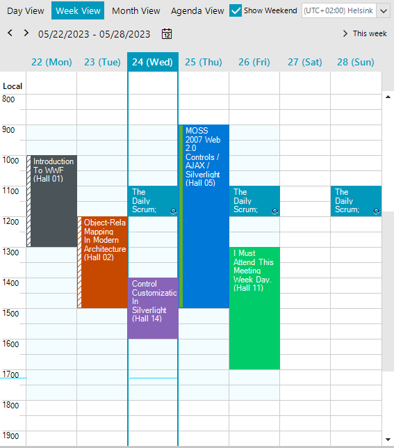
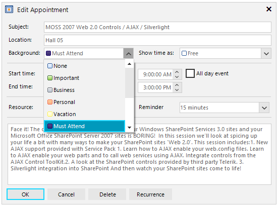
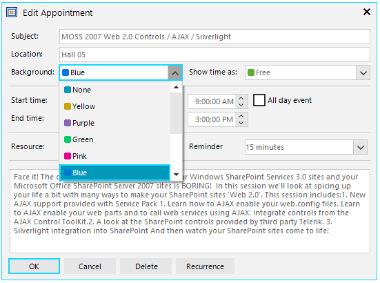

# Appointment Styles

As of **R2 2023** RadScheduler offers *Modern* style for its appointments. This functionality is enabled by default and it can be controlled by the **UseModernAppointmentStyles** property. If you want to bring back the *Classic* style, it is necessary to set explicitly the **UseModernAppointmentStyles** property to *false*.

|Classic|Modern|
|----|----|
|||

The **Background** items represented in the *Edit Appointment Dialog* match the applied theme when using the *Modern* style:

|Classic|Modern|
|----|----|
|||

>note Since the Background information is stored as an integer in the appointments, the changes affect only the visual representation and color for the existing events. Changes in the code are not required unless you need to [localize]() the new strings.

You can find below a matching table between the background values when using the Modern vs Classic style:

|BackgroundId|Modern Style (AppointmentCategory)|Classic Style (AppointmentBackground)|
|----|----|----|
|1|None|None|
|2|Yellow|Important|
|3|Purple|Business|
|4|Green|Personal|
|5|Pink|Vacation|
|6|Blue|MustAttend|
|7|Olive|TravelRequired|
|8|Gray|NeedsPreparation|
|9|Orange|Birthday|
|10|Lavender|Anniversary|
|11|Raspberry|PhoneCall|

With the introduction of modern styles, a set of color properties are offered as well indicating the explicit color nuance according to the currently applied theme in RadScheduler. Hence, so the users will get consistent look and feel.  

>important These colors are applicable only for appointments with modern styles (UseModernAppointmentStyles=true).

|Properties|Description|
|----|----|
|**ModernAppointmentBackColor**|Gets or sets the back color of the appointment when it has the default None category.|
|**ModernAppointmentBackColor2**|Gets or sets the second back color of the appointment when it has a linear gradient in the default None category.|
|**ModernAppointmentForeColor**|Gets or sets the fore color of the appointment.|
|**ModernAppointmentBorderColor**|Gets or sets the border color of the appointment when it has the default None category.|
|**PaintModernApppointmentsBorders**|Gets or sets whether the borders of the appointment element will be painted. This color set via the RadScheduler.ModernAppointmentBorderColor property is applied only for appointments with modern styles.|
|**ModernAppointmentYellowColor**|Gets or sets the back color of the appointment when it has the Yellow category.|
|**ModernAppointmentPurpleColor**|Gets or sets the back color of the appointment when it has the Purple category.|
|**ModernAppointmentGreenColor**|Gets or sets the back color of the appointment when it has the Green category.|
|**ModernAppointmentPinkColor**|Gets or sets the back color of the appointment when it has the Pink category.|
|**ModernAppointmentBlueColor**|Gets or sets the back color of the appointment when it has the Blue category.|
|**ModernAppointmentOliveColor**| Gets or sets the back color of the appointment when it has the Olive category.|
|**ModernAppointmentGrayColor**|Gets or sets the back color of the appointment when it has the Gray category.|
|**ModernAppointmentOrangeColor**|Gets or sets the back color of the appointment when it has the Orange category.|
|**ModernAppointmentLavenderColor**|Gets or sets the back color of the appointment when it has the Lavender category.|
|**ModernAppointmentRaspberryColor**| Gets or sets the back color of the appointment when it has the Raspberry category.|
        
# See Also

* [Using Default Themes]()
* [Customize Appointment Backgrounds and Statuses in RadScheduler]()
* [Working with Appointments]()
