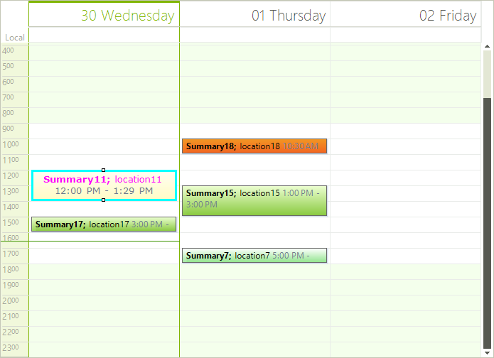
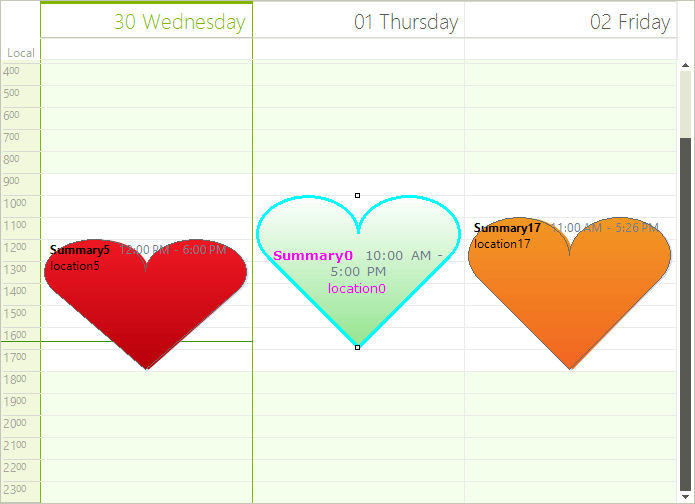

# Formatting Appointments

Appointments appearance in __RadScheduler__ can be customized using the __AppointmentFormatting__ event.

>note Appointment elements are created only for the currently visible cells and are being reused when scrolling or navigating backwards/forwards in the __RadScheduler__ . In order to prevent applying the formatting to other appointment elements, all styles should be reset for the rest of the appointment elements.
>

The code snippet below demonstrates how to change the font, fore color, border color and text alignment for the selected appointment element: 

#### Formatting Appointments

<snippet id='scheduler-formattingappointments-appointmentformatting-cs' />
<snippet id='scheduler-formattingappointments-appointmentformatting-vb' />

>caption Figure 1: Formatting Appointments

It is possible to change the appointments’ shape setting the SchedulerElement.__AppointmentShape__ property to the desired shape. Changing the __AppointmentShape__ will also change the shape of the shadow and the appointment type indicator (tentative/busy).#_[C#] _

<snippet id='scheduler-formattingappointments-appointmentshape-cs' />
<snippet id='scheduler-formattingappointments-appointmentshape-vb' />

>caption Figure 2: Custom Shapes

# See Also

* [Visual Style Builder]()
* [Using Default Themes]()
* [Views]()
* [Working with Appointments]()
