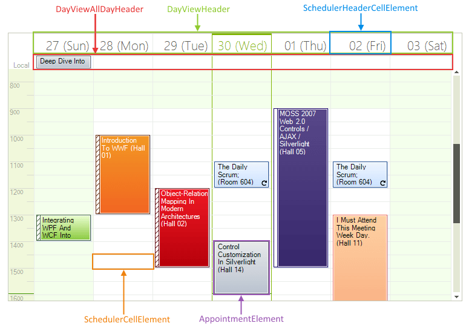
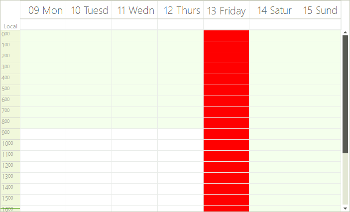
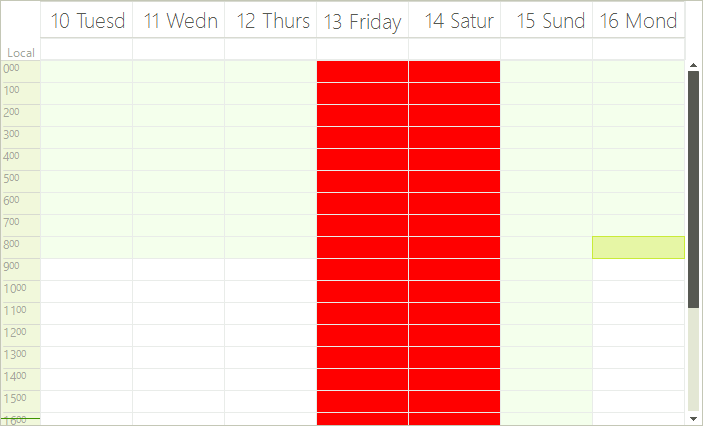
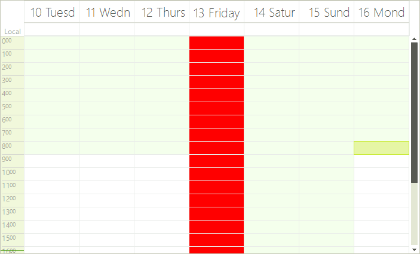
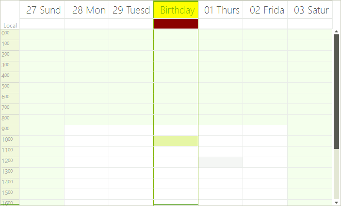

# Formatting cells

__RadScheduler__ uses a logical layer for storing appointments and view data, and the visual elements that represent this data are occasionally being refreshed. Thus, you might lose some of the properties you have set to the visual elements. In order to customize the properties of the cell elements, you should use the __CellFormatting__ event.

This event is fired after a __SchedulerCellElement__ has been created, and when the cell needs to be displayed. The arguments of this event contain a reference to the cell element itself, so you can modify its properties. The samples below demonstrate how you can programmatically change various properties of the __RadScheduler__ cells. Before these samples, we are going to provide some useful information about the __RadScheduler__ cells types.

>caption Figure 1: Visual Elements

## RadScheduler Data Cells

__RadScheduler__ data cells are of type __SchedulerCellElement__. This type of cell provides several useful properties:

* __Date__: Returns the date of the cell.

* __IsToday__: Indicates whether the date of the cells is today.

* __IsWorkTime__: Gets or sets whether the cell represents a work time slot.

* __IsWholeHour__: Indicates whether the cell represents a whole hour.

## RadScheduler Header Cells

__RadScheduler__ header cells are of type __SchedulerHeaderCellElement__. This type derive from __SchedulerCellElement__, so the properties mentioned above are valid here as well. __SchedulerHeaderCellElement__ exposes one more property  that you may find useful:

* __IsVertical__: Returns whether the cell element is vertical or not.

The interesting fact about __SchedulerHeaderCellElement__ is that cells of this type are used for two different operations. For example, let's get the DayView. You can see that there is a header cell with text for each of the days. The cell below, which allows for hosting all-day appointments, is of type SchedulerHeaderCellElement as well. If you need to programmatically differentiate the first cell from the second, you can do this by the __Parent__ property of the cell. The header cells that contain text are contained by an element of type __DayViewHeader__. The cells that can contain all-day appointments are contained by an element of type __DayViewAllDayHeader__.

>tip Still wondering what type of cell is the cell that you want to format? You can employ[ RadControlSpy]() for this task.
>

## Formatting Data Cells

Let's now format some data cells. We will make red the SchedulerCellElements that represent a specific day, for example Apr 13. Let's note that SchedulerHeaderCellElement derive from SchedulerDataElement, so we need to include an 'if' clause that prevents the header cells from being painted:

#### Data Cells

<snippet id='scheduler-formattingschedulercells-settingredcolor-cs' />
<snippet id='scheduler-formattingschedulercells-settingredcolor-vb' />

We have the desired result. The data cells of April 13 are red.

>caption Figure 2: Formatted Cells

However, what will happen if we navigate left or right in order to see the next/previous days of the  days that are currently into view? Here is the result. 

>caption Figure 3: Formatting Incorrect Result

As you can see, undesired cells become red as well. RadScheduler is using elements recycling which means that the elements are reused and this is why other cells appear red also. To avoid this you should add an 'else' clause that will reset the BackColor property:

#### Reset Loaclly Set Values

<snippet id='scheduler-formattingschedulercells-resettingredcolor-cs' />
<snippet id='scheduler-formattingschedulercells-resettingredcolor-vb' />

As you can see in the screenshot below, the styling is now correct, because if the red cells now represent a day different from April 13, the red color is removed.

>caption Figure 4: Formatting Correct Result

## Formatting Header Cells.

We are going to make the header cells that displays the text orange, while the header cell that contains all-day appointment will become dark red:

#### Header Cells.

<snippet id='scheduler-formattingschedulercells-headercellformatting-cs' />
<snippet id='scheduler-formattingschedulercells-headercellformatting-vb' />

The result of the code snippet above is shown below:
>caption Figure 5: Formatted Header Cells

# See Also

* [Visual Style Builder]()
* [Using Default Themes]()
* [Views]()
* [Working with Appointments]()
