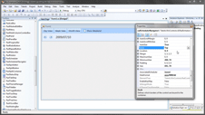
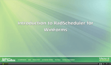
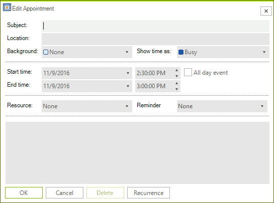
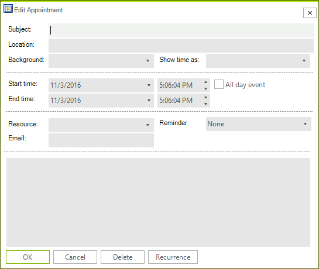

# Adding a Custom Field to the EditAppointment Dialog

| RELATED VIDEOS |  |
| ------ | ------ |
|[Adding Custom Fields to RadScheduler Appointmentss](http://www.telerik.com/videos/winforms/adding-custom-fields-to-radscheduler-for-winforms-appointments)   In this video, you will learn how to add custom fields to the RadScheduler for WinForms. You'll learn how to create the required classes, mappings, and dialogs that make it easy to integrate any custom data in a Scheduler appointment. (Runtime: 19:48)||
|[Introduction to RadScheduler for WinForms](http://www.telerik.com/videos/winforms/introduction-to-radscheduler-for-winforms-webinar) In this webinar, Telerik Developer Support Specialist Robert Shoemate will introduce RadScheduler and demonstrate how to utilize its powerful feature set in your own applications. By attending this webinar, you will learn about features such as codeless data binding, adding custom fields, and UI customization. (Runtime: 55:58)||

| RELATED BLOGS |  |
| ------ | ------ |
|Adding Custom Fields to RadScheduler AppointmentsWhen using RadScheduler for WinForms, it will almost always need to be customized in some way. This could come in the form of custom dialogs, context menus, or even custom appointments.In this blog entry, I am going to explain the steps required to add a custom field to RadScheduler [Read full post ...](  http://blogs.telerik.com/winformsteam/posts/10-04-02/adding_custom_fields_to_radscheduler_for_winforms_appointments.aspx )||

>caption Figure 1: Default Edit Appointment Dialog

The following tutorial will demonstrate how you can customize the default __EditAppointmentDialog__ (shown above) by adding a custom field to it. In our case, we are going to add an E-mail field. This field will not only exist in the dialog as a control, but will also be stored as a value in the custom appointment provided below.
        
Here is a step by step guide how to achieve that:

1\. First we have to create a new form (let's call it CustomAppointmentEditForm) which derives from __EditAppointmentDialog__ in order to extend the default scheduler’s dialog.

2\. Open the dialog in Design Time and add a label and a text box to under the Resource label and text box. Name the text box __txtEmail__

3\. Here is the form's implementation:
 
<snippet id='scheduler-customappointmenteditform-customappeditform-cs' />
<snippet id='scheduler-customappointmenteditform-customappeditform-vb' />

4\. Create a new appointment class (let's call it AppointmentWithEmail) which derives from the __Appointment__ class and add an Email property as shown:

<snippet id='scheduler-addingcustomfieldhelper-appwithmail-cs' />
<snippet id='scheduler-addingcustomfieldhelper-appwithmail-vb' />

5\. Create an appointment factory which returns our AppointmentWithEmail when creating appointments:

<snippet id='scheduler-addingcustomfieldhelper-customappfactory-cs' />
<snippet id='scheduler-addingcustomfieldhelper-customappfactory-vb' />

6\. Subscribe to the AppointmentEditDialogShowing event and in the event handler use the AppointmentEditDialog property of the event arguments to change the default dialog with the custom one you just created. For optimization, you can create a global variable, which can be reused, instead of creating a new instance of the form every time.
     
<snippet id='scheduler-addingcustomfield-showing-cs' />
<snippet id='scheduler-addingcustomfield-showing-vb' />

7\. Last, but not least we should assign the custom AppointmentFactory to our RadScheduler. This will come in handy when you create your appointments in-line:
            

<snippet id='scheduler-addingcustomfield-settingfactory-cs' />
<snippet id='scheduler-addingcustomfield-settingfactory-vb' />

>caption Figure 2: Custom Edit Appointment Dialog

>important As of **R1 2021** the EditAppointmentDialog provides UI for selecting multiple resources per appointment. In certain cases (e.g. unbound mode), the *Resource* **RadDropDownList** is replaced with a **RadCheckedDropDownList**. Otherwise, the default drop down with single selection for resources is shown. To enable the multiple resources selection in bound mode, it is necessary to specify the AppointmentMappingInfo. **Resources** property. The **Resources** property should be set to the name of the relation that connects the **Appointments** and the **AppointmentsResources** tables. 

#### EditAppointmentDialog with multiple resources

# See Also

* [Views]()
* [Data Binding Introduction]()
* [Formatting Appointments]()
* [Scheduler Element Provider]()
* [How to Display Multiple Resources in EditAppointmentDialog]()
