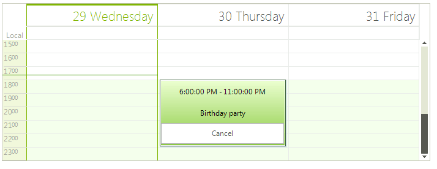

# Custom Appointment Element

**RadScheduler** allows you to create and use your own custom appointment elements. Thus, you can add the desired elements to fit your business need. In the following example, we will add two **LightVisualElements** to display the time interval and description and one **RadButtonElement** to cancel the appointment.

>caption Figure 1: Custom AppointmentElement 


 
1\. Let's start with creating a derivative of the **AppointmentElement** class. We will add the desired elements in the **CreateChildElements** method. The **Synchronize** method is the appropriate place to display the correct data in the custom elements in the **AppointmentElement**. It is also necessary to override the **DrawEventText** method and leave it empty in order to prevent drawing the default text.

{{source=..\SamplesCS\Scheduler\AppointmentsAndDialogues\CustomAppointmentElement.cs region=CustomElement}}
{{source=..\SamplesVB\Scheduler\AppointmentsAndDialogues\CustomAppointmentElement.vb region=CustomElement}}    
       
````C#
        
public class MyAppointmentElement : AppointmentElement
{
    public MyAppointmentElement(RadScheduler scheduler, SchedulerView view, IEvent appointment) : base(scheduler, view, appointment)
    {
    }
    
    StackLayoutElement panel = new StackLayoutElement();
    RadButtonElement button = new RadButtonElement();
    LightVisualElement timeInterval = new LightVisualElement();
    LightVisualElement description = new LightVisualElement();
    
    protected override void CreateChildElements()
    {
        base.CreateChildElements(); 
        
        panel.StretchHorizontally = true;
        panel.StretchVertically = true;
        panel.Orientation = Orientation.Vertical;
        panel.Children.Add(timeInterval);
        panel.Children.Add(description);
        panel.Children.Add(button);
        button.Click += button_Click;
        button.Text = "Cancel";
        panel.ShouldHandleMouseInput = false;
        panel.NotifyParentOnMouseInput = true;
        timeInterval.ShouldHandleMouseInput = false;
        timeInterval.NotifyParentOnMouseInput = true;
        description.ShouldHandleMouseInput = false;
        description.NotifyParentOnMouseInput = true;
        button.ShouldHandleMouseInput = true; 
    
        this.Children.Add(panel);
    }
    
    private void button_Click(object sender, EventArgs e)
    {
        this.Scheduler.Appointments.Remove(this.Appointment);
    }
    
    public override void Synchronize()
    {
        base.Synchronize(); 
        timeInterval.Text = this.Appointment.Start.ToLongTimeString() + " - " + this.Appointment.End.ToLongTimeString();
        description.Text = this.Appointment.Summary;
    }
    
    public override void DrawEventText(Telerik.WinControls.Paint.IGraphics graphics)
    {
        //leave the method empty to prevent the default appointment information to be drawn
    }
}

````
````VB.NET
    
Public Class MyAppointmentElement
Inherits AppointmentElement
    Public Sub New(scheduler As RadScheduler, view As SchedulerView, appointment As IEvent)
        MyBase.New(scheduler, view, appointment)
    End Sub
    Private panel As StackLayoutElement
    Private button As RadButtonElement
    Private timeInterval As LightVisualElement
    Private description As LightVisualElement
    Protected Overrides Sub CreateChildElements()
        MyBase.CreateChildElements()
        panel = New StackLayoutElement()
        button = New RadButtonElement()
        timeInterval = New LightVisualElement()
        description = New LightVisualElement()
        panel.StretchHorizontally = True
        panel.StretchVertically = True
        panel.Orientation = Orientation.Vertical
        panel.Children.Add(timeInterval)
        panel.Children.Add(description)
        panel.Children.Add(button)
        AddHandler button.Click, AddressOf button_Click
        button.Text = "Cancel"
        panel.ShouldHandleMouseInput = False
        panel.NotifyParentOnMouseInput = True
        timeInterval.ShouldHandleMouseInput = False
        timeInterval.NotifyParentOnMouseInput = True
        description.ShouldHandleMouseInput = False
        description.NotifyParentOnMouseInput = True
        button.ShouldHandleMouseInput = True
        Me.Children.Add(panel)
    End Sub
    Private Sub button_Click(sender As Object, e As EventArgs)
        Me.Scheduler.Appointments.Remove(Me.Appointment)
    End Sub
    Public Overrides Sub Synchronize()
        MyBase.Synchronize()
        timeInterval.Text = Me.Appointment.Start.ToLongTimeString() + " - " + Me.Appointment.[End].ToLongTimeString()
        description.Text = Me.Appointment.Summary
    End Sub
    Public Overrides Sub DrawEventText(graphics As Telerik.WinControls.Paint.IGraphics)
    'leave the method empty to prevent the default appointment information to be drawn
    End Sub
End Class

````

{{endregion}}

2\. Next, it is necessary to replace the default **AppointmentElement** with the custom class. For this purpose, it is necessary to create a [SchedulerElementProvider]() and override its **CreateElement<T>** method:

{{source=..\SamplesCS\Scheduler\AppointmentsAndDialogues\CustomAppointmentElement.cs region=CustomProvider}}
{{source=..\SamplesVB\Scheduler\AppointmentsAndDialogues\CustomAppointmentElement.vb region=CustomProvider}}    
       
````C#
        
public class MyElementProvider : SchedulerElementProvider
{
    public MyElementProvider(RadScheduler scheduler) : base(scheduler)
    {
    }
    
    protected override T CreateElement<T>(SchedulerView view, object context)
    {
        if (typeof(T) == typeof(AppointmentElement))
        {
            return new MyAppointmentElement(this.Scheduler, view, (IEvent)context)as T;
        }
        
        return base.CreateElement<T>(view, context);
    }
}

````
````VB.NET
    
Public Class MyElementProvider
Inherits SchedulerElementProvider
    Public Sub New(scheduler As RadScheduler)
        MyBase.New(scheduler)
    End Sub
    Protected Overrides Function CreateElement(Of T As SchedulerVisualElement)(view As SchedulerView, context As Object) As T
        If GetType(T) = GetType(AppointmentElement) Then
            Return TryCast(New MyAppointmentElement(Me.Scheduler, view, DirectCast(context, IEvent)), T)
        End If
        Return MyBase.CreateElement(Of T)(view, context)
    End Function
End Class

````

{{endregion}}

3\. Last, you should set the RadScheduler.**ElementProvider** property to a new instance of the custom provider:

{{source=..\SamplesCS\Scheduler\AppointmentsAndDialogues\CustomAppointmentElement.cs region=ReplaceElementProvider}}
{{source=..\SamplesVB\Scheduler\AppointmentsAndDialogues\CustomAppointmentElement.vb region=ReplaceElementProvider}}    
       
````C#
            
this.radScheduler1.ElementProvider = new MyElementProvider(this.radScheduler1);

````
````VB.NET
Me.RadScheduler1.ElementProvider = New MyElementProvider(Me.RadScheduler1)

````

{{endregion}}

# See Also

* [Scheduler Element Provider ]()


