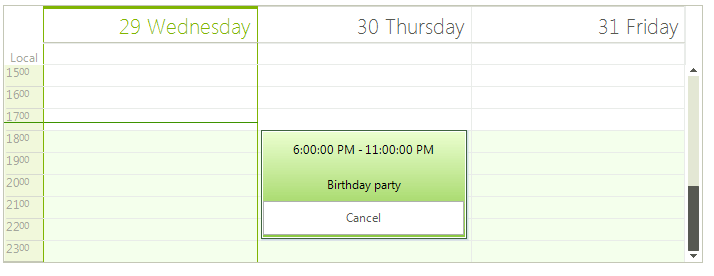

# Custom Appointment Element

**RadScheduler** allows you to create and use your own custom appointment elements. Thus, you can add the desired elements to fit your business need. In the following example, we will add two **LightVisualElements** to display the time interval and description and one **RadButtonElement** to cancel the appointment.

>caption Figure 1: Custom AppointmentElement 

 
1\. Let's start with creating a derivative of the **AppointmentElement** class. We will add the desired elements in the **CreateChildElements** method. The **Synchronize** method is the appropriate place to display the correct data in the custom elements in the **AppointmentElement**. It is also necessary to override the **DrawEventText** method and leave it empty in order to prevent drawing the default text.

<snippet id='scheduler-customappointmentelement-customelement-cs' />
<snippet id='scheduler-customappointmentelement-customelement-vb' />

2\. Next, it is necessary to replace the default **AppointmentElement** with the custom class. For this purpose, it is necessary to create a [SchedulerElementProvider]() and override its **CreateElement&lt;T&gt;** method:

<snippet id='scheduler-customappointmentelement-customprovider-cs' />
<snippet id='scheduler-customappointmentelement-customprovider-vb' />

3\. Last, you should set the RadScheduler.**ElementProvider** property to a new instance of the custom provider:

<snippet id='scheduler-customappointmentelement-replaceelementprovider-cs' />
<snippet id='scheduler-customappointmentelement-replaceelementprovider-vb' />

# See Also

* [Scheduler Element Provider ]()

