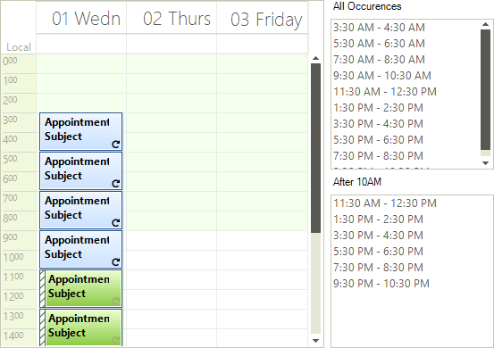

# Recurrence Rule Walkthrough

This example will create a single appointment, then define a recurrence rule that occurs every two hours for ten occurrences. In the example you will change the background and status for a subset of appointments that occur after 10AM.

>caption Figure 1: Recurring Appointment 

1\. In a new application, add a RadScheduler and two RadListControls to the form. Place the RadScheduler on the left half of the form and the two RadListControls on the right half of the form, one above the other. Name the  first list box "lcAll" and the second "lcAfter10".
            
2\. Add the code below to the form's Load Event handler:

<snippet id='scheduler-recurrencerulewalkthrough-addingandtraversing-cs' />
<snippet id='scheduler-recurrencerulewalkthrough-addingandtraversing-vb' />

3\. Run the application. Notice that the background and status for appointments after 10am are changed to reflect changes made to members of the collection returned by GetOccurrences().
            
# See Also

* [Workding With Recurring Appointments]()
* [Views]()
* [Data Binding Introduction]()
* [Formatting Appointments]()
* [Scheduler Element Provider]()
