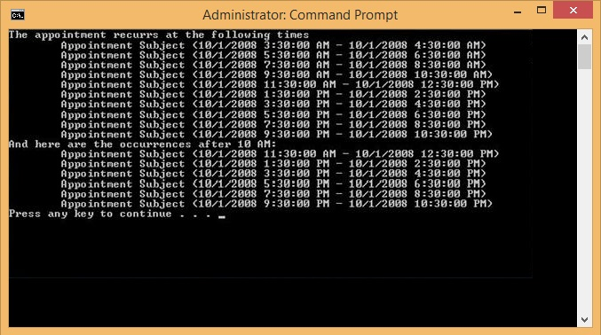

# Working with Recurring Appointments

__RadScheduler__ includes support for recurring events on minutely, hourly, weekly, daily, monthly and yearly basis. __Exceptions__ to the recurrence rules are also permitted. To support this recurrence behavior, the __IEvent__ interface (which the __Appointment__ class implements) includes the __RecurrenceRule__, __MasterEvent__, __Occurrences__ and __Exceptions__ properties. When an appointment is assigned a recurrence rule it becomes a recurring appointment.

If the user modifies an individual appointment occurrence, this creates an __exception__, sets its __MasterEvent__ property to the original recurring appointment and puts it in its __Exceptions__ collection so that no occurrence is generated for the exception occurrence. This way the exception is still linked to the original recurrence series.

The __RecurrenceRule__ class is the engine for creating and evaluating recurrence rules. It serves as a base class to several specialized classes and cannot be instantiated directly. The specialized classes are:

* MinutelyRecurrenceRule

* HourlyRecurrenceRule

* DailyRecurrenceRule

* WeeklyRecurrenceRule

* MonthlyRecurrenceRule

* YearlyRecurrenceRule

Using the specialized classes makes it easier to define recurrence rules because only relevant parameters are specified in their constructors.

## Recurring Appointments

One of several constructor overloads lets you set the start time, duration and number of occurences. Then the rule can be assigned to the appointments __RecurrenceRule__ property. The snippet below defines a rule that starts "now" and recurs every two hours and stops after the tenth occurence.

#### RecurrenceRule Property

{{source=..\SamplesCS\Scheduler\AppointmentsAndDialogues\RecurringAppointments.cs region=addingRecRule}} 
{{source=..\SamplesVB\Scheduler\AppointmentsAndDialogues\RecurringAppointments.vb region=addingRecRule}} 

````C#
radScheduler1.Appointments[0].RecurrenceRule = new HourlyRecurrenceRule(DateTime.Now, 2, 10);

````
````VB.NET
RadScheduler1.Appointments(0).RecurrenceRule = New HourlyRecurrenceRule(Date.Now, 2, 10)

````

{{endregion}} 

The Appointment __Occurrences__ property lets you iterate a list of __IEvent__ instances. To get only some occurrences between specific starting and stopping times, use the Appointment __GetOccurrences()__ method.

#### Retrieving Occurrences

{{source=..\SamplesCS\Scheduler\AppointmentsAndDialogues\RecurringAppointments.cs region=iterating}} 
{{source=..\SamplesVB\Scheduler\AppointmentsAndDialogues\RecurringAppointments.vb region=iterating}} 

````C#
// iterate all appointment occurrances
foreach (IEvent ev in recurringAppointment.Occurrences)
{
    //...
}
// iterate only occurrances after 10am
IEnumerable<IEvent> occurrencesAfter10AM = recurringAppointment.GetOccurrences(
 new DateTime(2008, 10, 1, 10, 0, 0), DateTime.Now);
foreach (IEvent ev in occurrencesAfter10AM)
{
    //...
}

````
````VB.NET
' iterate all appointment occurrances
For Each ev As IEvent In recurringAppointment.Occurrences
    '...
Next ev
' iterate only occurrances after 10am
Dim occurrencesAfter10AM As IEnumerable(Of IEvent) = recurringAppointment.GetOccurrences(New Date(2008, 10, 1, 10, 0, 0), Date.Now)
For Each ev As IEvent In occurrencesAfter10AM
    '...
Next ev

````

{{endregion}} 

When the user changes a specific occurrence and not the entire series, an "Exception" is created. "Exceptions" in this context refer to "Exceptions to a rule", not the .NET Exception class related to error handling. You can create exceptions programmatically by adding to the IEvent __MasterEvent.Exceptions__ collection. The snippet below changes the background and status of an IEvent instance and adds the IEvent to its own MasterEvent Exceptions collection.

#### Recurrence Rule Exception

{{source=..\SamplesCS\Scheduler\AppointmentsAndDialogues\RecurringAppointments.cs region=addingExceptions}} 
{{source=..\SamplesVB\Scheduler\AppointmentsAndDialogues\RecurringAppointments.vb region=addingExceptions}} 

````C#
myEvent.BackgroundId = (int)AppointmentBackground.Important;
myEvent.StatusId = (int)AppointmentStatus.Tentative;
myEvent.MasterEvent.Exceptions.Add(myEvent);

````
````VB.NET
myEvent.BackgroundId = CInt(Fix(AppointmentBackground.Important))
myEvent.StatusId = CInt(Fix(AppointmentStatus.Tentative))
myEvent.MasterEvent.Exceptions.Add(myEvent)

````

{{endregion}} 

## Examples

Here is an example using the __HourlyRecurrenceRule__ class:

#### Setting HourlyReccurrenceRule

{{source=..\SamplesCS\Scheduler\AppointmentsAndDialogues\RecurringAppointments.cs region=console}} 
{{source=..\SamplesVB\Scheduler\AppointmentsAndDialogues\RecurringAppointments.vb region=console}} 

````C#
// Create a sample appointment that starts at 10/1/2008 3:30 AM and lasts half an hour.
Appointment recurringAppointment = new Appointment(new DateTime(2008, 10, 1, 3, 30, 0),
      TimeSpan.FromHours(1.0), "Appointment Subject");
// Create a recurrence rule to repeat the appointment every 2 hours for 10 occurrences.
HourlyRecurrenceRule rrule = new HourlyRecurrenceRule(recurringAppointment.Start, 2, 10);
//Assign the hourly recurrence rule to the appointment
recurringAppointment.RecurrenceRule = rrule;
Console.WriteLine("The appointment recurrs at the following times");
foreach (IEvent ev in recurringAppointment.Occurrences)
{
    Console.WriteLine("\t{0}", ev);
}
IEnumerable<IEvent> occurrencesAfter10AM = recurringAppointment.GetOccurrences(
      new DateTime(2008, 10, 1, 10, 0, 0), DateTime.Now);
Console.WriteLine("And here are the occurrences after 10 AM:");
foreach (IEvent ev in occurrencesAfter10AM)
{
    Console.WriteLine("\t{0}", ev);
}

````
````VB.NET
' Create a sample appointment that starts at 10/1/2008 3:30 AM and lasts half an hour.
Dim recurringAppointment As New Appointment(New Date(2008, 10, 1, 3, 30, 0), TimeSpan.FromHours(1.0), "Appointment Subject")
' Create a recurrence rule to repeat the appointment every 2 hours for 10 occurrences.
Dim rrule As New HourlyRecurrenceRule(recurringAppointment.Start, 2, 10)
'Assign the hourly recurrence rule to the appointment
recurringAppointment.RecurrenceRule = rrule
Console.WriteLine("The appointment recurrs at the following times")
For Each ev As IEvent In recurringAppointment.Occurrences
    Console.WriteLine(vbTab & "{0}", ev)
Next ev
Dim occurrencesAfter10AM As IEnumerable(Of IEvent) = recurringAppointment.GetOccurrences(New Date(2008, 10, 1, 10, 0, 0), Date.Now)
Console.WriteLine("And here are the occurrences after 10 AM:")
For Each ev As IEvent In occurrencesAfter10AM
    Console.WriteLine(vbTab & "{0}", ev)
Next ev

````

{{endregion}} 

The __Occurrences__ property of the __Appointment__ class returns an enumerator that can be used to retrieve all the occurrences defined by the rule. Similarly the __GetOccurrences__ method of the __Appointment__ class can be used to retrieve all occurrences in a given interval. The example above produces the following output:

>caption Figure 1: Appointment Occurrences 


# See Also

* [Reccurrence Rule Walkthrough]()
* [Views]()
* [Data Binding Introduction]()
* [Formatting Appointments]()
* [Scheduler Element Provider]()
