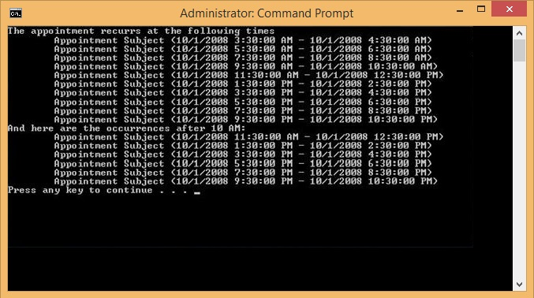

# Working with Recurring Appointments

__RadScheduler__ includes support for recurring events on minutely, hourly, weekly, daily, monthly and yearly basis. __Exceptions__ to the recurrence rules are also permitted. To support this recurrence behavior, the __IEvent__ interface (which the __Appointment__ class implements) includes the __RecurrenceRule__, __MasterEvent__, __Occurrences__ and __Exceptions__ properties. When an appointment is assigned a recurrence rule it becomes a recurring appointment.

If the user modifies an individual appointment occurrence, this creates an __exception__, sets its __MasterEvent__ property to the original recurring appointment and puts it in its __Exceptions__ collection so that no occurrence is generated for the exception occurrence. This way the exception is still linked to the original recurrence series.

The __RecurrenceRule__ class is the engine for creating and evaluating recurrence rules. It serves as a base class to several specialized classes and cannot be instantiated directly. The specialized classes are:

* MinutelyRecurrenceRule

* HourlyRecurrenceRule

* DailyRecurrenceRule

* WeeklyRecurrenceRule

* MonthlyRecurrenceRule

* YearlyRecurrenceRule

Using the specialized classes makes it easier to define recurrence rules because only relevant parameters are specified in their constructors.

## Recurring Appointments

One of several constructor overloads lets you set the start time, duration and number of occurences. Then the rule can be assigned to the appointments __RecurrenceRule__ property. The snippet below defines a rule that starts "now" and recurs every two hours and stops after the tenth occurence.

#### RecurrenceRule Property

<snippet id='scheduler-recurringappointments-addingrecrule-cs' />
<snippet id='scheduler-recurringappointments-addingrecrule-vb' />

The Appointment __Occurrences__ property lets you iterate a list of __IEvent__ instances. To get only some occurrences between specific starting and stopping times, use the Appointment __GetOccurrences()__ method.

#### Retrieving Occurrences

<snippet id='scheduler-recurringappointments-iterating-cs' />
<snippet id='scheduler-recurringappointments-iterating-vb' />

When the user changes a specific occurrence and not the entire series, an "Exception" is created. "Exceptions" in this context refer to "Exceptions to a rule", not the .NET Exception class related to error handling. You can create exceptions programmatically by adding to the IEvent __MasterEvent.Exceptions__ collection. The snippet below changes the background and status of an IEvent instance and adds the IEvent to its own MasterEvent Exceptions collection.

#### Recurrence Rule Exception

<snippet id='scheduler-recurringappointments-addingexceptions-cs' />
<snippet id='scheduler-recurringappointments-addingexceptions-vb' />

## Examples

Here is an example using the __HourlyRecurrenceRule__ class:

#### Setting HourlyReccurrenceRule

<snippet id='scheduler-recurringappointments-console-cs' />
<snippet id='scheduler-recurringappointments-console-vb' />

The __Occurrences__ property of the __Appointment__ class returns an enumerator that can be used to retrieve all the occurrences defined by the rule. Similarly the __GetOccurrences__ method of the __Appointment__ class can be used to retrieve all occurrences in a given interval. The example above produces the following output:

>caption Figure 1: Appointment Occurrences 

# See Also

* [Reccurrence Rule Walkthrough]()
* [Views]()
* [Data Binding Introduction]()
* [Formatting Appointments]()
* [Scheduler Element Provider]()
