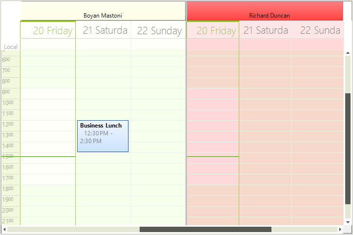
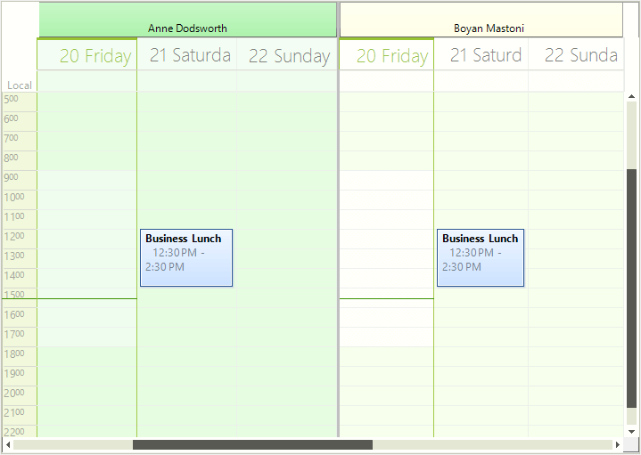
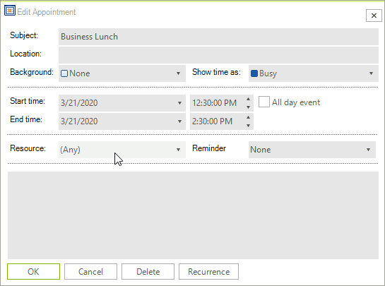

# Working with Resources

When **RadScheduler** is [grouped by resources](), it stores them in the **Resources** collection. Each **Resource** offers the following properties:

|Resource's properties|Description|Type|
|----|----|----|
|**Name**|Gets or sets the name of the resource.|*string*|
|**Id**|Gets or sets the id of the resource.|*EventId*|
|**Image**|Gets or sets the image of the resource.|*Image*|
|**Visible**|Gets or sets a value indicating whether this resource is visible.|*bool*|
|**Color**|Gets or sets the color that is associated with the resource.|*Color*|

One **Appointment** may refer to one or many resources. Each **Appoinment** offers two properties that allow managing its resource/resources:

* **ResourceId** - represents the **EventId** of the resource to which this appointment is associated.
* **ResourceIds** - represents an ObservableCollection of **EventId**s to which this appointment is associated.

>note Using the **EditAppointmentDialog** allows you to assign only a single resource for the appointment. If you want to specify which multiple resources exactly are applied, it can be set programmically to the Appointment via the **ResourcesIds** property. However, selecting *Any* from the dialog, will generate an event for all existing resources in **RadScheduler**.

#### Apply a single resource to an appointment

{{source=..\SamplesCS\Scheduler\Views\GroupingByResources.cs region=SingleResource}} 
{{source=..\SamplesVB\Scheduler\Views\GroupingByResources.vb region=SingleResource}} 

````C#
            Appointment appointment = new Appointment(DateTime.Today.AddDays(1).AddHours(12).AddMinutes(30), TimeSpan.FromHours(2), "Business Lunch");
            appointment.ResourceId = this.radScheduler1.Resources[2].Id;
            this.radScheduler1.Appointments.Add(appointment);

````
````VB.NET
        Dim appointment As Appointment = New Appointment(DateTime.Today.AddDays(1).AddHours(12).AddMinutes(30), TimeSpan.FromHours(2), "Business Lunch")
        appointment.ResourceId = Me.radScheduler1.Resources(2).Id
        Me.radScheduler1.Appointments.Add(appointment)

````

{{endregion}} 





#### Apply multiple resources to an appointment

{{source=..\SamplesCS\Scheduler\Views\GroupingByResources.cs region=MultipleResources}} 
{{source=..\SamplesVB\Scheduler\Views\GroupingByResources.vb region=MultipleResources}} 

````C#
            Appointment appointmentWithMultipleResources = new Appointment(DateTime.Today.AddDays(1).AddHours(12).AddMinutes(30), TimeSpan.FromHours(2), "Business Lunch");
            appointmentWithMultipleResources.ResourceIds.Add(this.radScheduler1.Resources[2].Id);
            appointmentWithMultipleResources.ResourceIds.Add(this.radScheduler1.Resources[1].Id);
            this.radScheduler1.Appointments.Add(appointmentWithMultipleResources);

````
````VB.NET
        Dim appointmentWithMultipleResources As Appointment = New Appointment(DateTime.Today.AddDays(1).AddHours(12).AddMinutes(30), TimeSpan.FromHours(2), "Business Lunch")
        appointmentWithMultipleResources.ResourceIds.Add(Me.radScheduler1.Resources(2).Id)
        appointmentWithMultipleResources.ResourceIds.Add(Me.radScheduler1.Resources(1).Id)
        Me.RadScheduler1.Appointments.Add(appointmentWithMultipleResources)

````

{{endregion}}



When multiple resources are associated with an appointment, the **Resource** field in the **EditAppointmentDialog** shows **Any**:



>important As of **R1 2021** the EditAppointmentDialog provides UI for selecting multiple resources per appointment. In certain cases (e.g. unbound mode), the *Resource* **RadDropDownList** is replaced with a **RadCheckedDropDownList**. Otherwise, the default drop down with single selection for resources is shown. To enable the multiple resources selection in bound mode, it is necessary to specify the AppointmentMappingInfo. **Resources** property. The **Resources** property should be set to the name of the relation that connects the **Appointments** and the **AppointmentsResources** tables. 

#### EditAppointmentDialog with multiple resources


            
# See Also

* [Working with Appointments]()
* [Grouping by Resources]()
* [How to Display Multiple Resources in EditAppointmentDialog]()
* [How to Show Columns in Resource Headers]()
