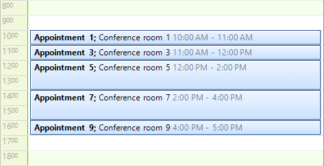
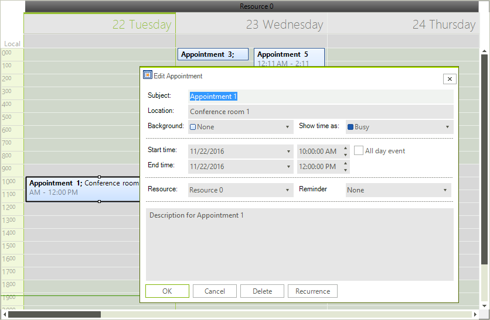
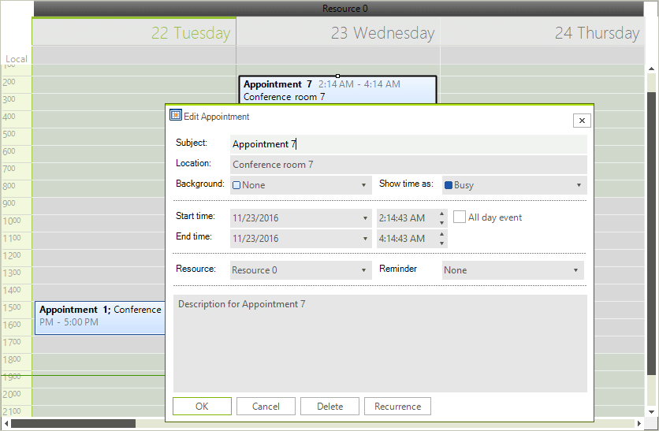

# Binding to Business Objects

What if your scheduling data originates from somewhere other than an easily accessible database? An API that accesses a legacy system or an email based system are two examples that might fit this description. __RadScheduler__ allows binding to objects of any arbitrary structure.

Binding to objects follows the same basic pattern as binding to database tables. You must assign a collection of objects to an instance of __SchedulerBindingDataSource__. You also need to define mappings so that the appointment data expected in the scheduler (Start, End, Subject, etc.) is satisfied by specific properties in the bound objects.

The code below is an example appointment. Keep in mind that the particular construction of the *CustomAppointment* class and the names of its properties are arbitrary. The mappings will decide where properties are used. Notice that the object implements the __INotifyPropertyChanged__ interface. Without this interface implementation the populated appointment object data will not show up in the scheduler.

#### Custom Appointment Class

<snippet id='scheduler-customappointment-customappointment-cs' />
<snippet id='scheduler-customappointment-customappointment-vb' />

To use your custom object, create CustomAppointment instances and place them in a generic list before mapping and binding to the __SchedulerBindingDataSource__ component.

#### Create Appointments

<snippet id='scheduler-bindingtobusinessobjects-bindingtolist-cs' />
<snippet id='scheduler-bindingtobusinessobjects-bindingtolist-vb' />

When you run the application, a series of CustomAppointment objects will show up in the scheduler.

>caption Figure 1: Custom Appointments

## Grouping by Resources

To use grouping by resource in this scenario, first you will need to create the business object that represents the resources:

#### Custom Resource Class

<snippet id='scheduler-bindingtobusinessobjects-createtheresourceobject-cs' />
<snippet id='scheduler-bindingtobusinessobjects-createtheresourceobject-vb' />

Now we need to bind the __ResourceProvider__ of __SchedulerBindingDataSource__ to a collection of __CustomResource__ objects:

#### Bind Resource Provider

<snippet id='scheduler-bindingtobusinessobjects-bind_the_resource_provider-cs' />
<snippet id='scheduler-bindingtobusinessobjects-bind_the_resource_provider-vb' />

Next we need to create the relation between appointments and resources. We can create either one-to-many relation or many-to-many relation. The following two sections cover each of these scenarios.

## One-to-many Relation

To create a one-to-many relation between appointments and resources we need to add a property of type __EventId__ to the business object that represents an appointment:

#### Define One-to-many Relation

<snippet id='scheduler-customappointment-customappointmentwithonetomanyrelation-cs' />
<snippet id='scheduler-customappointment-customappointmentwithonetomanyrelation-vb' />

To map the new property, add the following setting to your __AppointmentMappingInfo__ instance:

<snippet id='scheduler-bindingtobusinessobjects-onetomany1-cs' />
<snippet id='scheduler-bindingtobusinessobjects-onetomany1-vb' />

>note In this scenario you should __not__ set the __Resources__ property of the __AppointmentMappingInfo__ 
>

#### Set Resource

<snippet id='scheduler-bindingtobusinessobjects-onetomany2-cs' />
<snippet id='scheduler-bindingtobusinessobjects-onetomany2-vb' />

To test this scenario, assign each appointment with a __ResourceId__ and enable grouping by setting RadScheduler’s __GroupType__ property:

#### Group By Resource

<snippet id='scheduler-bindingtobusinessobjects-onetomany3-cs' />
<snippet id='scheduler-bindingtobusinessobjects-onetomany3-vb' />

>caption Figure 2: One-to-Many Relation

## Many-to-many Relation

This scenario can be implemented similarly to the previous one. Instead of the __ResourceId__ property, we should add a __Resources__ property which represents a collection of __EventId__ objects:

#### Define Many-to-many Relation

<snippet id='scheduler-customappointment-customappointmentwithmanytomanyrelation-cs' />
<snippet id='scheduler-customappointment-customappointmentwithmanytomanyrelation-vb' />

In the __AppointmentMappingInfo__ settings the __ResourceId__ property should be left unset and the __Resources__ property should be set with the name of the collection:

#### Set Resources

<snippet id='scheduler-bindingtobusinessobjects-manytomany1-cs' />
<snippet id='scheduler-bindingtobusinessobjects-manytomany1-vb' />

Now we can add a resource to an appointment by adding its id in the __Resources__ collection of our business objects:

<snippet id='scheduler-bindingtobusinessobjects-manytomany2-cs' />
<snippet id='scheduler-bindingtobusinessobjects-manytomany2-vb' />

>caption Figure 3: Many-to-Many Relation

# See Also

* [Design Time]()
* [Views]()
* [Scheduler Mapping]()
* [Working with Resources]()
* [setting Appointments and Resources Relations]()

