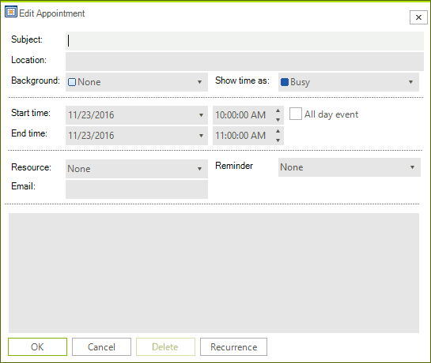

# Binding to Custom Fields

__RadScheduler__ has full support for binding to custom fields i.e. __RadScheduler__ can be bound to an email field in your data source. The process consists of five steps:      

1. Add your custom field to your data source.

1. Add a custom appointment class that stores this additional data. Note: *The easiest way to do that is to inherit from the Appointment class that RadScheduler uses by default*.

<snippet id='scheduler-addingcustomfieldhelper-appwithmail-cs' />
<snippet id='scheduler-addingcustomfieldhelper-appwithmail-vb' />

3\. Implement a simple appointment factory and inherit from the default appointment dialog and add some input controls and logic for your custom field. The easiest way to do the latter is to create a form in Visual Studio that inherits from the standard *Edit Appointment *dialog, then open it in the designer, and add your custom UI. The extended form from the example is shown on the screenshot below (notice the Email field on it):

>caption Figure 1: Appointment with a Custom Field

<snippet id='scheduler-addingcustomfieldhelper-customappfactory-cs' />
<snippet id='scheduler-addingcustomfieldhelper-customappfactory-vb' />

<snippet id='scheduler-customappointmenteditform-customappeditform-cs' />
<snippet id='scheduler-customappointmenteditform-customappeditform-vb' />

4\. You should assign the custom AppointmentFactory to RadScheduler:

<snippet id='scheduler-bindingtocustomfields-customfactory-cs' />
<snippet id='scheduler-bindingtocustomfields-customfactory-vb' />

5\. You need to handle the AppointmentEditDialogShowing event of RadScheduler in order to replace the default appointment dialog with a custom one. You will also have to give an instance of your appointment factory to the RadScheduler so it can create instances of your custom appointment class:            

<snippet id='scheduler-bindingtocustomfields-loadandshowing-cs' />
<snippet id='scheduler-bindingtocustomfields-loadandshowing-vb' />

6\. Finally, you have to add a mapping for your custom field to the appointment mapping info. Note that the same appointment factory instance is assigned to the event provider.

<snippet id='scheduler-bindingtocustomfields-mappings-cs' />
<snippet id='scheduler-bindingtocustomfields-mappings-vb' />

# See Also

* [Design Time]()
* [Views]()
* [Scheduler Mapping]()
* [Working with Resources]()
* [setting Appointments and Resources Relations]()

