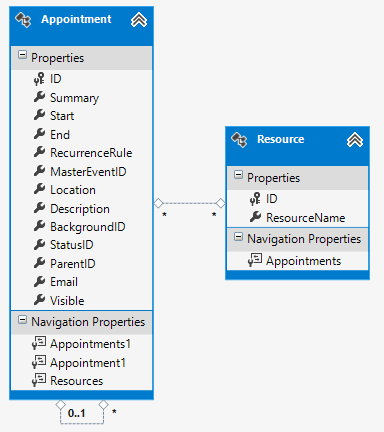

# Binding to EntityFramework and Telerik Data Access

Binding to an ORM is similar to binding to a [DataSet](). First you will need to create the models out of an existing database. You can read how to do that for Entity Framework [here](http://msdn.microsoft.com/en-us/data/jj206878.aspx). And for Telerik Data Access [here](http://docs.telerik.com/data-access/getting-started/getting-started-root-generating-model-mappings-taking-database-first-approach).

For the purpose of this tutorial you can download a sample database from the [ here]( http://www.telerik.com/docs/default-source/ui-for-winforms/schedulerdatasql.zip).

After you have mapped your database to local entities your tables should look like this:

>caption Figure 1: Tables Mapped by the ORM

Now, you need to create a form and add a RadScheduler, in this tutorial it is named *scheduler*. After this we will need to access out data from the database. For this we will need a [DbContext](http://msdn.microsoft.com/en-us/library/system.data.entity.dbcontext(v=vs.113).aspx) reference. In my case my DbContext is of type __SchedulerDataEntities1__, so we can create it as follows:

#### Create DbContext

<snippet id='scheduler-bindingtoentityframeworkandtelerikdataaccess-dbcontext-cs' />
<snippet id='scheduler-bindingtoentityframeworkandtelerikdataaccess-dbcontext-vb' />

Then, we will need a __SchedulerBindingDataSource__, __AppointmentMappingInfo__ and __ResourceMappingInfo__ which we will use to map our data. You can create them in the Form's constructor.

#### Data Source Objects

<snippet id='scheduler-bindingtoentityframeworkandtelerikdataaccess-mappings-cs' />
<snippet id='scheduler-bindingtoentityframeworkandtelerikdataaccess-mappings-vb' />

Now you just need to setup the mappings. The approaches for *Entity Framework* and *Telerik Data Access* are a bit different.

#### Create Mappings for Entity Framework

Below you can see the code you need to use with *Entity Framework*:

<snippet id='scheduler-bindingtoentityframeworkandtelerikdataaccess-efcode-cs' />
<snippet id='scheduler-bindingtoentityframeworkandtelerikdataaccess-efcode-vb' />

>important In order to use the __Load__ extension method you need to add *System.Data.Entity* to your usings(C#) or Imports(VB).
>

And the following code needs to be used with *Telerik Data Access*:

#### Create Mappings for DataAccess

<snippet id='scheduler-bindingtoentityframeworkandtelerikdataaccess-tdacode-cs' />
<snippet id='scheduler-bindingtoentityframeworkandtelerikdataaccess-tdacode-vb' />

The last step that you need to take in order to complete the binding process is to assign the DataSource property of __RadScheduler__ and group it by resource:

#### Set Data Source

<snippet id='scheduler-bindingtoentityframeworkandtelerikdataaccess-datasourceandgroup-cs' />
<snippet id='scheduler-bindingtoentityframeworkandtelerikdataaccess-datasourceandgroup-vb' />

>important As of **R1 2021** the EditAppointmentDialog provides UI for selecting multiple resources per appointment. In certain cases (e.g. unbound mode), the *Resource* **RadDropDownList** is replaced with a **RadCheckedDropDownList**. Otherwise, the default drop down with single selection for resources is shown. To enable the multiple resources selection in bound mode, it is necessary to specify the AppointmentMappingInfo. **Resources** property. The **Resources** property should be set to the name of the relation that connects the **Appointments** and the **AppointmentsResources** tables. 

#### EditAppointmentDialog with multiple resources

Saving changes to the database happens when the __SaveChanges__ method of the DbContext is invoked. You can invoke it on a button click or when the form is closing:

#### Save Changes

<snippet id='scheduler-bindingtoentityframeworkandtelerikdataaccess-closing-cs' />
<snippet id='scheduler-bindingtoentityframeworkandtelerikdataaccess-closing-vb' />

# See Also

* [Design Time]()
* [Views]()
* [Scheduler Mapping]()
* [Working with Resources]()
