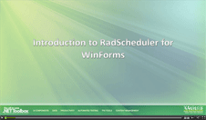
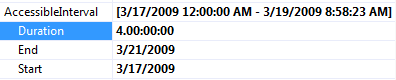

# Introduction

| RELATED VIDEOS |  |
| ------ | ------ |
|[Codeless Data Binding with RadScheduler for WinForms](http://tv.telerik.com/watch/winforms/radscheduler/codeless-data-binding-with-radscheduler-winforms) In this video, you will learn how to use the SchedulerBindingDataSource with the RadScheduler for WinForms to quickly and codelessly data bind a RadScheduler. You will also be introduced to the RadSchedulerNavigator, a simple control that makes it easy for users navigate a RadScheduler. (Runtime: 07:04)|
|[Introduction to RadScheduler for WinForms](http://tv.telerik.com/watch/winforms/radscheduler/introduction-radscheduler-winforms)  In this webinar, Telerik Developer Support Specialist Robert Shoemate will introduce RadScheduler and demonstrate how to utilize its powerful feature set in your own applications. By attending this webinar, you will learn about features such as codeless data binding, adding custom fields, and UI customization. (Runtime: 55:58)||

| RELATED BLOGS |
| ------ |
| __Data Binding with RadScheduler for WinForms__  RadScheduler for WinForms is highlycustomizable component that offers functionality similar tothat of the Calendar included with MS Outlook. When working with RadScheduler, developers can easily bind data sources directly to it using an instance of SchedulerBindingDataSource. The provided data source can be in the form of a database or business objects. The only requirement is that the data source must conform to a specific structure and provide specific fields. [Read full post ...](http://blogs.telerik.com/winformsteam/posts/10-04-01/data_binding_with_radscheduler_for_winforms.aspx)|
| __RadScheduler for WinForms data binding and occurrence exceptions__   The big [new] feature for R3 2009 release in RadScheduler for WinForms has got to be the resource grouping functionality. There are, however, numerous other improvements that also deserve attention, such as data binding. Some of you may remember that in its first release the WinForms Scheduler had just basic support for binding to appointment data. Later we extended this functionality to support storing associations to resources in the data source. [Read full post ...](http://blogs.telerik.com/winformsteam/posts/09-11-04/radscheduler-for-winforms-data-binding-and-occurrence-exceptions.aspx)|

__RadScheduler__ uses a data source provider model for data binding that targets highly customizable information storage and retrieval. For example, the information that defines the events has an obligatory part - a subject, a start time, and an end time entries, and customizable properties like recurrence rule, location, etc. It can also include fields for any custom resources and  attributes you want to include. If you are including custom properties, you  must map them to scheduler properties using the __SchedulerMapping__ class. You can also bind the scheduler to a  data source using a specific SchedulerDataSource (like the __SchedulerBindingDataSource__).

The most important property aside from those dealing with data binding is __ActiveViewType__ which can be __Day__, __MultiDay__, __Week__, __WorkWeek__ or __Month__. Like __RadCalendar__, the __FocusedDate__ is a DateTime that determines the visible day, week or month currently displayed in the scheduler.

Here are some of the other helpful properties that can be set at design time:

* __AccessibleInterval__ is a the duration of time that the user is allowed to use.

>note The active view cannot be changed if the new view is not in the accessible interval.
>

* __AppointmentTitleFormat__ is fed to a String.Format() call and supplies parameters for Start, End, Subject and Location in that order. So for example you could assign a string with a format like this: Starts: {0} Ends: {1} Subject: {2} Location: {3}

* __AllowAppointmentMove__ and __AllowAppointmentResize__ control if the user can drag or resize an appointment at runtime.

* To toggle visibility of appointment status, all day appointment status and navigation elements use the __ShowAppointmentStatus__, __ShowAllDayAppointmentStatus__ and __ShowNavigationElements__ properties.

# See Also

* [Design Time]()
* [Element Provider]()
* [Views]()
* [Scheduler Data Binding Tutorial]()
