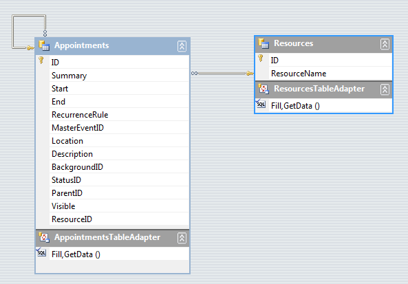
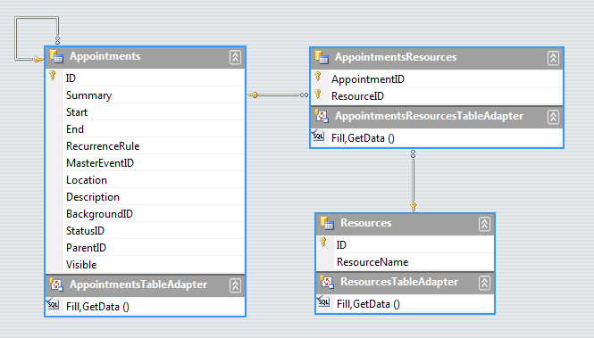
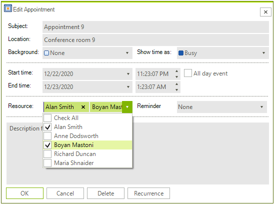

# Setting Appointment and Resource Relations

## One to Many Relations

This covers the case of assigning a single resource to many appointments. When you have a two table relation (one to many) then you should have an *Appointments* and a *Resources* tables. *Appointments* should have a field name that relates to the *Resources* table id (for example __ResourceId__). If you set a resource to the appointment, the __ResourceId__ field should be updated with the correct value. For __AppointmentMappingInfo__ you should set the __ResourceId__ field with the column name that contains the resosurce id (the __ResourceId__ column in the picture below). The *Resources* field of the __AppointmentMappingInfo__ should NOT be set to anything.

>caption Figure 1: One to Many Relation

Additionally, since the type of the __ResourceId__ property in the __Appointment__ class is of type __EventId__ but in the database it is stored as an integer, you should create the following convert methods:

#### Convert Methods

<snippet id='scheduler-settingappointmentandresourcerelations-sample-cs' />
<snippet id='scheduler-settingappointmentandresourcerelations-sample-vb' />

>important A common case is that the resource_id field is stored as an integer field in your DataSource. But **RadScheduler** needs **EventId** type. You can have a look at the Appointment.**ResourceId** property which expects **EventId** value, not an integer. That is why it is necessary to use a **SchedulerMapping** in this case and convert the integer value to **EventId** used by **RadScheduler** and convert the **EventId** to an integer used by your **DataSource**. This conversion is performed by the **ConvertToDataSource** and **ConvertToScheduler** callbacks. Additional information for the **SchedulerMapping** is available [here]()

## Many to Many Relations

This covers the case of assigning many resources to many appointments. When you have relations between three tables (many to many) then you should have three tables: *Appointments*, *Resources* and  *AppointmentsResources*. *AppointmentResouces* should have two field names: one for the id of the appointment (__AppointmentId__), and one for id of the resource (__ResourceId__). Here we should have two relations: one between *Appointments* and *AppointmentsResources*, and one between *Resources* and *AppointmentsResources*.

For the __AppointmentMappingInfo__ you should set the __ResourceId__ property to the __ResourceId__ field name in the *AppointmentsResources* table, and for the __Resources__ you should set the name of the relation between *AppointmentsResources *and *Appointments*. When you associate the resource to the appointment, a new record will be added to *AppointmentsResources* if there is not such.

This scenario is also demonstrated in the [Data Binding Walkthrough article]().

>caption Figure 2: Many to Many Relation

>important As of **R1 2021** the EditAppointmentDialog provides UI for selecting multiple resources per appointment. In certain cases (e.g. unbound mode), the *Resource* **RadDropDownList** is replaced with a **RadCheckedDropDownList**. Otherwise, the default drop down with single selection for resources is shown. To enable the multiple resources selection in bound mode, it is necessary to specify the AppointmentMappingInfo. **Resources** property. The **Resources** property should be set to the name of the relation that connects the **Appointments** and the **AppointmentsResources** tables. 

#### EditAppointmentDialog with multiple resources

# See Also

* [Design Time]()
* [Views]()
* [Scheduler Mapping]()
* [Working with Resources]()
