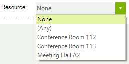
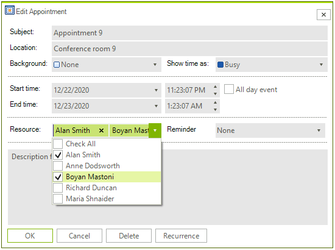

# Working with Resources

## Overview

For the end-user, __RadScheduler__ resources can be company resources, such as conference rooms, vehicles, laptops, or AV equipment, which can be booked and assigned to a particular event.

## Binding the Resources Collection

See the [Using DataSource property]() and [Binding to Business Objects]() topics on how to bind the Resources Collection.

>note If the data bound object is a list of appointments, set the __Resources__ property of the AppointmentMappingInfo object to "Resources".
>Do not set the __Resources__ property of the AppointmentMappingInfo object to "Resources" if the data bound object has a property that has no Resources collection, but has only a __ResourceId__ property.
>

## Adding Resources Manually

To add resources to RadScheduler's Resource drop down (visible in the appointment dialog by default), you need to use the __Resources__ collection's __Add__ method and to pass a new __Resource__ instance. Pass a unique ID and a description in the constructor:

>note A Resource object also has an __Image__ property that is not displayed as of this writing. In the near future, resource images will be displayed by the scheduler in the resource selection control.
>

#### Adding Resources

{{source=..\SamplesCS\Scheduler\AppointmentsAndDialogues\WorkingWithResources.cs region=loadResources}} 
{{source=..\SamplesVB\Scheduler\AppointmentsAndDialogues\WorkingWithResources.vb region=loadResources}} 

````C#
private void LoadResources()
{
    string[] descriptions = { "Conference Room 112", "Conference Room 113", "Meeting Hall A2" };
    int count = 1;
    foreach (string description in descriptions)
    {
        this.radScheduler1.Resources.Add(new Resource(count++, description));
    }
}

````
````VB.NET
Private Sub LoadResources()
    Dim descriptions() As String = {"Conference Room 112", "Conference Room 113", "Meeting Hall A2"}
    Dim count As Integer = 1
    For Each description As String In descriptions
        Me.RadScheduler1.Resources.Add(New Telerik.WinControls.UI.Resource(count, description))
        count += 1
    Next description
End Sub

````

{{endregion}} 

>caption Figure 1: Added Resources



>important As of **R1 2021** the EditAppointmentDialog provides UI for selecting multiple resources per appointment. In certain cases (e.g. unbound mode), the *Resource* **RadDropDownList** is replaced with a **RadCheckedDropDownList**. Otherwise, the default drop down with single selection for resources is shown. To enable the multiple resources selection in bound mode, it is necessary to specify the AppointmentMappingInfo. **Resources** property. The **Resources** property should be set to the name of the relation that connects the **Appointments** and the **AppointmentsResources** tables. 

#### EditAppointmentDialog with multiple resources



# See Also

* [Design Time]()
* [Views]()
* [Scheduler Mapping]()
* [setting Appointments and Resources Relations]()
