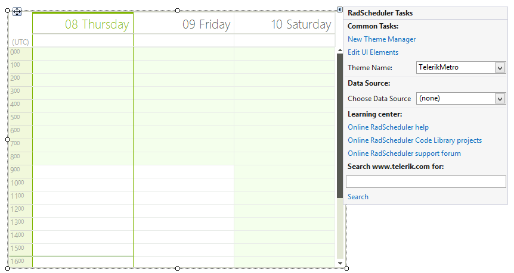
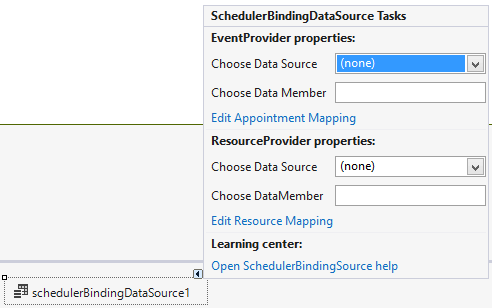

# Smart Tag

In this article we will describe the design time abilities of __RadScheduler__ and the __SchedulerBindingDataSource__ object provided by their Smart Tag.

## RadScheduler

Here is how the control's Smart Tag looks like:

>caption Figure 1: RadScheduler Smart Tag

* __Common Tasks__

	* __New Theme Manager__: Adds a new __RadThemeManager__ component to the form.

	* __Edit UI elements__: Opens a dialog that displays the *Element Hierarchy Editor*. This editor lets you browse all the elements in the control.

	* __Theme Name__: Select a theme name from the drop down list of themes available for that control. Selecting a theme allows you to change all aspects of the controls visual style at one time.

* __Data Source__

	* __Choose Data Source__: Expects a __SchedulerBindingDataSource__ instance.

## SchedulerBindingDataSource

The __SchedulerBindingDataSource__ object can be dragged onto the form straight from the Visual Studio designer. It provides __RadScheduler__ specific actions and one needs to work with it in order to perform a design-time data binding.

* __Event Provider Properties__

	* __Choose Data Source__: Specifies the data source object of the appointments.

	* __Choose Data Member__: Specifies the data member of the appointments data source object.

	* __Edit Appointment Mappings__: Maps the properties coming from the data source to __RadScheduler__ appointment properties.

* __Resource Provider Properties__

	* __Choose Data Source__: Specifies the data source object of the resources.

	* __Choose Data Member__: Specifies the data member of the resources data source object.

	* __Edit Resource Mappings__: Maps the properties coming from the data source to __RadScheduler__ resource properties.

>caption Figure 2: SchedulerBindingDataSource Smart Tag

Complete tutorials on how data binding can be setup at design time are availalble in the following articles: [Data Binding Walkthrough]() and [Codeless Data Binding]().

# See Also

* [Views]()
* [Codeless Data Binding]()
* [Data Binding Walkthrough]()
* [Element Provider]()
* [Element Hierarchy Editor]()
