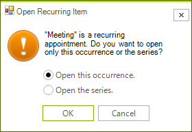
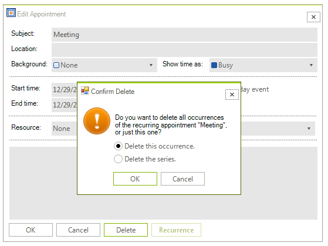
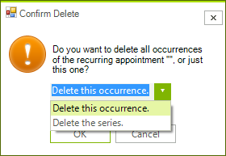

# DeleteRecurringAppointmentDialog

The **DeleteRecurringAppointmentDialog** is shown when you try to delete a recurring appointment.

>caption Figure 1. DeleteRecurringAppointmentDialog

It will pop up when you press the `Delete` key while a recurring appointment is selected. Alternatively, you can show it by pressing the **Delete** button in the **EditAppointmentDialog** while editing a single occurrence.

>caption Figure 2. Delete button in the EditAppointmentDialog

## Create a custom DeleteRecurringAppointmentDialog

You can extend the default **DeleteRecurringAppointmentDialog** and add custom fields or replace some of the existing ones. Alternatively, you can create a completely new dialog according to any specific requirements. For this purpose, it is necessary to create a class that inherits **RadSchedulerDialog** and implements the **IDeleteRecurringAppointmentDialog** interface. The **IDeleteRecurringAppointmentDialog** interface requires implementing the following methods and properties:
*  DialogResult **ShowDialog**() 
*  string **EventName**
*  bool **DeleteSeries**
*  string **ThemeName**

As a derivative of **RadSchedulerDialog** which inherits **RadForm**, the **ShowDialog** method and the **ThemeName** property are already available. It is left to implement the **EventName** and **DeleteSeries** properties. 

In the following example, we will create a derivative of the **DeleteRecurringAppointmentDialog** which contains **RadDropDownList** instead of two **RadRadioButton** controls for choosing to delete the occurrence/series.

>caption Figure 3. Custom DeleteRecurringAppointmentDialog

<snippet id='scheduler-customdeleterecurringappointmentdialog-mydeleterecurringappointmentdialog-cs' />
<snippet id='scheduler-customdeleterecurringappointmentdialog-mydeleterecurringappointmentdialog-vb' />

Now, you can replace the default **DeleteRecurringAppointmentDialog** with the custom one by using the RadScheduler.**RecurrenceDeleteDialogShowing** event:

<snippet id='scheduler-schedulercustomdialogs-replacedefaultdeleterecurringappointmentdialog-cs' />
<snippet id='scheduler-schedulercustomdialogs-replacedefaultdeleterecurringappointmentdialog-vb' />

