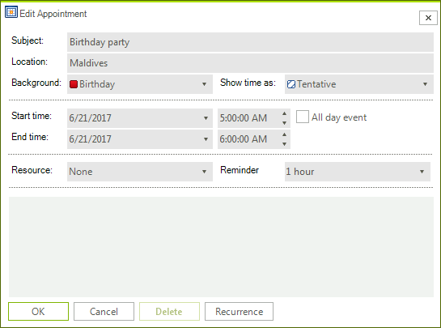
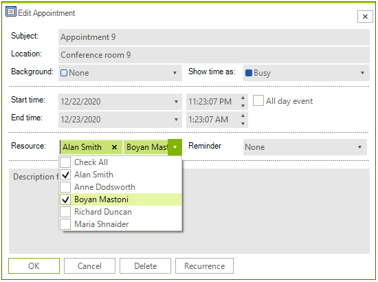
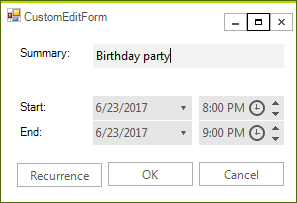

# EditAppointmentDialog

The **EditAppointmentDialog** is shown when you try to add a new appointment or start editing an existing one.

>caption Figure 1. EditAppointmentDialog



It will pop up when you double click an empty cell or an existing appointment. Alternatively, you can show it by using the default context menu. 

>important As of **R1 2021** the EditAppointmentDialog provides UI for selecting multiple resources per appointment. In certain cases (e.g. unbound mode), the *Resource* **RadDropDownList** is replaced with a **RadCheckedDropDownList**. Otherwise, the default drop down with single selection for resources is shown. To enable the multiple resources selection in bound mode, it is necessary to specify the AppointmentMappingInfo. **Resources** property. The **Resources** property should be set to the name of the relation that connects the **Appointments** and the **AppointmentsResources** tables.  

#### EditAppointmentDialog with multiple resources




# Create a custom EditAppointmentDialog

You can extend the default **EditAppointmentDialog** and add custom fields following the approach in this help article: [Adding a Custom Field to the EditAppointment Dialog]().

Alternatively, you can create a completely new dialog according to any specific requirements. For this purpose, it is necessary to create a class that inherits **RadSchedulerDialog** and implements the **IEditAppointmentDialog** interface. The **IEditAppointmentDialog** interface requires implementing the following methods and events:
* void **ShowRecurrenceDialog**()
* DialogResult **ShowDialog**()
* bool **EditAppointment**(IEvent appointment, ISchedulerData schedulerData)
* event EventHandler **Shown**

As a derivative of **RadSchedulerDialog** which inherits **RadForm**, the **ShowDialog** method and **Shown** event are already available. It is left to implement the **ShowRecurrenceDialog** and **EditAppointment** methods. You can find below a sample implementation of the edit dialog which contains a few controls to modify the summary, start/end date and time of the appointment.

>caption Figure 2. Custom edit dialog



{{source=..\SamplesCS\Scheduler\Dialogs\CustomEditForm.cs region=CustomEditDialog}}
{{source=..\SamplesVB\Scheduler\Dialogs\CustomEditForm.vb region=CustomEditDialog}}    
       
````C#
    
public partial class CustomEditForm : RadSchedulerDialog, IEditAppointmentDialog
{
    public CustomEditForm()
    {
        InitializeComponent();
    }
    
    bool editOccurrence = false;
    IOpenRecurringAppointmentDialog openRecurringAppointmentDialog = null;
    IEvent appointment;
    ISchedulerData schedulerData;
    IEvent recurringAppointment;
    bool saveRecurringAppointment = false;
    
    public bool EditAppointment(Telerik.WinControls.UI.IEvent appointment, Telerik.WinControls.UI.ISchedulerData schedulerData)
    {
        this.editOccurrence = false;
        this.schedulerData = schedulerData;
        this.appointment = appointment;
        
        if (appointment != null && appointment.MasterEvent != null)
        {
            if (this.openRecurringAppointmentDialog == null)
            {
                this.openRecurringAppointmentDialog = new OpenRecurringAppointmentDialog();
            }
            this.openRecurringAppointmentDialog.ThemeName = this.ThemeName;
            this.openRecurringAppointmentDialog.EventName = appointment.Summary;
            
            DialogResult result = this.openRecurringAppointmentDialog.ShowDialog();
            if (result != DialogResult.OK)
            {
                return false;
            }
            
            this.editOccurrence = this.openRecurringAppointmentDialog.EditOccurrence;
            if (!this.editOccurrence)
            {
                //if you edit the entire series, modify the master event, not the occurence
                this.appointment = appointment.MasterEvent;
            }
        }
        
        return true;
    }
    
    private bool RecurrenceSettingsShouldBeSaved()
    {
        return this.saveRecurringAppointment && this.recurringAppointment != null;
    }
    
    protected override void OnLoad(EventArgs e)
    {
        base.OnLoad(e);
        //load the data to the respective controls
        this.saveRecurringAppointment = false;
        this.recurrenceButton.Enabled = this.appointment.MasterEvent == null;
        this.dateStart.Value = appointment.Start;
        this.dateEnd.Value = appointment.End;
        this.timeStart.Value = appointment.Start;
        this.timeEnd.Value = appointment.End;
        this.summaryTextBox.Text = this.appointment.Summary;
    }
    
    public void ShowRecurrenceDialog()
    {
        RadScheduler scheduler = this.schedulerData as RadScheduler;
        if (this.recurringAppointment == null)
        {
            this.recurringAppointment = scheduler != null ? scheduler.AppointmentFactory.CreateNewAppointment() : new Appointment();
        }
        
        DateTime targetEventStart = this.GetAppointmentStart();
        DateTime targetEventEnd = this.GetAppointmentEnd();
        
        if (scheduler != null)
        {
            targetEventStart = scheduler.SystemTimeZone.OffsetTime(targetEventStart, scheduler.ActiveView.DefaultTimeZone);
            targetEventEnd = scheduler.SystemTimeZone.OffsetTime(targetEventEnd, scheduler.ActiveView.DefaultTimeZone);
        }
        
        this.recurringAppointment.Start = targetEventStart;
        this.recurringAppointment.End = targetEventEnd;
        this.recurringAppointment.AllDay = this.appointment.AllDay;
        
        if (!this.RecurrenceSettingsShouldBeSaved() && this.appointment.RecurrenceRule != null)
        {
            this.recurringAppointment.RecurrenceRule = this.appointment.RecurrenceRule.Clone();
        }
        IEditRecurrenceDialog editRecurrenceDialog = new EditRecurrenceDialog(recurringAppointment, this.schedulerData);
        DialogResult result = editRecurrenceDialog.ShowDialog();
        if (result == DialogResult.OK)
        {
            this.saveRecurringAppointment = true;
            DateTime recurringAppointmentStart = this.recurringAppointment.Start;
            DateTime recurringAppointmentEnd = this.recurringAppointment.End;
            if (scheduler != null)
            {
                recurringAppointmentStart = scheduler.ActiveView.DefaultTimeZone.OffsetTime(recurringAppointmentStart, scheduler.SystemTimeZone);
                recurringAppointmentEnd = scheduler.ActiveView.DefaultTimeZone.OffsetTime(recurringAppointmentEnd, scheduler.SystemTimeZone);
            }
        }
    }
    
    private DateTime GetAppointmentStart()
    {
        DateTime startDate = this.dateStart.Value.Date;
        
        if (!(this.appointment.AllDay))
        {
            TimeSpan startTime = this.timeStart.Value.Value.TimeOfDay;
            startDate = startDate.Add(startTime);
        }
        
        return startDate;
    }
    
    private DateTime GetAppointmentEnd()
    {
        DateTime endDate = this.dateEnd.Value.Date;
        TimeSpan endTime = !this.appointment.AllDay ? this.timeEnd.Value.Value.TimeOfDay : TimeSpan.Zero;
        endDate = endDate.Add(endTime);
        return endDate;
    }
    
    private void recurrenceButton_Click(object sender, EventArgs e)
    {
        this.ShowRecurrenceDialog();
    }
    
    private void okButton_Click(object sender, EventArgs e)
    {
        if (this.RecurrenceSettingsShouldBeSaved())
        {
            this.appointment.RecurrenceRule = this.recurringAppointment.RecurrenceRule;
            if (this.appointment.RecurrenceRule == null)
            {
                this.appointment.Exceptions.Clear();
            }
        }
        
        if (this.editOccurrence)
        {
            if (this.appointment.MasterEvent != null)
            {
                this.appointment.MasterEvent.AddOccurrenceException(appointment, true);
            }
        }
        
        this.appointment.Summary = this.summaryTextBox.Text;
        this.appointment.Start = GetAppointmentStart();
        this.appointment.End = GetAppointmentEnd();
        this.DialogResult = DialogResult.OK;
        this.Close();
    }
    
    private void cancelButton_Click(object sender, EventArgs e)
    {
        this.DialogResult = DialogResult.Cancel;
        this.Close();
    }
}

````
````VB.NET
Public Class CustomEditForm
    Inherits RadSchedulerDialog
    Implements IEditAppointmentDialog
    Sub New()
        InitializeComponent()
    End Sub
    Private editOccurrence As Boolean = False
    Private openRecurringAppointmentDialog As IOpenRecurringAppointmentDialog = Nothing
    Private appointment As IEvent
    Private schedulerData As ISchedulerData
    Private recurringAppointment As IEvent
    Public Event Shown As EventHandler Implements IEditAppointmentDialog.Shown
    Private saveRecurringAppointment As Boolean = False
    Public Function EditAppointment(appointment As Telerik.WinControls.UI.IEvent, schedulerData As Telerik.WinControls.UI.ISchedulerData) As Boolean _
        Implements IEditAppointmentDialog.EditAppointment
        Me.editOccurrence = False
        Me.schedulerData = schedulerData
        Me.appointment = appointment
        If appointment IsNot Nothing AndAlso appointment.MasterEvent IsNot Nothing Then
            If Me.openRecurringAppointmentDialog Is Nothing Then
                Me.openRecurringAppointmentDialog = New OpenRecurringAppointmentDialog()
            End If
            Me.openRecurringAppointmentDialog.ThemeName = Me.ThemeName
            Me.openRecurringAppointmentDialog.EventName = appointment.Summary
            Dim result As DialogResult = Me.openRecurringAppointmentDialog.ShowDialog()
            If result <> DialogResult.OK Then
                Return False
            End If
            Me.editOccurrence = Me.openRecurringAppointmentDialog.EditOccurrence
            If Not Me.editOccurrence Then
                'if you edit the entire series, modify the master event, not the occurence
                Me.appointment = appointment.MasterEvent
            End If
        End If
        Return True
    End Function
    Private Function RecurrenceSettingsShouldBeSaved() As Boolean
        Return Me.saveRecurringAppointment AndAlso Me.recurringAppointment IsNot Nothing
    End Function
    Protected Overrides Sub OnLoad(e As EventArgs)
        MyBase.OnLoad(e)
        'load the data to the respective controls
        Me.saveRecurringAppointment = False
        Me.recurrenceButton.Enabled = Me.appointment.MasterEvent Is Nothing
        Me.dateStart.Value = appointment.Start
        Me.dateEnd.Value = appointment.[End]
        Me.timeStart.Value = appointment.Start
        Me.timeEnd.Value = appointment.[End]
        Me.summaryTextBox.Text = Me.appointment.Summary
    End Sub
    Public Sub ShowRecurrenceDialog() Implements IEditAppointmentDialog.ShowRecurrenceDialog
        Dim scheduler As RadScheduler = TryCast(Me.schedulerData, RadScheduler)
        If Me.recurringAppointment Is Nothing Then
            Me.recurringAppointment = If(scheduler IsNot Nothing, scheduler.AppointmentFactory.CreateNewAppointment(), New Appointment())
        End If
        Dim targetEventStart As DateTime = Me.GetAppointmentStart()
        Dim targetEventEnd As DateTime = Me.GetAppointmentEnd()
        If scheduler IsNot Nothing Then
            targetEventStart = scheduler.SystemTimeZone.OffsetTime(targetEventStart, scheduler.ActiveView.DefaultTimeZone)
            targetEventEnd = scheduler.SystemTimeZone.OffsetTime(targetEventEnd, scheduler.ActiveView.DefaultTimeZone)
        End If
        Me.recurringAppointment.Start = targetEventStart
        Me.recurringAppointment.[End] = targetEventEnd
        Me.recurringAppointment.AllDay = Me.appointment.AllDay
        If Not Me.RecurrenceSettingsShouldBeSaved() AndAlso Me.appointment.RecurrenceRule IsNot Nothing Then
            Me.recurringAppointment.RecurrenceRule = Me.appointment.RecurrenceRule.Clone()
        End If
        Dim editRecurrenceDialog As IEditRecurrenceDialog = New EditRecurrenceDialog(recurringAppointment, Me.schedulerData)
        Dim result As DialogResult = editRecurrenceDialog.ShowDialog()
        If result = DialogResult.OK Then
            Me.saveRecurringAppointment = True
            Dim recurringAppointmentStart As DateTime = Me.recurringAppointment.Start
            Dim recurringAppointmentEnd As DateTime = Me.recurringAppointment.[End]
            If scheduler IsNot Nothing Then
                recurringAppointmentStart = scheduler.ActiveView.DefaultTimeZone.OffsetTime(recurringAppointmentStart, scheduler.SystemTimeZone)
                recurringAppointmentEnd = scheduler.ActiveView.DefaultTimeZone.OffsetTime(recurringAppointmentEnd, scheduler.SystemTimeZone)
            End If
        End If
    End Sub
    Public Function ShowDialog() As DialogResult Implements IEditAppointmentDialog.ShowDialog
        Return MyBase.ShowDialog()
    End Function
    Private Function GetAppointmentStart() As DateTime
        Dim startDate As DateTime = Me.dateStart.Value.[Date]
        If Not (Me.appointment.AllDay) Then
            Dim startTime As TimeSpan = Me.timeStart.Value.Value.TimeOfDay
            startDate = startDate.Add(startTime)
        End If
        Return startDate
    End Function
    Private Function GetAppointmentEnd() As DateTime
        Dim endDate As DateTime = Me.dateEnd.Value.[Date]
        Dim endTime As TimeSpan = If(Not Me.appointment.AllDay, Me.timeEnd.Value.Value.TimeOfDay, TimeSpan.Zero)
        endDate = endDate.Add(endTime)
        Return endDate
    End Function
    Private Sub recurrenceButton_Click(sender As Object, e As EventArgs)
        Me.ShowRecurrenceDialog()
    End Sub
    Private Sub okButton_Click(sender As Object, e As EventArgs)
        If Me.RecurrenceSettingsShouldBeSaved() Then
            Me.appointment.RecurrenceRule = Me.recurringAppointment.RecurrenceRule
            If Me.appointment.RecurrenceRule Is Nothing Then
                Me.appointment.Exceptions.Clear()
            End If
        End If
        If Me.editOccurrence Then
            If Me.appointment.MasterEvent IsNot Nothing Then
                Me.appointment.MasterEvent.AddOccurrenceException(appointment, True)
            End If
        End If
        Me.appointment.Summary = Me.summaryTextBox.Text
        Me.appointment.Start = GetAppointmentStart()
        Me.appointment.[End] = GetAppointmentEnd()
        Me.DialogResult = DialogResult.OK
        Me.Close()
    End Sub
    Private Sub cancelButton_Click(sender As Object, e As EventArgs)
        Me.DialogResult = DialogResult.Cancel
        Me.Close()
    End Sub

````

{{endregion}}

Now, you can replace the default edit dialog with the custom one by using the RadScheduler.**AppointmentEditDialogShowing** event:

{{source=..\SamplesCS\Scheduler\Dialogs\SchedulerCustomDialogs.cs region=ReplaceDefaultDialog}}
{{source=..\SamplesVB\Scheduler\Dialogs\SchedulerCustomDialogs.vb region=ReplaceDefaultDialog}}    
       
````C#
CustomEditForm editDialog = null;
        
private void radScheduler1_AppointmentEditDialogShowing(object sender, AppointmentEditDialogShowingEventArgs e)
{
    if (editDialog == null)
    {
        editDialog = new CustomEditForm();
    }
    e.AppointmentEditDialog = editDialog;
}

````
````VB.NET
Private editDialog As CustomEditForm = Nothing
Private Sub radScheduler1_AppointmentEditDialogShowing(sender As Object, e As Telerik.WinControls.UI.AppointmentEditDialogShowingEventArgs)
    If editDialog Is Nothing Then
        editDialog = New CustomEditForm()
    End If
    e.AppointmentEditDialog = editDialog
End Sub

````

{{endregion}}
 
# See Also

* [Adding a Custom Field to the EditAppointment Dialog]() 
