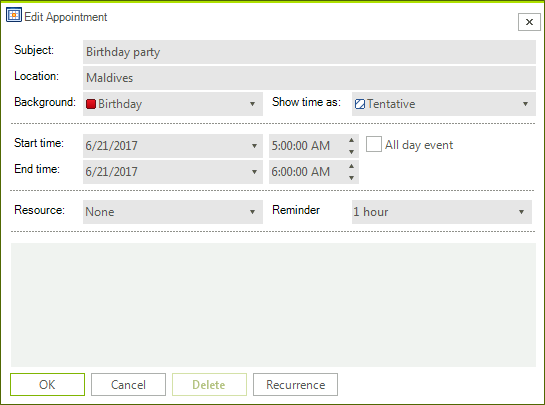
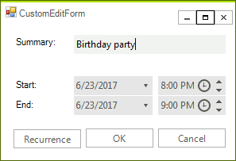

# EditAppointmentDialog

The **EditAppointmentDialog** is shown when you try to add a new appointment or start editing an existing one.

>caption Figure 1. EditAppointmentDialog

It will pop up when you double click an empty cell or an existing appointment. Alternatively, you can show it by using the default context menu. 

>important As of **R1 2021** the EditAppointmentDialog provides UI for selecting multiple resources per appointment. In certain cases (e.g. unbound mode), the *Resource* **RadDropDownList** is replaced with a **RadCheckedDropDownList**. Otherwise, the default drop down with single selection for resources is shown. To enable the multiple resources selection in bound mode, it is necessary to specify the AppointmentMappingInfo. **Resources** property. The **Resources** property should be set to the name of the relation that connects the **Appointments** and the **AppointmentsResources** tables.  

#### EditAppointmentDialog with multiple resources

# Create a custom EditAppointmentDialog

You can extend the default **EditAppointmentDialog** and add custom fields following the approach in this help article: [Adding a Custom Field to the EditAppointment Dialog]().

Alternatively, you can create a completely new dialog according to any specific requirements. For this purpose, it is necessary to create a class that inherits **RadSchedulerDialog** and implements the **IEditAppointmentDialog** interface. The **IEditAppointmentDialog** interface requires implementing the following methods and events:
* void **ShowRecurrenceDialog**()
* DialogResult **ShowDialog**()
* bool **EditAppointment**(IEvent appointment, ISchedulerData schedulerData)
* event EventHandler **Shown**

As a derivative of **RadSchedulerDialog** which inherits **RadForm**, the **ShowDialog** method and **Shown** event are already available. It is left to implement the **ShowRecurrenceDialog** and **EditAppointment** methods. You can find below a sample implementation of the edit dialog which contains a few controls to modify the summary, start/end date and time of the appointment.

>caption Figure 2: Custom Edit Dialog

<snippet id='scheduler-customeditform-customeditdialog-cs' />
<snippet id='scheduler-customeditform-customeditdialog-vb' />

Now, you can replace the default edit dialog with the custom one by using the RadScheduler.**AppointmentEditDialogShowing** event:

<snippet id='scheduler-schedulercustomdialogs-replacedefaultdialog-cs' />
<snippet id='scheduler-schedulercustomdialogs-replacedefaultdialog-vb' />

# See Also

* [Adding a Custom Field to the EditAppointment Dialog]() 
