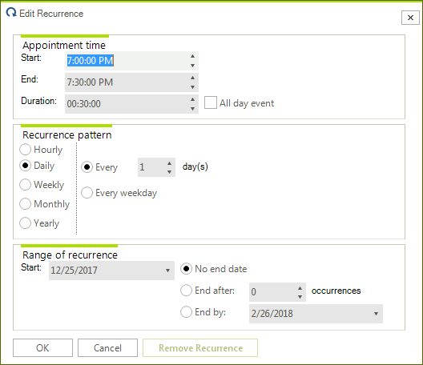
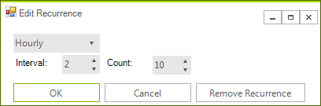

# EditRecurrenceDialog

The **EditRecurrenceDialog** is shown when you click the `Recurrence` button in the [EditAppointmentDialog](). It allows you to create a new or edit an existing recurrence rule.

>caption Figure 1. EditRecurrenceDialog




## Create a custom EditRecurrenceDialog

The **EditRecurrenceDialog** inherits the **RadSchedulerDialog** class and implements the **IEditRecurrenceDialog** interface.  The **IEditRecurrenceDialog** interface requires implementing the **ShowDialog** method and the **ThemeName** property. As a derivative of **RadSchedulerDialog** which inherits **RadForm**, the **ShowDialog** method and the **ThemeName** property are already available. 

In the following example, we will create a completely new dialog which will replace the default **EditRecurrenceDialog**. It demonstrates a sample approach how to customize the dialog. It allows managing **HourlyRecurrenceRule** and **DailyRecurrenceRule**. Note that it can be extended to handle all recurrence rules. However, for simplicity of the example we will handle only these two recurrence rules.

1\. Create a class which inherits the **RadSchedulerDialog** class and implements the **IEditRecurrenceDialog** interface.
2\. Add one **RadDropDownList**, two **RadLabels**, two **RadSpinEditors** and three **RadButtons** as it is shown in the below screenshot:



3\. Manage the recurrence rule of the appointment by the added controls on the form:

{{source=..\SamplesCS\Scheduler\Dialogs\MyEditRecurrenceDialog.cs region=CustomEditRecurrenceDialog}}
{{source=..\SamplesVB\Scheduler\Dialogs\MyEditRecurrenceDialog.vb region=CustomEditRecurrenceDialog}}    
       
````C#
public partial class MyEditRecurrenceDialog : RadSchedulerDialog, IEditRecurrenceDialog
{
    private IEvent Appointment;
    RecurrenceRule recurrenceRule = null;
    public MyEditRecurrenceDialog()
    {
        InitializeComponent();
        this.radButton1.Click += radButton1_Click;
        this.radButton2.Click += radButton2_Click;
        this.radButton3.Click += radButton3_Click;
    }
    public MyEditRecurrenceDialog(IEvent targetEvent)
        : this()
    {
        this.Appointment = targetEvent;
        this.radDropDownList1.DropDownStyle = RadDropDownStyle.DropDownList;
        this.radDropDownList1.Items.Add(new RadListDataItem()
        {
            Text = "Hourly",
            Value = new HourlyRecurrenceRule(this.Appointment.Start, 1)
        });
        this.radDropDownList1.Items.Add(new RadListDataItem()
        {
            Text = "Daily",
            Value = new DailyRecurrenceRule(this.Appointment.Start, 1, 5)
        });
        this.radDropDownList1.SelectedIndexChanged += radDropDownList1_SelectedIndexChanged;
        this.radDropDownList1.SelectedIndex = 0;
        this.radSpinEditor1.ValueChanged += radSpinEditor1_ValueChanged;
        this.radSpinEditor2.ValueChanged += radSpinEditor2_ValueChanged;
        this.radSpinEditor1.Maximum = this.radSpinEditor2.Maximum = int.MaxValue;
        this.LoadSettingsFromEvent(this.Appointment);
    }
    private void radButton3_Click(object sender, EventArgs e)
    {
        if (this.Appointment.RecurrenceRule != null)
        {
            this.Appointment.RecurrenceRule = null;
        }
        else if (this.Appointment.MasterEvent != null)
        {
            this.Appointment.MasterEvent.RecurrenceRule = null;
        }
        this.DialogResult = DialogResult.OK;
        this.Close();
    }
    private void radButton2_Click(object sender, EventArgs e)
    {
        this.DialogResult = DialogResult.Cancel;
        this.Close();
    }
    private void radSpinEditor2_ValueChanged(object sender, EventArgs e)
    {
        this.recurrenceRule.Count = (int)this.radSpinEditor2.Value;
    }
    private void radSpinEditor1_ValueChanged(object sender, EventArgs e)
    {
        this.recurrenceRule.Interval = (int)this.radSpinEditor1.Value;
    }
    private void radDropDownList1_SelectedIndexChanged(object sender, Telerik.WinControls.UI.Data.PositionChangedEventArgs e)
    {
        this.recurrenceRule = this.radDropDownList1.SelectedItem.Value as RecurrenceRule;
    }
    private void LoadSettingsFromEvent(IEvent targetEvent)
    {
        if (targetEvent.RecurrenceRule != null)
        {
            this.recurrenceRule = targetEvent.RecurrenceRule;
            HourlyRecurrenceRule hourlyRecurrenceRule = targetEvent as HourlyRecurrenceRule;
            DailyRecurrenceRule dailyRecurrenceRule = targetEvent as DailyRecurrenceRule;
            if (hourlyRecurrenceRule != null)
            {
                this.radDropDownList1.SelectedIndex = 0;
            }
            else if (dailyRecurrenceRule != null)
            {
                this.radDropDownList1.SelectedIndex = 1;
            }
            this.radSpinEditor1.Value = targetEvent.RecurrenceRule.Interval;
            this.radSpinEditor2.Value = targetEvent.RecurrenceRule.Count;
        }
    }
    private void radButton1_Click(object sender, EventArgs e)
    {
        this.ApplySettingsToEvent(this.Appointment);
        this.DialogResult = DialogResult.OK;
        this.Close();
    }
    protected override void LocalizeDialog(Telerik.WinControls.UI.Localization.RadSchedulerLocalizationProvider localizationProvider)
    {
        base.LocalizeDialog(localizationProvider);
        this.Text = localizationProvider.GetLocalizedString(Telerik.WinControls.UI.Localization.RadSchedulerStringId.RecurrenceDialogTitle);
        this.radButton1.Text = localizationProvider.GetLocalizedString(Telerik.WinControls.UI.Localization.RadSchedulerStringId.RecurrenceDialogOK);
        this.radButton2.Text = localizationProvider.GetLocalizedString(Telerik.WinControls.UI.Localization.RadSchedulerStringId.RecurrenceDialogCancel);
        this.radButton3.Text = localizationProvider.GetLocalizedString(Telerik.WinControls.UI.Localization.RadSchedulerStringId.RecurrenceDialogRemoveRecurrence);
        this.radLabel1.Text = "Interval:";
        this.radLabel2.Text = "Count:";
    }
    public void ApplySettingsToEvent(IEvent targetEvent)
    {
        this.recurrenceRule.Interval = (int)this.radSpinEditor1.Value;
        this.recurrenceRule.Count = (int)this.radSpinEditor2.Value;
        this.Appointment.RecurrenceRule = this.recurrenceRule;
    }
}

````
````VB.NET
Public Class MyEditRecurrenceDialog
Inherits RadSchedulerDialog
Implements IEditRecurrenceDialog
    Private Appointment As IEvent
    Private recurrenceRule As RecurrenceRule = Nothing
    Public Sub New()
        InitializeComponent()
        AddHandler Me.radButton1.Click, AddressOf radButton1_Click
        AddHandler Me.radButton2.Click, AddressOf radButton2_Click
        AddHandler Me.radButton3.Click, AddressOf radButton3_Click
    End Sub
    Public Property ThemeName() As String Implements IEditRecurrenceDialog.ThemeName
        Get
            Return MyBase.ThemeName
        End Get
        Set(value As String)
            MyBase.ThemeName = Value
        End Set
    End Property
    Public Function ShowDialog() As DialogResult Implements IEditRecurrenceDialog.ShowDialog
        Return MyBase.ShowDialog()
    End Function
    Public Sub New(ByVal targetEvent As IEvent)
        Me.New()
        Me.Appointment = targetEvent
        Me.radDropDownList1.DropDownStyle = RadDropDownStyle.DropDownList
        Me.radDropDownList1.Items.Add(New RadListDataItem() With {.Text = "Hourly", .Value = New HourlyRecurrenceRule(Me.Appointment.Start, 1)})
        Me.radDropDownList1.Items.Add(New RadListDataItem() With {.Text = "Daily", .Value = New DailyRecurrenceRule(Me.Appointment.Start, 1, 5)})
        AddHandler Me.radDropDownList1.SelectedIndexChanged, AddressOf radDropDownList1_SelectedIndexChanged
        Me.radDropDownList1.SelectedIndex = 0
        AddHandler Me.radSpinEditor1.ValueChanged, AddressOf radSpinEditor1_ValueChanged
        AddHandler Me.radSpinEditor2.ValueChanged, AddressOf radSpinEditor2_ValueChanged
        Me.radSpinEditor1.Maximum = Integer.MaxValue
        Me.radSpinEditor2.Maximum = Integer.MaxValue
        Me.LoadSettingsFromEvent(Me.Appointment)
    End Sub
    Private Sub radButton3_Click(ByVal sender As Object, ByVal e As EventArgs)
        If Me.Appointment.RecurrenceRule IsNot Nothing Then
            Me.Appointment.RecurrenceRule = Nothing
        ElseIf Me.Appointment.MasterEvent IsNot Nothing Then
            Me.Appointment.MasterEvent.RecurrenceRule = Nothing
        End If
        Me.DialogResult = Windows.Forms.DialogResult.OK
        Me.Close()
    End Sub
    Private Sub radButton2_Click(ByVal sender As Object, ByVal e As EventArgs)
        Me.DialogResult = Windows.Forms.DialogResult.Cancel
        Me.Close()
    End Sub
    Private Sub radSpinEditor2_ValueChanged(ByVal sender As Object, ByVal e As EventArgs)
        Me.recurrenceRule.Count = CInt(Me.radSpinEditor2.Value)
    End Sub
    Private Sub radSpinEditor1_ValueChanged(ByVal sender As Object, ByVal e As EventArgs)
        Me.recurrenceRule.Interval = CInt(Me.radSpinEditor1.Value)
    End Sub
    Private Sub radDropDownList1_SelectedIndexChanged(ByVal sender As Object, ByVal e As Telerik.WinControls.UI.Data.PositionChangedEventArgs)
        Me.recurrenceRule = TryCast(Me.radDropDownList1.SelectedItem.Value, RecurrenceRule)
    End Sub
    Private Sub LoadSettingsFromEvent(ByVal targetEvent As IEvent)
        If targetEvent.RecurrenceRule IsNot Nothing Then
            Me.recurrenceRule = targetEvent.RecurrenceRule
            Dim hourlyRecurrenceRule As HourlyRecurrenceRule = TryCast(targetEvent, HourlyRecurrenceRule)
            Dim dailyRecurrenceRule As DailyRecurrenceRule = TryCast(targetEvent, DailyRecurrenceRule)
            If hourlyRecurrenceRule IsNot Nothing Then
                Me.radDropDownList1.SelectedIndex = 0
            ElseIf dailyRecurrenceRule IsNot Nothing Then
                Me.radDropDownList1.SelectedIndex = 1
            End If
            Me.radSpinEditor1.Value = targetEvent.RecurrenceRule.Interval
            Me.radSpinEditor2.Value = targetEvent.RecurrenceRule.Count
        End If
    End Sub
    Private Sub radButton1_Click(ByVal sender As Object, ByVal e As EventArgs)
        Me.ApplySettingsToEvent(Me.Appointment)
        Me.DialogResult = Windows.Forms.DialogResult.OK
        Me.Close()
    End Sub
    Protected Overrides Sub LocalizeDialog(ByVal localizationProvider As Telerik.WinControls.UI.Localization.RadSchedulerLocalizationProvider)
        MyBase.LocalizeDialog(localizationProvider)
        Me.Text = localizationProvider.GetLocalizedString(Telerik.WinControls.UI.Localization.RadSchedulerStringId.RecurrenceDialogTitle)
        Me.radButton1.Text = localizationProvider.GetLocalizedString(Telerik.WinControls.UI.Localization.RadSchedulerStringId.RecurrenceDialogOK)
        Me.radButton2.Text = localizationProvider.GetLocalizedString(Telerik.WinControls.UI.Localization.RadSchedulerStringId.RecurrenceDialogCancel)
        Me.radButton3.Text = localizationProvider.GetLocalizedString(Telerik.WinControls.UI.Localization.RadSchedulerStringId.RecurrenceDialogRemoveRecurrence)
        Me.radLabel1.Text = "Interval:"
        Me.radLabel2.Text = "Count:"
    End Sub
    Public Sub ApplySettingsToEvent(ByVal targetEvent As IEvent)
        Me.recurrenceRule.Interval = CInt(Me.radSpinEditor1.Value)
        Me.recurrenceRule.Count = CInt(Me.radSpinEditor2.Value)
        Me.Appointment.RecurrenceRule = Me.recurrenceRule
    End Sub
End Class

````

{{endregion}}

4\. Now, you can replace the default **EditRecurrenceDialog** with the custom one by using the RadScheduler.**RecurrenceEditDialogShowing** event:

{{source=..\SamplesCS\Scheduler\Dialogs\SchedulerCustomDialogs.cs region=ReplaceDefaultRecurrenceEditDialog}}
{{source=..\SamplesVB\Scheduler\Dialogs\SchedulerCustomDialogs.vb region=ReplaceDefaultRecurrenceEditDialog}}    
       
````C#
        
private void radScheduler1_RecurrenceEditDialogShowing(object sender, RecurrenceEditDialogShowingEventArgs e)
{
    e.RecurrenceEditDialog = new MyEditRecurrenceDialog(e.Appointment);
}

````
````VB.NET
Private Sub radScheduler1_RecurrenceEditDialogShowing(ByVal sender As Object, ByVal e As RecurrenceEditDialogShowingEventArgs)
    e.RecurrenceEditDialog = New MyEditRecurrenceDialog(e.Appointment)
End Sub

````

{{endregion}}