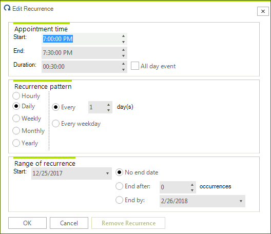
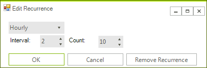

# EditRecurrenceDialog

The **EditRecurrenceDialog** is shown when you click the `Recurrence` button in the [EditAppointmentDialog](). It allows you to create a new or edit an existing recurrence rule.

>caption Figure 1. EditRecurrenceDialog

## Create a custom EditRecurrenceDialog

The **EditRecurrenceDialog** inherits the **RadSchedulerDialog** class and implements the **IEditRecurrenceDialog** interface.  The **IEditRecurrenceDialog** interface requires implementing the **ShowDialog** method and the **ThemeName** property. As a derivative of **RadSchedulerDialog** which inherits **RadForm**, the **ShowDialog** method and the **ThemeName** property are already available. 

In the following example, we will create a completely new dialog which will replace the default **EditRecurrenceDialog**. It demonstrates a sample approach how to customize the dialog. It allows managing **HourlyRecurrenceRule** and **DailyRecurrenceRule**. Note that it can be extended to handle all recurrence rules. However, for simplicity of the example we will handle only these two recurrence rules.

1\. Create a class which inherits the **RadSchedulerDialog** class and implements the **IEditRecurrenceDialog** interface.
2\. Add one **RadDropDownList**, two **RadLabels**, two **RadSpinEditors** and three **RadButtons** as it is shown in the below screenshot:

3\. Manage the recurrence rule of the appointment by the added controls on the form:

<snippet id='scheduler-myeditrecurrencedialog-customeditrecurrencedialog-cs' />
<snippet id='scheduler-myeditrecurrencedialog-customeditrecurrencedialog-vb' />

4\. Now, you can replace the default **EditRecurrenceDialog** with the custom one by using the RadScheduler.**RecurrenceEditDialogShowing** event:

<snippet id='scheduler-schedulercustomdialogs-replacedefaultrecurrenceeditdialog-cs' />
<snippet id='scheduler-schedulercustomdialogs-replacedefaultrecurrenceeditdialog-vb' />

