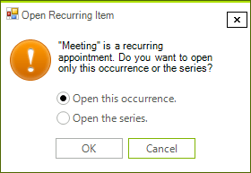

# OpenRecurringAppointmentDialog

The **OpenRecurringAppointmentDialog** is shown when you try to edit a recurring appointment.

>caption Figure 1. OpenRecurringAppointmentDialog

It will pop up when you double click a recurring appointment. Alternatively, you can show it by using the "Edit Appointment" option in the default context menu when a recurring appointment is currently selected. 

The **OpenRecurringAppointmentDialog** is shown in the EditAppointmentDialog.**EditAppointment** method when trying to edit an existing appointment. If you create a custom **EditAppointmentDialog** and override its **EditAppointment** method you can replace the default **OpenRecurringAppointmentDialog** with a custom one if needed.

**OpenRecurringAppointmentDialog** inherits **RadSchedulerDialog** and implements the **IOpenRecurringAppointmentDialog** interface. The **IOpenRecurringAppointmentDialog** interface requires implementing the following methods and properties:

* DialogResult **ShowDialog**()
* string **EventName**
* bool **EditOccurrence**
* string **ThemeName**

As a derivative of **RadSchedulerDialog** which inherits **RadForm**, the **ShowDialog** method and the **ThemeName** property are already available. It is necessary to implement the **EventName** and **EditOccurrence** properties. 

