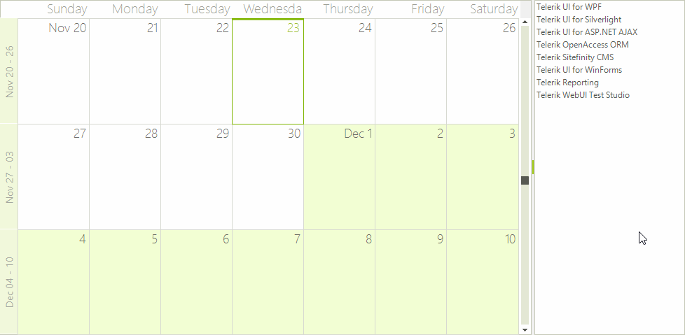

# Combining RadDragDropService and OLE Drag and Drop

This article demonstrates a sample approach how to achieve drag and drop functionality between __RadScheduler__ and __RadListControl__. For this purpose, we will use a combination between the __RadDragDropService__, supported by the __RadScheduler__ control, and the OLE drag-and-drop, which is supported by all controls from the Telerik UI for WinForms suite.

Let’s assume that our __RadScheduler__ is in [bound mode]() and the __RadListControl__ is populated manually with items. Set the __AllowDrop__ property to *true* for both of the controls.

## Drag and Drop from RadScheduler to RadListControl Using RadDragDropService

To implement drag and drop functionality for this scenario, we will use the SchedulerElement.__DragDropBehavior__, which is a derivative of the __RadDragDropService__. Subscribe to its __PreviewDragOver__ and __PreviewDragDrop__ events. In the __PreviewDragOver__ event allow dropping over a __RadListElement__. The __PreviewDragDrop__ event performs the actual inserting of the dragged appointment into the __RadListControl.Items__ collection:

#### Behavior PreviewDragOver

<snippet id='scheduler-schedulertolistcontrol-radschedulertoradlistcontrol-cs' />
<snippet id='scheduler-schedulertolistcontrol-radschedulertoradlistcontrol-vb' />

>caption Figure 1: Using RadDragDropService

>note As we remove the dragged appointment,it is necessary to save the performed changes in the data source.Please refer to [Data Binding Walkthrough]() article.
>

## Drag and Drop from RadListControl to RadScheduler Using the OLE Drag and Drop

1. Firstly, we should start the drag and drop operation using the RadListControl.__MouseMove__ event when the left mouse button is pressed.  Afterwards, allow dragging over the __RadScheduler__ via the __Effect__ argument of the __DragEventArgs__ in the RadScheduler.__DragEnter__ event handler:

<snippet id='scheduler-schedulertolistcontrol-startdragdrop-cs' />
<snippet id='scheduler-schedulertolistcontrol-startdragdrop-vb' />

2\. In the RadScheduler.__DragDrop__ event you need to get the location of the mouse and convert it to a point that the scheduler can use to get the cell element underneath the mouse. This __MonthCellElement__ is passed to a private method __GetCellAppointment__ that we will write next:

<snippet id='scheduler-schedulertolistcontrol-dodragdrop-cs' />
<snippet id='scheduler-schedulertolistcontrol-dodragdrop-vb' />

3\. The helper method __CreateAppointment()__ creates an appointment, starting at the cell where the __RadListControl__ item is dropped. This appointment gets its data from the dragged item.

<snippet id='scheduler-schedulertolistcontrol-draghelper-cs' />
<snippet id='scheduler-schedulertolistcontrol-draghelper-vb' />

>caption Figure 2: OLE Drag and Drop

# See Also

* [Views]()
* [Working with Appointments]()
* [Formatting Appointments]()
* [Scheduler Element Provider]()
