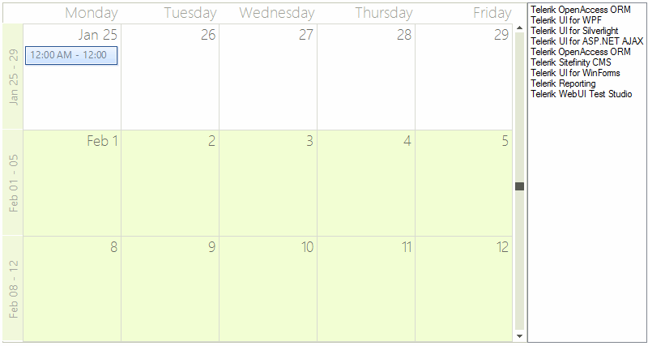

# Drag and Drop from Another Control

>note Similar approach is demonstrated in the *Demos, section Scheduler >> Drag&Drop.* 
>

__RadScheduler__ supports drag and drop and it can be implemented so that appointments are dragged from another control, in our case a ListBox. It is necessary to set the __AllowDrop__ property to *true*.

## Drag and Drop from ListBox to RadScheduler

Firstly, we should start the drag and drop operation using the ListBox.__MouseMove__ event when the left mouse button is pressed. Afterwards, allow dragging over the __RadScheduler__ via the __Effect__ argument of the __DragEventArgs__ in the RadScheduler.__DragEnter__ event handler:

#### Handle ListBox MouseMove

<snippet id='scheduler-dragdropfromcontrol-listboxtoschedulerstart-cs' />
<snippet id='scheduler-dragdropfromcontrol-listboxtoschedulerstart-vb' />

In order to use this feature, we will need to find the scheduler cell when the item is dropped onto the scheduler surface. Once you have the scheduler cell you can get the date and create an appointment for it.

>caption Figure 1: Dragging from a ListBox

In the RadScheduler __DragDrop__ event handler you need to get the location of the mouse and convert it to a point that the scheduler can use to get the cell element underneath the mouse. This __MonthCellElement__ is passed to a private method __GetCellAppointment()__ that we will write next.

#### Handle RadScheduler DragDrop

<snippet id='scheduler-dragdropfromcontrol-droptocell-cs' />
<snippet id='scheduler-dragdropfromcontrol-droptocell-vb' />

The helper method __CreateAppointment()__ creates an appontment starting at the cell where the ListBox item is dropped. This appointment gets its data from the dragged item.

#### Create Appointment

<snippet id='scheduler-dragdropfromcontrol-createappointment-cs' />
<snippet id='scheduler-dragdropfromcontrol-createappointment-vb' />

## Drag and Drop from RadScheduler to ListBox

In order to enable dragging an appointment from __RadScheduler__ and dropping it onto the ListBox, it is necessary to set the ListBox.__AllowDrop__ property to *true*. Use the RadScheduler.__MouseMove__ event to start the drag and drop operation. In the ListBox.__DragOver__ event you should allow the drop operation:

#### Handle RadScheduler MouseMove

<snippet id='scheduler-dragdropfromcontrol-schedulertolistboxstart-cs' />
<snippet id='scheduler-dragdropfromcontrol-schedulertolistboxstart-vb' />

Finally, perform the exact drag and drop operation via inserting a new item in the ListBox in the __DragDrop__ event:

#### Handle ListBox MouseMove

<snippet id='scheduler-dragdropfromcontrol-schedulertolistboxdrop-cs' />
<snippet id='scheduler-dragdropfromcontrol-schedulertolistboxdrop-vb' />

>caption Figure 2: Dragging from a RadScheduler

# See Also

* [Views]()
* [Working with Appointments]()
* [Formatting Appointments]()
* [Scheduler Element Provider]()
