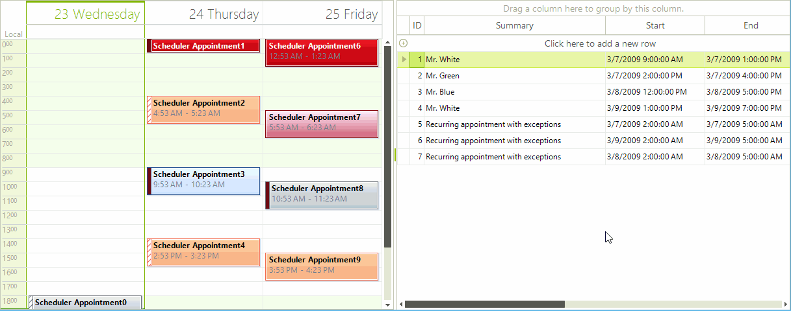
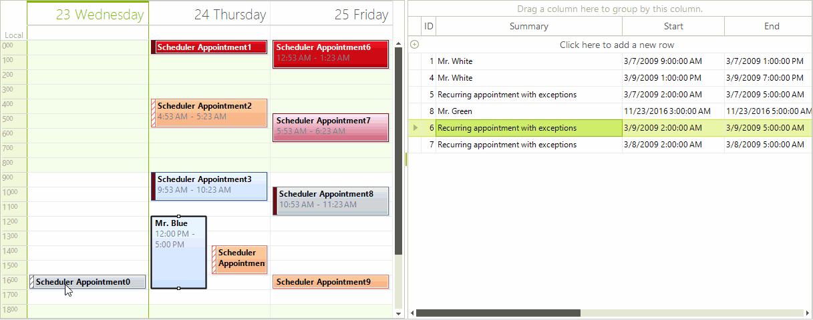

# Drag and Drop Using RadDragDropService

This article will guide you through the process of achieving drag and drop functionality from __RadScheduler__ to __RadGridView__ and vice versa. For this purpose, we will use the __RadDragDropService__, supported by both of the controls.

Let’s assume that our __RadScheduler__ is in unbound mode and the __RadGridView__ control is bound to *Appointments* data table. 

## Drag and Drop from RadGridView to RadScheduler

1. The first thing we need to do is to start the __RadGridView__’s drag and drop service when a user clicks on a row with the left mouse down. For this purpose we should create a custom [grid behavior]():

{{source=..\SamplesCS\Scheduler\DragDrop\SchedulerToGrid.cs region=CustomRowGridBehavior}} 
{{source=..\SamplesVB\Scheduler\DragDrop\SchedulerToGrid.vb region=CustomRowGridBehavior}} 

````C#
        
//initiates drag and drop service for clicked rows
public class CustomRowGridBehavior : GridDataRowBehavior
{
    protected override bool OnMouseDownLeft(MouseEventArgs e)
    {
        GridDataRowElement row = this.GetRowAtPoint(e.Location) as GridDataRowElement;
        if (row != null)
        {
            RadGridViewDragDropService svc = this.GridViewElement.GetService<RadGridViewDragDropService>();
            svc.Start(row);
        }
        return base.OnMouseDownLeft(e);
    }
}

````
````VB.NET
'initiates drag and drop service for clicked rows
Public Class CustomRowGridBehavior
Inherits GridDataRowBehavior
    Protected Overrides Function OnMouseDownLeft(e As MouseEventArgs) As Boolean
        Dim row As GridDataRowElement = TryCast(Me.GetRowAtPoint(e.Location), GridDataRowElement)
        If row IsNot Nothing Then
            Dim svc As RadGridViewDragDropService = Me.GridViewElement.GetService(Of RadGridViewDragDropService)()
            svc.Start(row)
        End If
        Return MyBase.OnMouseDownLeft(e)
    End Function
End Class

````

{{endregion}} 

2\. Next, we should register this behavior in our grid:

{{source=..\SamplesCS\Scheduler\DragDrop\SchedulerToGrid.cs region=RegisterGridBehavior}} 
{{source=..\SamplesVB\Scheduler\DragDrop\SchedulerToGrid.vb region=RegisterGridBehavior}} 

````C#
            
//register the custom row behavior
BaseGridBehavior gridBehavior = this.radGridView1.GridBehavior as BaseGridBehavior;
gridBehavior.UnregisterBehavior(typeof(GridViewDataRowInfo));
gridBehavior.RegisterBehavior(typeof(GridViewDataRowInfo), new CustomRowGridBehavior());

````
````VB.NET
'register the custom row behavior
Dim gridBehavior As BaseGridBehavior = TryCast(Me.RadGridView1.GridBehavior, BaseGridBehavior)
gridBehavior.UnregisterBehavior(GetType(GridViewDataRowInfo))
gridBehavior.RegisterBehavior(GetType(GridViewDataRowInfo), New CustomRowGridBehavior())

````

{{endregion}} 

3\. It is necessary to subscribe to the __PreviewDragStart__, __PreviewDragOver__ and __PreviewDragDrop__ events of the grid’s __RadDragDropService__. The __PreviewDragStart__ event is fired once the drag and drop service on the grid is started. We should notify the service that the drag and drop operation can move forward. In the __PreviewDragOver__ event you can control on what targets to allow dropping the dragged row. The __PreviewDragDrop__ event performs the actual move of the row from the __RadGridView__ to the __RadScheduler__.

{{source=..\SamplesCS\Scheduler\DragDrop\SchedulerToGrid.cs region=RadDragDropService}} 
{{source=..\SamplesVB\Scheduler\DragDrop\SchedulerToGrid.vb region=RadDragDropService}} 

````C#
            
//handle drag and drop events for the grid through the DragDrop service
RadDragDropService svc = this.radGridView1.GridViewElement.GetService<RadDragDropService>();
svc.PreviewDragStart += svc_PreviewDragStart;
svc.PreviewDragDrop += svc_PreviewDragDrop;
svc.PreviewDragOver += svc_PreviewDragOver;

````
````VB.NET
'handle drag and drop events for the grid through the DragDrop service
Dim svc As RadDragDropService = Me.RadGridView1.GridViewElement.GetService(Of RadDragDropService)()
AddHandler svc.PreviewDragStart, AddressOf svc_PreviewDragStart
AddHandler svc.PreviewDragDrop, AddressOf svc_PreviewDragDrop
AddHandler svc.PreviewDragOver, AddressOf svc_PreviewDragOver

````

{{endregion}} 

{{source=..\SamplesCS\Scheduler\DragDrop\SchedulerToGrid.cs region=PerformGridToSchedulerDragDrop}} 
{{source=..\SamplesVB\Scheduler\DragDrop\SchedulerToGrid.vb region=PerformGridToSchedulerDragDrop}} 

````C#
        
//required to initiate drag and drop when grid is in bound mode
private void svc_PreviewDragStart(object sender, PreviewDragStartEventArgs e)
{
    e.CanStart = true;
}
        
private void svc_PreviewDragOver(object sender, RadDragOverEventArgs e)
{
    if (e.DragInstance is GridDataRowElement)
    {
        e.CanDrop = e.HitTarget is SchedulerCellElement;
    }
}
        
private void svc_PreviewDragDrop(object sender, RadDropEventArgs e)
{
    SchedulerCellElement schedulerCell = e.HitTarget as SchedulerCellElement;
    if (schedulerCell == null)
    {
        DayViewAllDayHeader allDay = (this.radScheduler1.SchedulerElement.ViewElement as SchedulerDayViewElement).AllDayHeaderElement;
        schedulerCell = SchedulerUIHelper.GetCellAtPoint(e.DropLocation, allDay.Children);
    }
    if (schedulerCell == null)
    {
        return;
    }
    GridDataRowElement draggedRow = e.DragInstance as GridDataRowElement;
    if (draggedRow == null)
    {
        return;
    }
    
    DataRowView dataRowView = draggedRow.Data.DataBoundItem as DataRowView;
    if (dataRowView != null)
    {
        if (draggedRow.GridControl.DataSource != null && typeof(BindingSource).IsAssignableFrom(draggedRow.GridControl.DataSource.GetType()))
        {
            Appointment appointment = new Appointment();
            appointment.Start = (DateTime)draggedRow.RowInfo.Cells["Start"].Value;
            appointment.End = (DateTime)draggedRow.RowInfo.Cells["End"].Value;
            //adjust start/end according to target cell
            appointment.End = schedulerCell.Date.AddMinutes(appointment.Duration.TotalMinutes);
            appointment.Start = schedulerCell.Date;
            appointment.Summary = string.Empty + draggedRow.RowInfo.Cells["Summary"].Value;
            appointment.Description = string.Empty + draggedRow.RowInfo.Cells["Description"].Value;
            appointment.Location = string.Empty + draggedRow.RowInfo.Cells["Location"].Value;
            appointment.StatusId = (int)draggedRow.RowInfo.Cells["StatusId"].Value;
            appointment.BackgroundId = (int)draggedRow.RowInfo.Cells["BackgroundId"].Value;
            this.radScheduler1.Appointments.Add(appointment);
            
            dataRowView.Row.Table.Rows.Remove(dataRowView.Row);
        }
        else
        {
            throw new ApplicationException("Unhandled Scenario");
        }
    }
}

````
````VB.NET
'required to initiate drag and drop when grid is in bound mode
Private Sub svc_PreviewDragStart(sender As Object, e As PreviewDragStartEventArgs)
    e.CanStart = True
End Sub
Private Sub svc_PreviewDragOver(sender As Object, e As RadDragOverEventArgs)
    If TypeOf e.DragInstance Is GridDataRowElement Then
        e.CanDrop = TypeOf e.HitTarget Is SchedulerCellElement
    End If
End Sub
Private Sub svc_PreviewDragDrop(sender As Object, e As RadDropEventArgs)
    Dim schedulerCell As SchedulerCellElement = TryCast(e.HitTarget, SchedulerCellElement)
    If schedulerCell Is Nothing Then
        Dim allDay As DayViewAllDayHeader = TryCast(Me.RadScheduler1.SchedulerElement.ViewElement, SchedulerDayViewElement).AllDayHeaderElement
        schedulerCell = SchedulerUIHelper.GetCellAtPoint(e.DropLocation, allDay.Children)
    End If
    If schedulerCell Is Nothing Then
        Return
    End If
    Dim draggedRow As GridDataRowElement = TryCast(e.DragInstance, GridDataRowElement)
    If draggedRow Is Nothing Then
        Return
    End If
    Dim dataRowView As DataRowView = TryCast(draggedRow.Data.DataBoundItem, DataRowView)
    If dataRowView IsNot Nothing Then
        If draggedRow.GridControl.DataSource IsNot Nothing AndAlso GetType(BindingSource).IsAssignableFrom(draggedRow.GridControl.DataSource.[GetType]()) Then
            Dim appointment As New Appointment()
            appointment.Start = DirectCast(draggedRow.RowInfo.Cells("Start").Value, DateTime)
            appointment.[End] = DirectCast(draggedRow.RowInfo.Cells("End").Value, DateTime)
            'adjust start/end according to target cell
            appointment.[End] = schedulerCell.[Date].AddMinutes(appointment.Duration.TotalMinutes)
            appointment.Start = schedulerCell.[Date]
            appointment.Summary = String.Empty + draggedRow.RowInfo.Cells("Summary").Value
            appointment.Description = String.Empty + draggedRow.RowInfo.Cells("Description").Value
            appointment.Location = String.Empty + draggedRow.RowInfo.Cells("Location").Value
            appointment.StatusId = CInt(draggedRow.RowInfo.Cells("StatusId").Value)
            appointment.BackgroundId = CInt(draggedRow.RowInfo.Cells("BackgroundId").Value)
            Me.RadScheduler1.Appointments.Add(appointment)
            dataRowView.Row.Table.Rows.Remove(dataRowView.Row)
        Else
            Throw New ApplicationException("Unhandled Scenario")
        End If
    End If
End Sub

````

{{endregion}} 

>note The start date of the created appointment is in correspondence with the cell where the row is dropped. The appointment’s duration is relevant to the original duration.
>

>caption Figure 1: Drag and Drop from RadGridView to RadScheduler


## Drag and Drop from RadScheduler to RadGridView

To implement drag and drop functionality for this scenario, we will use the SchedulerElement.__DragDropBehavior__, which is a derivative of the __RadDragDropService__. Subscribe to its __PreviewDragOver__ and __PreviewDragDrop__ events. In the __PreviewDragOver__ event allow dropping over a row element or over the table element. The __PreviewDragDrop__ event performs the actual inserting of the dragged appointment into the __RadGridView__’s data source:

{{source=..\SamplesCS\Scheduler\DragDrop\SchedulerToGrid.cs region=SchedulerToGrid}} 
{{source=..\SamplesVB\Scheduler\DragDrop\SchedulerToGrid.vb region=SchedulerToGrid}} 

````C#
        
private void DragDropBehavior_PreviewDragOver(object sender, Telerik.WinControls.RadDragOverEventArgs e)
{
    e.CanDrop = e.HitTarget is GridTableElement ||
                e.HitTarget is GridDataRowElement;
}
        
private void DragDropBehavior_PreviewDragDrop(object sender, Telerik.WinControls.RadDropEventArgs e)
{
    DragFeedbackElement draggedInstance = e.DragInstance as DragFeedbackElement;
    if (draggedInstance == null)
    {
        return;
    }
    GridDataRowElement rowElement = e.HitTarget as GridDataRowElement;
    GridTableElement tableElement = e.HitTarget as GridTableElement;
    RadGridView targetGrid;
    if (rowElement == null && tableElement == null)
    {
        return;
    }
    if (rowElement != null)
    {
        targetGrid = rowElement.GridViewElement.GridControl;
    }
    else
    {
        targetGrid = tableElement.GridViewElement.GridControl;
    }
    
    if (targetGrid == null)
    {
        return;
    }
    e.Handled = true;
    
    int index = rowElement != null ? this.GetTargetRowIndex(rowElement, e.DropLocation) : targetGrid.RowCount;
    Appointment draggedAppointment = draggedInstance.AssociatedAppointment as Appointment;
    this.MoveRows(targetGrid, draggedAppointment, index);
}
        
private int GetTargetRowIndex(GridDataRowElement row, Point dropLocation)
{
    int halfHeight = row.Size.Height / 2;
    int index = row.RowInfo.Index;
    if (dropLocation.Y > halfHeight)
    {
        index++;
    }
    return index;
}
        
private void MoveRows(RadGridView dragGrid,
    Appointment draggedAppointment, int index)
{
    dragGrid.BeginUpdate();
    
    if (dragGrid.DataSource != null && typeof(BindingSource).IsAssignableFrom(dragGrid.DataSource.GetType()))
    {
        //bound to a BindingSource scenario
        BindingSource sourceCollection = (BindingSource)dragGrid.DataSource;
        this.radScheduler1.Appointments.Remove(draggedAppointment);
        
        DataRowView newDataRowView = sourceCollection.AddNew() as DataRowView;
        if (newDataRowView != null)
        {
            newDataRowView["Start"] = draggedAppointment.Start;
            newDataRowView["End"] = draggedAppointment.End ;
            newDataRowView["Summary"] = draggedAppointment.Summary;
            newDataRowView["Description"] = draggedAppointment.Description ;
            newDataRowView["Location"] = draggedAppointment.Location;
            newDataRowView["StatusId"] = draggedAppointment.StatusId;
            newDataRowView["BackgroundId"] = draggedAppointment.BackgroundId ;
        }
        newDataRowView.Row.Table.Rows.InsertAt(newDataRowView.Row, index);
    }
    else
    {
        throw new ApplicationException("Unhandled Scenario");
    }
    
    dragGrid.EndUpdate(true);
}

````
````VB.NET
Private Sub DragDropBehavior_PreviewDragOver(sender As Object, e As Telerik.WinControls.RadDragOverEventArgs)
    e.CanDrop = TypeOf e.HitTarget Is GridTableElement OrElse TypeOf e.HitTarget Is GridDataRowElement
End Sub
Private Sub DragDropBehavior_PreviewDragDrop(sender As Object, e As Telerik.WinControls.RadDropEventArgs)
    Dim draggedInstance As DragFeedbackElement = TryCast(e.DragInstance, DragFeedbackElement)
    If draggedInstance Is Nothing Then
        Return
    End If
    Dim rowElement As GridDataRowElement = TryCast(e.HitTarget, GridDataRowElement)
    Dim tableElement As GridTableElement = TryCast(e.HitTarget, GridTableElement)
    Dim targetGrid As RadGridView
    If rowElement Is Nothing AndAlso tableElement Is Nothing Then
        Return
    End If
    If rowElement IsNot Nothing Then
        targetGrid = rowElement.GridViewElement.GridControl
    Else
        targetGrid = tableElement.GridViewElement.GridControl
    End If
    If targetGrid Is Nothing Then
        Return
    End If
    e.Handled = True
    Dim index As Integer = If(rowElement IsNot Nothing, Me.GetTargetRowIndex(rowElement, e.DropLocation), targetGrid.RowCount)
    Dim draggedAppointment As Appointment = TryCast(draggedInstance.AssociatedAppointment, Appointment)
    Me.MoveRows(targetGrid, draggedAppointment, index)
End Sub
Private Function GetTargetRowIndex(row As GridDataRowElement, dropLocation As Point) As Integer
    Dim halfHeight As Integer = row.Size.Height / 2
    Dim index As Integer = row.RowInfo.Index
    If dropLocation.Y > halfHeight Then
        index += 1
    End If
    Return index
End Function
Private Sub MoveRows(dragGrid As RadGridView, draggedAppointment As Appointment, index As Integer)
    dragGrid.BeginUpdate()
    If dragGrid.DataSource IsNot Nothing AndAlso GetType(BindingSource).IsAssignableFrom(dragGrid.DataSource.[GetType]()) Then
        'bound to a BindingSource scenario
        Dim sourceCollection As BindingSource = DirectCast(dragGrid.DataSource, BindingSource)
        Me.RadScheduler1.Appointments.Remove(draggedAppointment)
        Dim newDataRowView As DataRowView = TryCast(sourceCollection.AddNew(), DataRowView)
        If newDataRowView IsNot Nothing Then
            newDataRowView("Start") = draggedAppointment.Start
            newDataRowView("End") = draggedAppointment.[End]
            newDataRowView("Summary") = draggedAppointment.Summary
            newDataRowView("Description") = draggedAppointment.Description
            newDataRowView("Location") = draggedAppointment.Location
            newDataRowView("StatusId") = draggedAppointment.StatusId
            newDataRowView("BackgroundId") = draggedAppointment.BackgroundId
        End If
        newDataRowView.Row.Table.Rows.InsertAt(newDataRowView.Row, index)
    Else
        Throw New ApplicationException("Unhandled Scenario")
    End If
    dragGrid.EndUpdate(True)
End Sub

````

{{endregion}} 

>caption Figure 2: Drag and Drop from RadScheduler to RadGridView 


# See Also

* [Views]()
* [Working with Appointments]()
* [Formatting Appointments]()
* [Scheduler Element Provider]()
