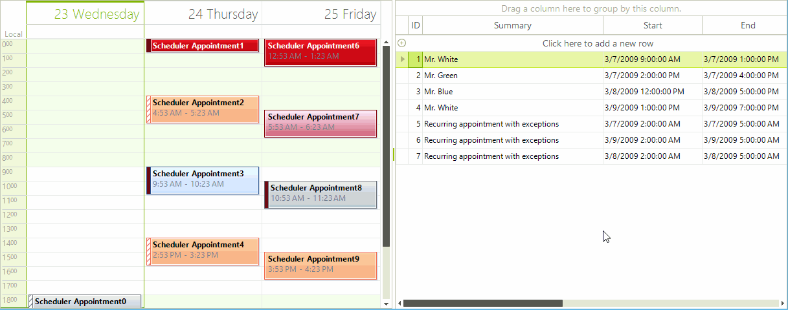
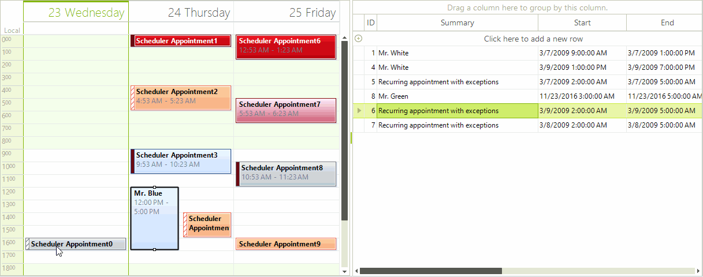

# Drag and Drop Using RadDragDropService

This article will guide you through the process of achieving drag and drop functionality from __RadScheduler__ to __RadGridView__ and vice versa. For this purpose, we will use the __RadDragDropService__, supported by both of the controls.

Let’s assume that our __RadScheduler__ is in unbound mode and the __RadGridView__ control is bound to *Appointments* data table. 

## Drag and Drop from RadGridView to RadScheduler

1. The first thing we need to do is to start the __RadGridView__’s drag and drop service when a user clicks on a row with the left mouse down. For this purpose we should create a custom [grid behavior]():

<snippet id='scheduler-schedulertogrid-customrowgridbehavior-cs' />
<snippet id='scheduler-schedulertogrid-customrowgridbehavior-vb' />

2\. Next, we should register this behavior in our grid:

<snippet id='scheduler-schedulertogrid-registergridbehavior-cs' />
<snippet id='scheduler-schedulertogrid-registergridbehavior-vb' />

3\. It is necessary to subscribe to the __PreviewDragStart__, __PreviewDragOver__ and __PreviewDragDrop__ events of the grid’s __RadDragDropService__. The __PreviewDragStart__ event is fired once the drag and drop service on the grid is started. We should notify the service that the drag and drop operation can move forward. In the __PreviewDragOver__ event you can control on what targets to allow dropping the dragged row. The __PreviewDragDrop__ event performs the actual move of the row from the __RadGridView__ to the __RadScheduler__.

<snippet id='scheduler-schedulertogrid-raddragdropservice-cs' />
<snippet id='scheduler-schedulertogrid-raddragdropservice-vb' />

<snippet id='scheduler-schedulertogrid-performgridtoschedulerdragdrop-cs' />
<snippet id='scheduler-schedulertogrid-performgridtoschedulerdragdrop-vb' />

>note The start date of the created appointment is in correspondence with the cell where the row is dropped. The appointment’s duration is relevant to the original duration.
>

>caption Figure 1: Drag and Drop from RadGridView to RadScheduler

## Drag and Drop from RadScheduler to RadGridView

To implement drag and drop functionality for this scenario, we will use the SchedulerElement.__DragDropBehavior__, which is a derivative of the __RadDragDropService__. Subscribe to its __PreviewDragOver__ and __PreviewDragDrop__ events. In the __PreviewDragOver__ event allow dropping over a row element or over the table element. The __PreviewDragDrop__ event performs the actual inserting of the dragged appointment into the __RadGridView__’s data source:

<snippet id='scheduler-schedulertogrid-schedulertogrid-cs' />
<snippet id='scheduler-schedulertogrid-schedulertogrid-vb' />

>caption Figure 2: Drag and Drop from RadScheduler to RadGridView 

# See Also

* [Views]()
* [Working with Appointments]()
* [Formatting Appointments]()
* [Scheduler Element Provider]()
