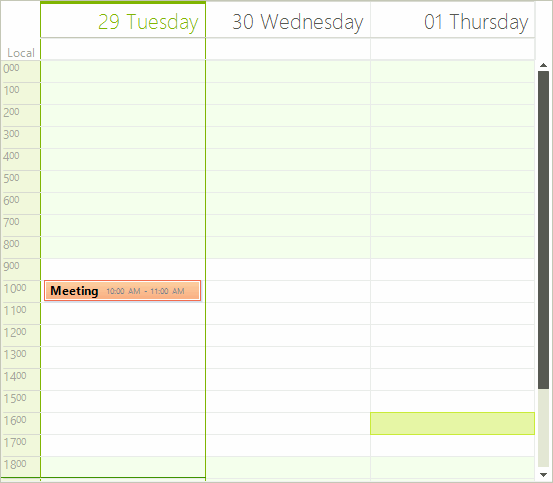

# Copy/Paste/Cut

__RadScheduler__ supports built-in Copy/Paste/Cut functionality, which allows you to store appointments information in the Clipboard and then paste it in a different location. Using "Copy", "Paste" and "Cut" options gets quite useful when you want to enter the same content repeatedly.

You can control which Clipboard operations are allowed via the RadScheduler.__AllowCopyPaste__ property. The possible values are listed below:

* __Disallow__:The end user is not allowed to copy, paste and cut appointments.
  
* __AllowCopy__: The end user is only allowed to copy appointments.
  
* __AllowCut__: The end user is only allowed to cut appointments.
  
* __AllowPaste__: The end user is only allowed to paste appointments.
  
* __AllowCopyPaste__: The end user is only allowed to copy and paste appointments.
  
* __AllowCutPaste__: The end user is only allowed to cut and paste appointments.
  
* __AllowCopyCut__: The end user is only allowed to copy and cut appointments.
  
* __AllowAll__: All Clipboard operations are allowed.

## Copying

Copying is a pretty simple operation. After an appointment is selected, press Ctrl+C. Then, you can paste the content anywhere you need to, e.g. Notepad or __RadScheduler__ itself.

__RadScheduler__ introduces __AppointmentsCopying__ event which occurs when the scheduler has prepared appropriate data formats that represent the copy selection. This event is fired once for each supported format: *Text*, *Csv*, *ICal*. You can cancel this event if the data is not allowed to be stored to Clipboard in a specific format.

>note Additionally, you can use the RadScheduler.__Copy__ method in order to perform programmatically copy functionality.
>

## Pasting

Ctrl+V is the key combination performing the paste behavior in scheduler. The RadScheduler.__Pasting__ event is appropriate for modifying the Clipboard data before pasting it in the scheduler. The following example demonstrates how to modified the copied string before inserting it in the scheduler:

#### Pasting Appointment

{{source=..\SamplesCS\Scheduler\EndUserFunctionality\EditingAppointments.cs region=Pasting}} 
{{source=..\SamplesVB\Scheduler\EndUserFunctionality\EditingAppointments.vb region=Pasting}} 

````C#
        
private void radScheduler1_AppointmentsPasting(object sender, SchedulerClipboardEventArgs e)
{
    if (e.Format == "ICal")
    {
        string iCalData = e.DataObject.GetData(RadScheduler.ICalendarDataFormat) + "";               
        string newiCalData = iCalData.Replace("SUMMARY:", "SUMMARY: pasted ");                
        System.Windows.Forms.Clipboard.SetData(RadScheduler.ICalendarDataFormat, newiCalData);
    }
}

````
````VB.NET
Private Sub radScheduler1_AppointmentsPasting(sender As Object, e As SchedulerClipboardEventArgs)
    If e.Format = "ICal" Then
        Dim iCalData As String = e.DataObject.GetData(RadScheduler.ICalendarDataFormat) + ""
        Dim newiCalData As String = iCalData.Replace("SUMMARY:", "SUMMARY: pasted ")
        System.Windows.Forms.Clipboard.SetData(RadScheduler.ICalendarDataFormat, newiCalData)
    End If
End Sub

````

{{endregion}}

>caption Figure 1: Pasting Appointment


You can cancel this event as well in order to prevent pasting data in some cases.

>note Additionally, you can use the RadScheduler. __Paste__ method in order to perform programmatically paste functionality.
>

## Cutting

If the Cut operation is allowed, you can cut appointments by pressing Ctrl+X. Alternatively, you can use the RadScheduler.__Cut__ method.
      
# See Also

* [Views]()
* [Working with Appointments]()
* [Scheduler Navigator]()
* [Printing Overview]()
