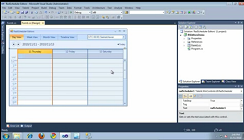
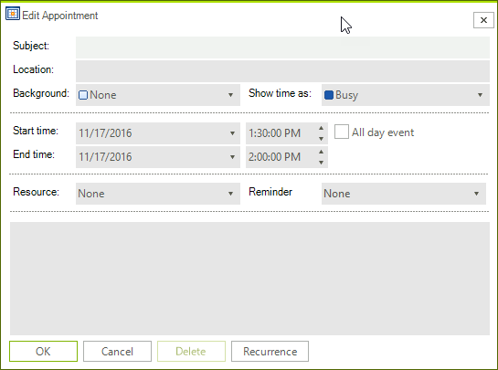
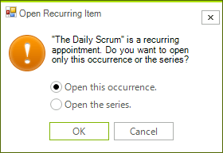
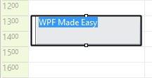
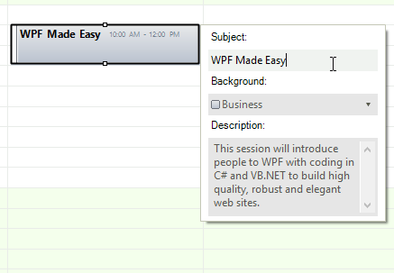
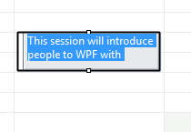

# Editing Appointments 

| RELATED VIDEOS |  |
| ------ | ------ |
|[In-Place Editors with RadScheduler for WinForms](http://www.telerik.com/videos/winforms/in-place-editors-with-radscheduler-for-winforms) In this video, you will learn how to use the new in-place editors feature of RadScheduler for WinForms.||

RadScheduler offers two options to edit an appointment:

* Edit an appointment using an Edit Appointment Dialog

* Edit an appointment using an in-place editor

When a change in an appointment's property occurs, the __AppointmentChanged__ event is fired. The __AppointmentChangedEventArgs__ gives you access to the exact __Appointment__ and the __PropertyName__ that has been modified.      

## Using EditAppointmentDialog

The EditAppointmentDialog allows for editing all the properties that an appointment exposes. To edit an appointment once it has been created:

1. Double-click an appointment and the "Editor Appointment Dialog" is shown if the appointment is not recurring.

1. If the appointment is recurring, the "Editing a recurring appointment" pop-up appears, where you can specify whether you want to edit only the selected occurrence of the appointment, or edit the entire series:
    

    Choose which you want to edit and press OK to open the "Editor Appointment Dialog". You can also press Cancel to cancel the edit entirely.
            

1. To change the recurrence rules press the Recurrence button in the "Editor Appointment Dialog" and the "Edit Recurrence Dialog" will appear. Make the desired changes to the appointment and click OK to save the changes or Cancel to cancel them.
            
1. Exceptions to recurring appointments When you edit a single instance of a recurring appointment, you create an exception. This indicates that the appointment is still part of a recurring sequence, but that it differs in some details from the master recurring appointment. Exceptions can reflect any change to the appointment including its subject, time, duration, or any custom resources or attributes.

>important As of **R1 2021** the EditAppointmentDialog provides UI for selecting multiple resources per appointment. In certain cases (e.g. unbound mode), the *Resource* **RadDropDownList** is replaced with a **RadCheckedDropDownList**. Otherwise, the default drop down with single selection for resources is shown. To enable the multiple resources selection in bound mode, it is necessary to specify the AppointmentMappingInfo. **Resources** property. The **Resources** property should be set to the name of the relation that connects the **Appointments** and the **AppointmentsResources** tables. 

#### EditAppointmentDialog with multiple resources

            
## Using In-place editors      

In-place editors provide a quick and easy way to edit a small number of the appointment's properties. The end use can open the in-place editors by pressing the *F2* key.There are three options for the behavior of the in-place editor:

* The in-place editor opens in the area of the appointment.By default this editor edits the Summary (subject) property of the appointment in which it is opened.

#### Setting a Simple Editor

<snippet id='scheduler-editingappointments-editorviewmodeeditor-cs' />
<snippet id='scheduler-editingappointments-editorviewmodeeditor-vb' />

>caption Figure 1: Simple Editor

* The in-place editor behaves as a composite dialog editor that appears next to the appointment in the view. This editor allows for editing more properties of the appointment at once.

#### Setting an Editor Dialog

<snippet id='scheduler-editingappointments-editorviewmodeeditordialog-cs' />
<snippet id='scheduler-editingappointments-editorviewmodeeditordialog-vb' />

>caption Figure 2: Dialog Editor

* All in-place editors are disabled. This is the default behavior.

<snippet id='scheduler-editingappointments-editorviewmodeeditornone-cs' />
<snippet id='scheduler-editingappointments-editorviewmodeeditornone-vb' />

##  Customizing the In-place Editors

You are able to change the default editors in the EditorRequired event of the RadScheduler. For example, if you want to modify the Description value instead of the Summary value, you should inherit RadSchedulerTextBoxEditor and override two of its methods - BeginEditorEdit and Save.

#### Custom TextBox Editor

<snippet id='scheduler-customschedulertextboxeditor-customschedulertextboxeditor-cs' />
<snippet id='scheduler-customschedulertextboxeditor-customschedulertextboxeditor-vb' />

After creating the custom editor that edits Description property of the appointment, you should replace the default editor. This has to be done on EditorRequired event of RadScheduler.

#### Replacing Editor

<snippet id='scheduler-editingappointments-editorrequired-cs' />
<snippet id='scheduler-editingappointments-editorrequired-vb' />

The result is shown on the screenshot below:

>caption Figure 3: Custom TextBox Editor

In this the EditorRequired event you can also change the in-place editor dialog if the editor mode is EditorDialog.

# See Also

* [Views]()
* [Working with Appointments]()
* [Scheduler Navigator]()
* [Printing Overview]()
