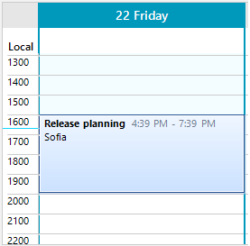
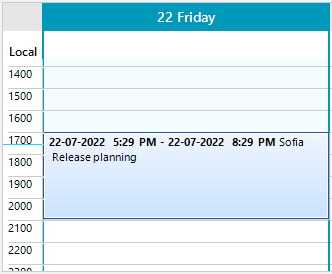
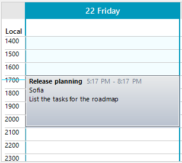
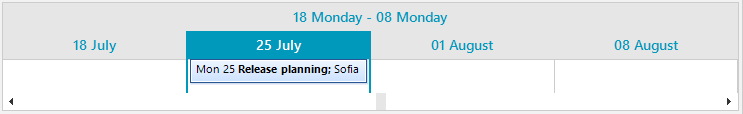
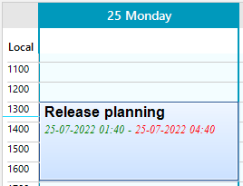

# Appointment Title Formatter

When a visual AppointmentElement is created, RadScheduler uses an **AppointmentTitleFormatter** to control what text to be displayed in the appointments available into the view. The internally used AppointmentTitleFormatterFactory creates the respective title formatter considering the active view type. 

## AppointmentTitleFormat

RadScheduler offers the **AppointmentTitleFormat** property allowing you to specify what information regarding the appointment will be displayed. The default title format is **"{6}{2}{7} {8}{3} {4}{0:h:mm tt} - {1:h:mm tt}{5}"** where:

* {0} – Start time

* {1} – End time

* {2} – Subject

* {3} – Location

* {4} – "&lt;span S&gt;" where S is a style attribute with font-family, font-size and color.* 

* {5} – "&lt;/span&gt;"

* {6} – "&lt;b&gt;"

* {7} – "&lt;/b&gt;"

* {8} – New line or empty string

>note The **AppointmentBackgroundInfo** controls the font style and color that will be used in the {4}{5} construction - "&lt;span&gt; &lt;/span&gt;" by its **DateTimeColor** and **DateTimeFont** properties.  The AppointmentBackgroundInfo.Font property controls the font for the entire text in the appointment element. 



{{source=..\SamplesCS\Scheduler\Fundamentals\TitleFormatter.cs region=Example1}}
{{source=..\SamplesVB\Scheduler\Fundamentals\TitleFormatter.vb region=Example1}} 

````C#

Appointment a = new Appointment();
a.Start = DateTime.Now;
a.End = a.Start.AddHours(3);
a.Summary = "Release planning";
a.Description = "List the tasks for the roadmap";
a.Location = "Sofia";
this.radScheduler1.Appointments.Add(a);

````
````VB.NET

Dim a As Appointment = New Appointment()
a.Start = DateTime.Now
a.[End] = a.Start.AddHours(3)
a.Summary = "Release planning"
a.Description = "List the tasks for the roadmap"
a.Location = "Sofia"
Me.radScheduler1.Appointments.Add(a)

````

Specify the title format according to the required information:

{{source=..\SamplesCS\Scheduler\Fundamentals\TitleFormatter.cs region=Example2}}
{{source=..\SamplesVB\Scheduler\Fundamentals\TitleFormatter.vb region=Example2}} 

````C#

this.radScheduler1.AppointmentTitleFormat = "{6}{0:dd-MM-yyyy h:mm tt} - {1:dd-MM-yyyy h:mm tt}{7} {3} {8} {2}";

````
````VB.NET

Me.radScheduler1.AppointmentTitleFormat = "{6}{0:dd-MM-yyyy h:mm tt} - {1:dd-MM-yyyy h:mm tt}{7} {3} {8} {2}"

````



## ShowAppointmentDescription

The AppointmentElement.**ShowAppointmentDescription** property controls whether the description will be drawn. By default, it is set to *false*. It can be set in the **AppointmentFormatting** event:

{{source=..\SamplesCS\Scheduler\Fundamentals\TitleFormatter.cs region=Example3}}
{{source=..\SamplesVB\Scheduler\Fundamentals\TitleFormatter.vb region=Example3}} 

````C#

private void RadScheduler1_AppointmentFormatting(object sender, SchedulerAppointmentEventArgs e)
{
    e.AppointmentElement.ShowAppointmentDescription = true;
} 

````
````VB.NET

Private Sub RadScheduler1_AppointmentFormatting(ByVal sender As Object, ByVal e As SchedulerAppointmentEventArgs)
    e.AppointmentElement.ShowAppointmentDescription = True
End Sub

````



## AppointmentTitleFormatterFactory

The factory creates the following different formatters according to the view type:

### DayViewAppointmentTitleFormatter

When the **SchedulerViewType** is *Day*, *MultiDay*, *Week*, *WorkWeek* a DayViewAppointmentTitleFormatter is used. 

### MonthViewAppointmentTitleFormatter

When the **SchedulerViewType** is *Month* a MonthViewAppointmentTitleFormatter is used. 


### TimelineViewAppointmentTitleFormatter

When the **SchedulerViewType** is *Timeline* a TimelineViewAppointmentTitleFormatter is used. 



## Customize Appointment's Text

A common requirement is to use different colors for the different text parts, e.g. color the *time* part in blue and the *summary* in red. This can be achieved by creating a custom [AppointmentElement]() and overriding its **CreateAppointmentText** method which is expected to return the [HTML-like formatted]() text for the appointment.

{{source=..\SamplesCS\Scheduler\Fundamentals\TitleFormatter.cs region=Example4}}
{{source=..\SamplesVB\Scheduler\Fundamentals\TitleFormatter.vb region=Example4}} 

````C#

public class MyAppointmentElement : AppointmentElement
{
    public MyAppointmentElement(RadScheduler scheduler, SchedulerView view, IEvent appointment) 
        : base(scheduler, view, appointment)
    {
    }

    protected override string CreateAppointmentText()
    {
        string text = "<html><b><font=Arial><size=12>" + this.Appointment.Summary + "</b><br>" +
            "<i><size=9><color=green><font=Times New Roman>" + string.Format("{0:dd-MM-yyyy hh:mm}", this.Appointment.Start) + " - " +
            "<color=red>" + string.Format("{0:dd-MM-yyyy hh:mm}", this.Appointment.End);

        return text;
    }
}

````
````VB.NET

Public Class MyAppointmentElement
    Inherits AppointmentElement

    Public Sub New(ByVal scheduler As RadScheduler, ByVal view As SchedulerView, ByVal appointment As IEvent)
        MyBase.New(scheduler, view, appointment)
    End Sub

    Protected Overrides Function CreateAppointmentText() As String
        Dim text As String = "<html><b><font=Arial><size=12>" & Me.Appointment.Summary & "</b><br>" &
            "<i><size=9><color=green><font=Times New Roman>" & String.Format("{0:dd-MM-yyyy hh:mm}",
             Me.Appointment.Start) & " - " & "<color=red>" & String.Format("{0:dd-MM-yyyy hh:mm}", Me.Appointment.[End])
        Return text
    End Function
End Class

````

Do not forget to replace the custom AppointmentElement with the help of a [SchedulerElementProvider]().



# See Also

* [Formatting Appointments]()
* [Working with Appointments]() 
