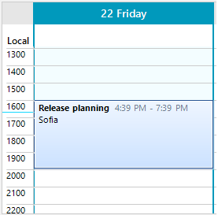
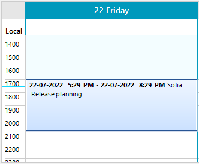
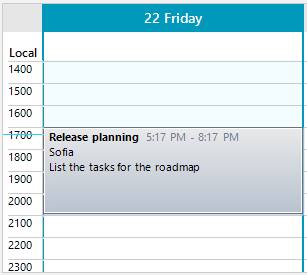
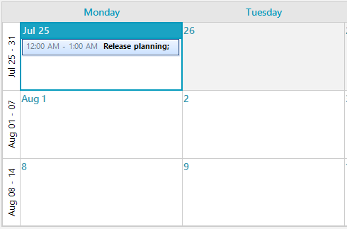
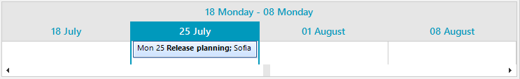
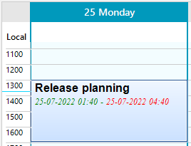

# Appointment Title Formatter

When a visual AppointmentElement is created, RadScheduler uses an **AppointmentTitleFormatter** to control what text to be displayed in the appointments available into the view. The internally used AppointmentTitleFormatterFactory creates the respective title formatter considering the active view type. 

## AppointmentTitleFormat

RadScheduler offers the **AppointmentTitleFormat** property allowing you to specify what information regarding the appointment will be displayed. The default title format is **"{6}{2}{7} {8}{3} {4}{0:h:mm tt} - {1:h:mm tt}{5}"** where:

* {0} – Start time

* {1} – End time

* {2} – Subject

* {3} – Location

* {4} – "&lt;span S&gt;" where S is a style attribute with font-family, font-size and color.* 

* {5} – "&lt;/span&gt;"

* {6} – "&lt;b&gt;"

* {7} – "&lt;/b&gt;"

* {8} – New line or empty string

>note The **AppointmentBackgroundInfo** controls the font style and color that will be used in the {4}{5} construction - "&lt;span&gt; &lt;/span&gt;" by its **DateTimeColor** and **DateTimeFont** properties.  The AppointmentBackgroundInfo.Font property controls the font for the entire text in the appointment element. 

<snippet id='scheduler-titleformatter-example1-cs' />
<snippet id='scheduler-titleformatter-example1-vb' />

Specify the title format according to the required information:

<snippet id='scheduler-titleformatter-example2-cs' />
<snippet id='scheduler-titleformatter-example2-vb' />

## ShowAppointmentDescription

The AppointmentElement.**ShowAppointmentDescription** property controls whether the description will be drawn. By default, it is set to *false*. It can be set in the **AppointmentFormatting** event:

<snippet id='scheduler-titleformatter-example3-cs' />
<snippet id='scheduler-titleformatter-example3-vb' />

## AppointmentTitleFormatterFactory

The factory creates the following different formatters according to the view type:

### DayViewAppointmentTitleFormatter

When the **SchedulerViewType** is *Day*, *MultiDay*, *Week*, *WorkWeek* a DayViewAppointmentTitleFormatter is used. 

### MonthViewAppointmentTitleFormatter

When the **SchedulerViewType** is *Month* a MonthViewAppointmentTitleFormatter is used. 

### TimelineViewAppointmentTitleFormatter

When the **SchedulerViewType** is *Timeline* a TimelineViewAppointmentTitleFormatter is used. 

## Customize Appointment's Text

A common requirement is to use different colors for the different text parts, e.g. color the *time* part in blue and the *summary* in red. This can be achieved by creating a custom [AppointmentElement]() and overriding its **CreateAppointmentText** method which is expected to return the [HTML-like formatted]() text for the appointment.

<snippet id='scheduler-titleformatter-example4-cs' />
<snippet id='scheduler-titleformatter-example4-vb' />

Do not forget to replace the custom AppointmentElement with the help of a [SchedulerElementProvider]().

# See Also

* [Formatting Appointments]()
* [Working with Appointments]() 
