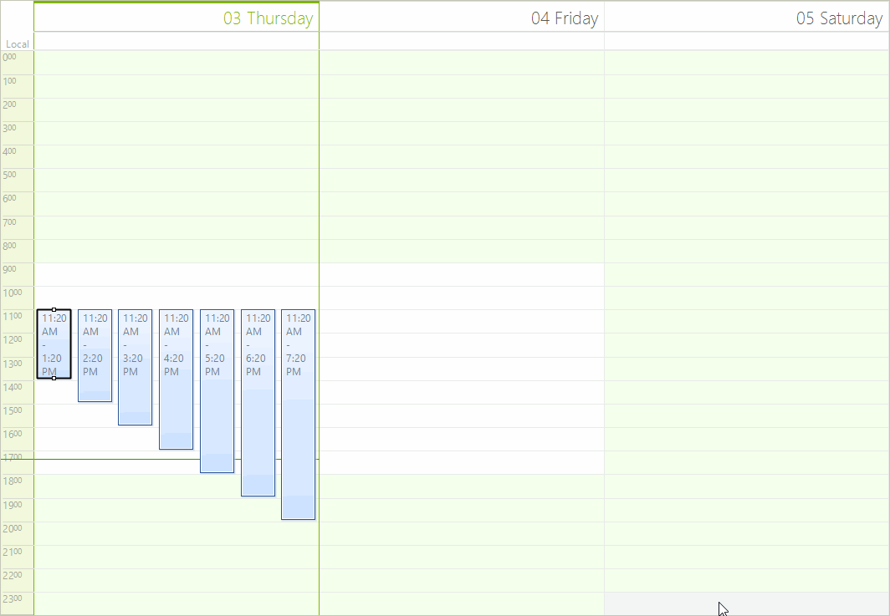

# Input Behavior

The __SchedulerInputBehavior__ is responsible for processing the keyboard and mouse input in __RadScheduler__.

Below are the methods which handle the respective events:

* __HandleMouseDown__
  
* __HandleMouseMove__
  
* __HandleMouseUp__ 
  
* __HandleNavigationKey__
  
* __HandleMouseWheel__
  
* __HandleMouseEnter__
  
* __HandleMouseLeave__
  
* __HandleCellElementDoubleClick__
  
* __HandleAppointmentElementDoubleClick__
  
* __HandleCellElementKeyPress__

Each of these methods can be overridden and the instance of the __SchedulerInputBehavior__ used in __RadScheduler__ can be replaced with a custom one. This allows you to modify the default behavior of the control. The following example demonstrates how to alter the default behavior and allow moving appointments via CTRL + arrow keys. In order to accomplish this, we need to inherit the SchedulerInputBehavior class and override the __HandleKeyDown__ method:

#### Custom Input Behavior

<snippet id='scheduler-inputbehavior-behavior-cs' />
<snippet id='scheduler-inputbehavior-behavior-vb' />

Now we need to assign this new input behavior to the __SchedulerInputBehavior__ property of __RadScheduler__:

#### Set Behavior

<snippet id='scheduler-inputbehavior-setbehavior-cs' />
<snippet id='scheduler-inputbehavior-setbehavior-vb' />

You can see the result below:

>caption Figure 1: Custom Input Behavior

# See Also

* [Design Time]()
* [Data Binding]()
* [Views]()
