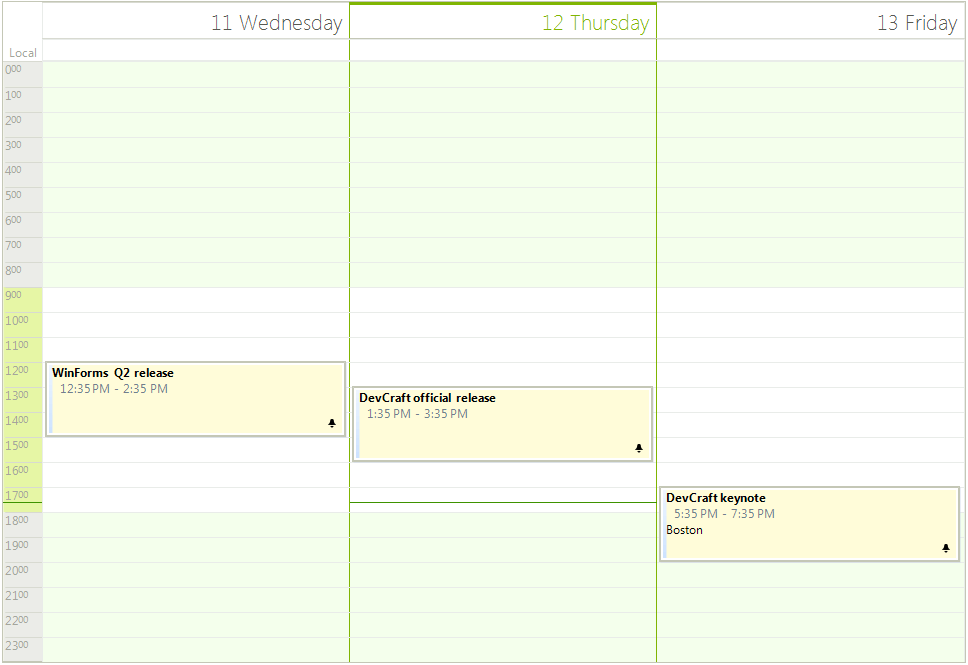

# Scheduler Element Provider 

The __SchedulerElementProvider__ class provides means for changing the default __RadScheduler__ elements.

>caption Figure 1: Custom Appointments

If you need to customize any of the  __RadSheduler__ elements you can use the __SchedulerElementProvider__ class. It allows you to replace the default elements with custom ones. This can be achieved by creating  __SchedulerElementProvider__ descendant class and overriding the corresponding methods.

#### Custom Element Provider

<snippet id='scheduler-schedulerelementprovidersample-schedulerelementprovider-cs' />
<snippet id='scheduler-schedulerelementprovidersample-schedulerelementprovider-vb' />

Your custom elements should be inherit of the default ones. For example, you can create custom elements and override some of their default properties.

#### Custom Cells

<snippet id='scheduler-schedulerelementprovidersample-elements-cs' />
<snippet id='scheduler-schedulerelementprovidersample-elements-vb' />

The following __RadSheduler__ elements can be substituted in the __CreateElement__ method.

| Scheduler Element |
| ------ |
|AppointmentElement|
|DayViewAllDayHeader|
|DayViewAppointmentsArea|
|DayViewAppointmentsTable|
|DayViewHeader|
|DragFeedbackElement|
|MonthCellElement|
|MonthViewAreaElement|
|MonthViewHeader|
|MonthViewVerticalHeader|
|SchedulerCellElement|
|SchedulerDayViewElement|
|SchedulerDayViewGroupedByResourceElement|
|SchedulerHeaderCellElement|
|SchedulerMonthViewElement|
|SchedulerMonthViewGroupedByResourceElement|
|SchedulerMultiDayViewElement|
|SchedulerResourceHeaderCellElement|
|SchedulerTimelineViewElement|
|TimelineAppointmentsPresenter|
|TimelineGroupingByResourcesElement|
|TimelineHeader|
|ViewNavigationElement|

# See Also

* [Design Time]()
* [Data Binding]()
* [Views]()
* [How to Show Columns in Resource Headers]()
