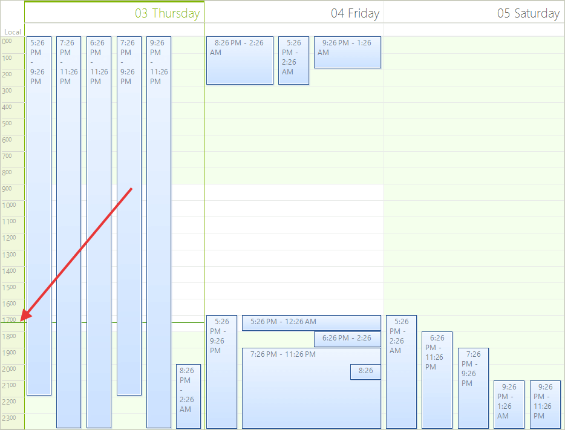
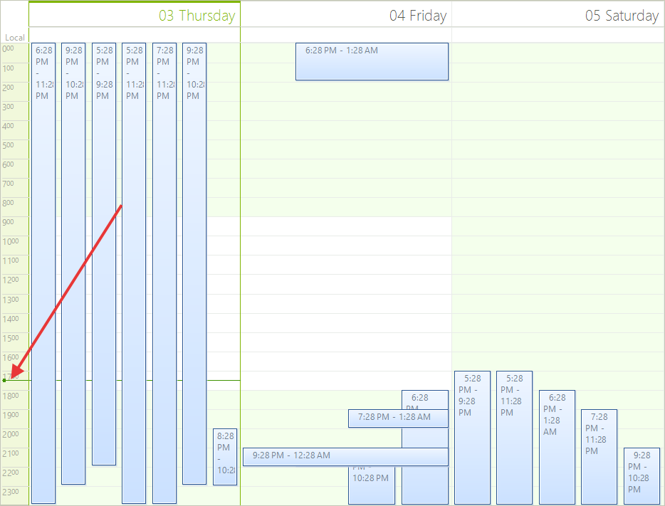
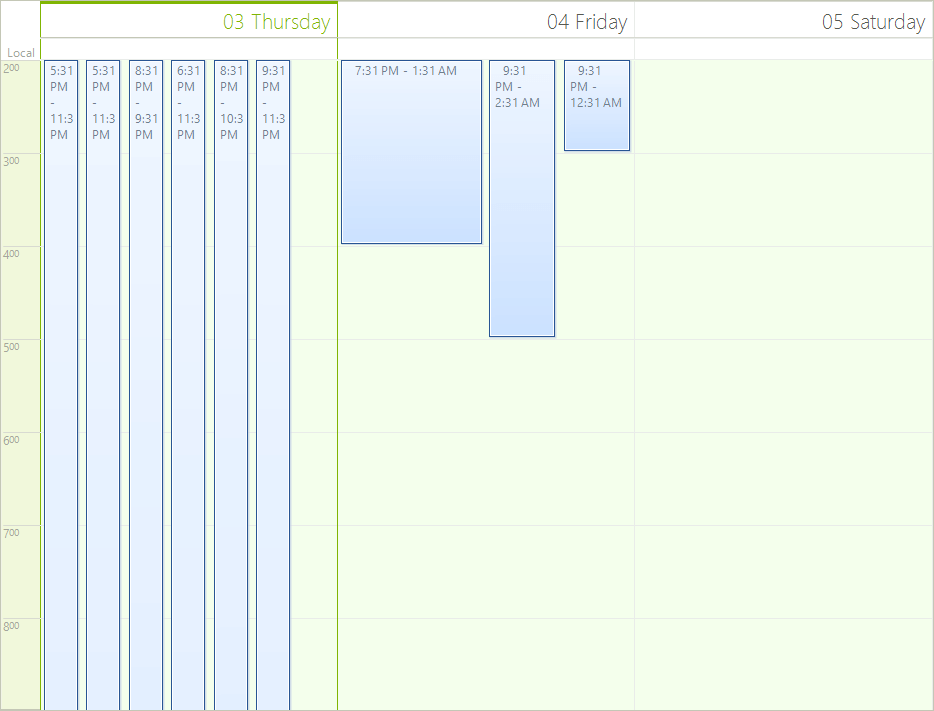
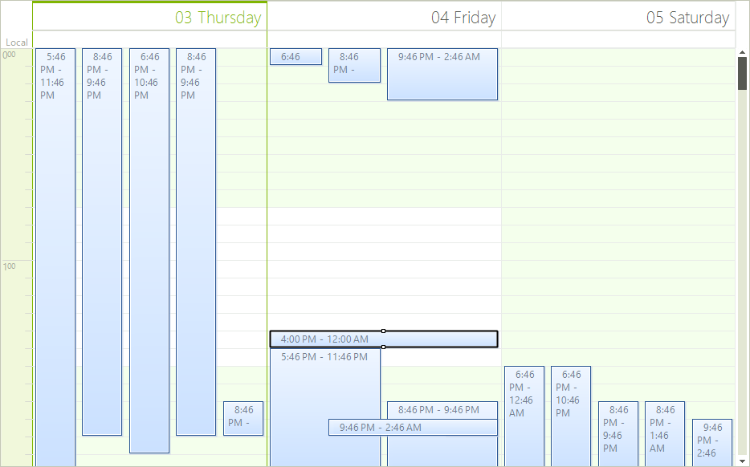
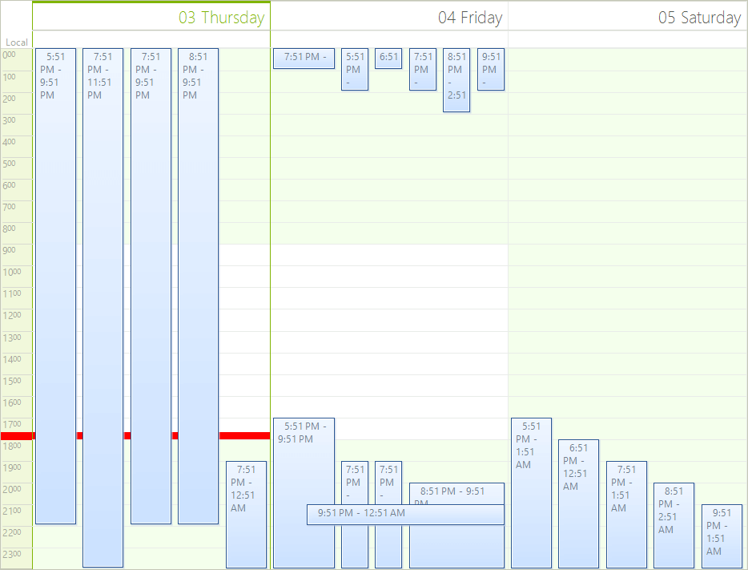
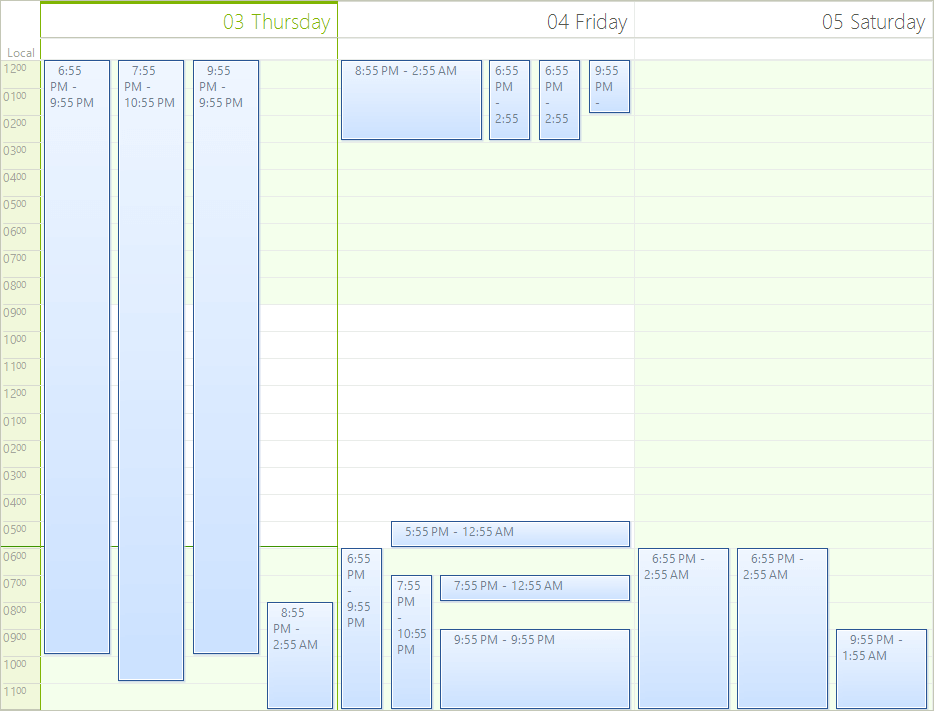
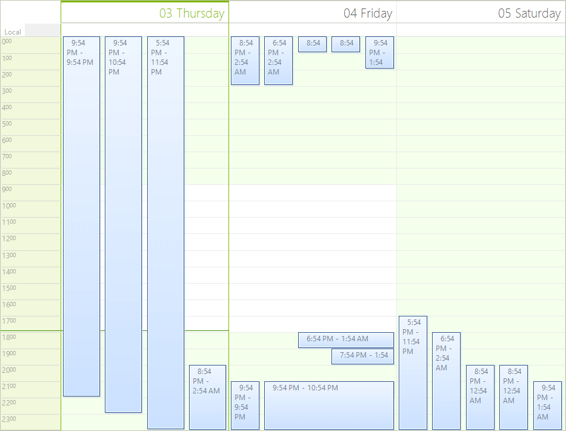

# Scheduler Ruler

The ruler in __RadScheduler__ is used to show the time intervals of the current view.

The ruler has various properties which can be used to modify its appearance. The examples below demonstrate the various behaviors of the ruler. The ruler can be accessed as follows:

{{source=..\SamplesCS\Scheduler\Fundamentals\Ruler.cs region=GetRuller}} 
{{source=..\SamplesVB\Scheduler\Fundamentals\Ruler.vb region=GetRuller}} 

````C#
RulerPrimitive ruler = (this.scheduler.SchedulerElement.ViewElement as SchedulerDayViewElement).DataAreaElement.Ruler;

````
````VB.NET
Dim ruler As RulerPrimitive = TryCast(Me.scheduler.SchedulerElement.ViewElement, SchedulerDayViewElement).DataAreaElement.Ruler

````

{{endregion}} 

>caption Figure 1: RadScheduler Ruler


* __TimePointerStyle__ - Sets the style of the pointer which shows the current time. Can be *Arrow, Line or SimpleLine*.

{{source=..\SamplesCS\Scheduler\Fundamentals\Ruler.cs region=TimePointerStyle}} 
{{source=..\SamplesVB\Scheduler\Fundamentals\Ruler.vb region=TimePointerStyle}} 

````C#
ruler.TimePointerStyle = RulerCurrentTimePointer.Arrow;

````
````VB.NET
ruler.TimePointerStyle = RulerCurrentTimePointer.Arrow

````

{{endregion}} 

>caption Figure 2: Time Pointer Style


* __Start__ and __EndScale__ - Sets the time when the ruler starts and ends.

{{source=..\SamplesCS\Scheduler\Fundamentals\Ruler.cs region=StartEndScale}} 
{{source=..\SamplesVB\Scheduler\Fundamentals\Ruler.vb region=StartEndScale}} 

````C#
ruler.StartScale = 2;
ruler.EndScale = 9;

````
````VB.NET
ruler.StartScale = 2
ruler.EndScale = 9

````

{{endregion}} 

>caption Figure 3: Start and End Scales


* __RangeFactor__ - The range factor determines whether the units in the ruler will be devided in *FiveMinutes, HalfHour, Hour, QuarterHour, SixMinutes or TenMinutes*.

{{source=..\SamplesCS\Scheduler\Fundamentals\Ruler.cs region=RangeFactor}} 
{{source=..\SamplesVB\Scheduler\Fundamentals\Ruler.vb region=RangeFactor}} 

````C#
ruler.RangeFactor = ScaleRange.FiveMinutes;

````
````VB.NET
ruler.RangeFactor = ScaleRange.FiveMinutes

````

{{endregion}} 

>caption Figure 4: Ruler Range


* __CurrentTimePointerWidth__ and __CurrentTimePointerColor__ - Sets the size and the color of the pointer which shows the current time.

{{source=..\SamplesCS\Scheduler\Fundamentals\Ruler.cs region=CurrentTimePointerWidthAndColor}} 
{{source=..\SamplesVB\Scheduler\Fundamentals\Ruler.vb region=CurrentTimePointerWidthAndColor}} 

````C#
ruler.CurrentTimePointerWidth = 10;
ruler.CurrentTimePointerColor = Color.Red;

````
````VB.NET
ruler.CurrentTimePointerWidth = 10
ruler.CurrentTimePointerColor = Color.Red

````

{{endregion}} 

>caption Figure 5: Time Pointer Width 


* __RulerFormatStrings__ and the __RulerTextFormatting__ event - They are used to format the text in the ruler. For example here is how to display the hours in a 12 hours format:

{{source=..\SamplesCS\Scheduler\Fundamentals\Ruler.cs region=FormatStrings}} 
{{source=..\SamplesVB\Scheduler\Fundamentals\Ruler.vb region=FormatStrings}} 

````C#
ruler.FormatStrings = new RulerFormatStrings("hh", "mm", "hh", "mm");

````
````VB.NET
ruler.FormatStrings = New RulerFormatStrings("hh", "mm", "hh", "mm")

````

{{endregion}} 

>caption Figure 6: Ruler Format String


The RulerTextFormatting event can be used to manually format the text. You can prepend a "0" in front of the text if it contains only one digit:

{{source=..\SamplesCS\Scheduler\Fundamentals\Ruler.cs region=RulerFormattingSubscribe}} 
{{source=..\SamplesVB\Scheduler\Fundamentals\Ruler.vb region=RulerFormattingSubscribe}} 

````C#
this.scheduler.RulerTextFormatting += Scheduler_RulerTextFormatting;

````
````VB.NET
AddHandler Me.scheduler.RulerTextFormatting, AddressOf Scheduler_RulerTextFormatting

````

{{endregion}} 


{{source=..\SamplesCS\Scheduler\Fundamentals\Ruler.cs region=RulerFormattingHandler}} 
{{source=..\SamplesVB\Scheduler\Fundamentals\Ruler.vb region=RulerFormattingHandler}} 

````C#
void Scheduler_RulerTextFormatting(object sender, RulerTextFormattingEventArgs e)
{
    if (e.Text.Length == 1)
    {
        e.Text = "0" + e.Text;
    }
}

````
````VB.NET
Private Sub Scheduler_RulerTextFormatting(sender As Object, e As RulerTextFormattingEventArgs)
    If e.Text.Length = 1 Then
        e.Text = "0" & e.Text
    End If
End Sub

````

{{endregion}} 

* __RulerWidth__ - Sets the width of the ruler.

{{source=..\SamplesCS\Scheduler\Fundamentals\Ruler.cs region=RulerWidth}} 
{{source=..\SamplesVB\Scheduler\Fundamentals\Ruler.vb region=RulerWidth}} 

````C#
ruler.RulerWidth = 100;

````
````VB.NET
ruler.RulerWidth = 100

````

{{endregion}} 

>caption Figure 7: Ruler Width


# See Also

* [Design Time]()
* [Data Binding]()
* [Views]()
