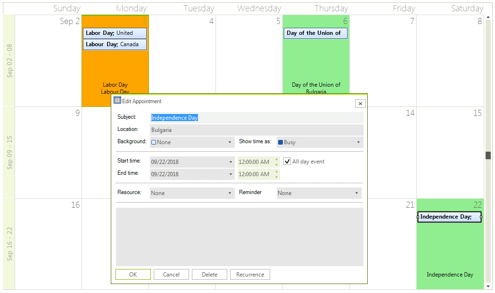
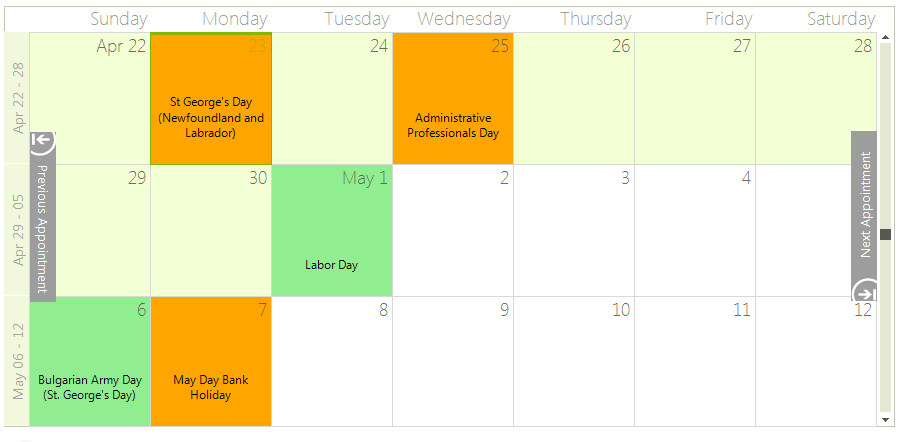

# Holidays

Similar to Outlook, since **R2 2018** **RadScheduler** provides holidays support. It allows loading holidays for different countries from a .hol file or adding them programmatically.

>caption Figure1: Holidays

The RadScheduler.**Holidays** collection stores all special days. It is of type **SchedulerHolidays** which is actually **IEnumerable&lt;Holiday&gt;**. For each **Holiday** object you can specify **Date**, **Location** and **HolidayName**.

## SchedulerHolidays' API

|Method|Description|
|----|----|
|**IsHoliday(DateTime dateTime)**|Check if the specific date is contained in the Holidays collection.|
|**GetHolidays(DateTime dateTime)**|Return all holidays for the specific date (if any).|
|**AddHoliday(Holiday holiday, bool createAppointment)**|Add holiday to the Holidays collection. If 'createAppointment' is true this will create an all day appointment.|
|**AddHolidays(IEnumerable&lt;Holiday&gt; holidays, bool createAppointment)**|Add a collection of holidays to the Holidays collection.If 'createAppointment' is true this will create an all day appointment.|
|**Clear**| Clear the Holidays collections. This does not affect already created appointments.|
|**GetAllLocations(string fileName)**| Return all locations from the file.|
|**GetAllLocations(Stream stream)**| Get all location from the stream.|
|**ReadHolidays(string fileName, bool createAppointment)**|Read the holidays information from the file and create Holidays objects in the holidays collection. Optionally can create also all day appointments for the holidays.|
|**ReadHolidays(string fileName, bool createAppointment, IEnumerable&lt;string&gt; locations)**|Read the holidays information from the file and create Holidays objects in the holidays collection only for holidays in the specific locations. Optionally can create also all day appointments for the holidays.|
|**ReadHolidays(Stream stream, bool createAppointment)**|Read the holidays information from the stream and create Holidays objects in the holidays collection. Optionally can create also and all day appointments for the holidays.|
|**ReadHolidays(Stream stream, bool createAppointment, IEnumerable&lt;string&gt; locations)**|Read the holidays information and create Holidays objects in the holidays collection only for holidays in the specific locations. Optionally can create also all day appointments for the holidays.|

## Add Holidays Programmatically
 
The following code snippet demonstrates how to add a holiday. The passed Boolean parameter to the **AddHoliday** method indicates whether an all-day appointment will be created for the specific day or not. 

#### Add a holiday programmatically

<snippet id='scheduler-schedulerholidays-addholidayprogrammatically-cs' />
<snippet id='scheduler-schedulerholidays-addholidayprogrammatically-vb' />

## Load Holidays from a File

<snippet id='scheduler-schedulerholidays-loadfile-cs' />
<snippet id='scheduler-schedulerholidays-loadfile-vb' />

## Load Holidays from a Stream

<snippet id='scheduler-schedulerholidays-loadstream-cs' />
<snippet id='scheduler-schedulerholidays-loadstream-vb' />

## Formatting Holidays

**RadScheduler** allows you to control whether to create all-day appointments for the holidays or not by passing a boolean argument to the **AddHoliday** method. If no appointments are created, there isn't any indication in the scheduler view when a certain day is a holiday. A common case is formatting the holidays' cells in a different color for a better indication. For this purpose, it is necessary to handle the RadScheduler.[CellFormatting]() event and introduce the desired style for holiday cells. The following example demonstrates how to color in *LightGreen* all holidays in Bulgaria and in *Orange* all the rest of the holidays.

>caption Figure2: Holidays Formatting 

#### Formatting the holidays

<snippet id='scheduler-schedulerholidays-holidaysformatting-cs' />
<snippet id='scheduler-schedulerholidays-holidaysformatting-vb' />

