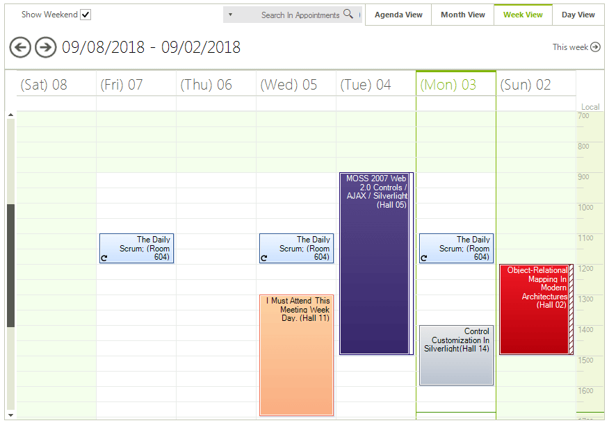

# Right-to-Left support

Enabling the RightToLeft mode of RadScheduler is achieved by setting the __RightToLeft__ property to *Yes*:

#### Right-to-Left Layout

{{source=..\SamplesCS\Scheduler\Localization\SchedulerRightToLeft.cs region=RTL}} 
{{source=..\SamplesVB\Scheduler\Localization\SchedulerRightToLeft.vb region=RTL}} 

````C#
radScheduler1.RightToLeft = System.Windows.Forms.RightToLeft.Yes;

````
````VB.NET
RadScheduler1.RightToLeft = System.Windows.Forms.RightToLeft.Yes

````

{{endregion}} 

Here is how your scheduler will look like in this mode:

>caption Figure 1: Right-to-Left Layout


# See Also

* [Localizing RadScheduler]()
* [Views]()
* [Themes and Appearance]()
